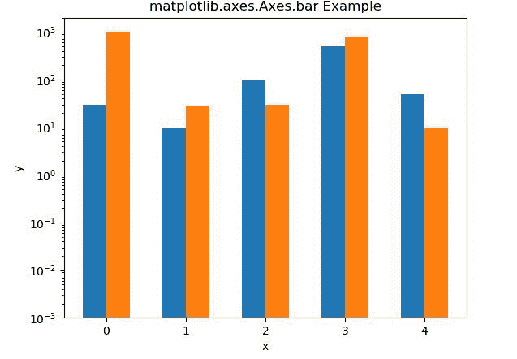
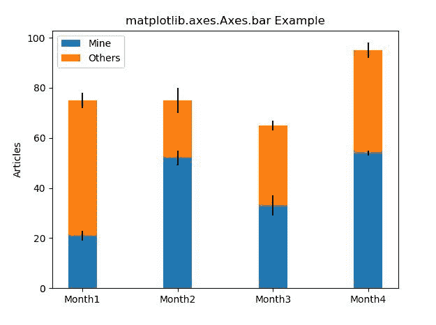

# Matplotlib.axes.Axes.bar()用 Python

表示

> 哎哎哎:# t0]https://www . geeksforgeeks . org/matplot lib-axes-axes-bar-in-python/

**[Matplotlib](https://www.geeksforgeeks.org/python-introduction-matplotlib/)** 是 Python 中的一个库，是 NumPy 库的数值-数学扩展。**轴类**包含了大部分的图形元素:轴、刻度、线二维、文本、多边形等。，并设置坐标系。Axes 的实例通过回调属性支持回调。

## Matplotlib.axes.Axes.bar()函数

matplotlib 库的 Axes 模块中的 **Axes.bar()函数**用于制作条形图。

> **语法:** Axes.bar(self，x，height，width=0.8，bottom=None，* align = ' center '，data=None，**kwargs)
> 
> **参数:**该方法接受以下描述的参数:
> 
> *   **x:** 该参数是条的水平坐标序列。
> *   **高度:**该参数是杆的高度。
> *   **宽度:**此参数为可选参数。默认值为 *0.8* 的条宽。
> *   **底部:**该参数也是可选参数。默认值为 *0* ，是杆座的 y 坐标。
> *   **align:**该参数也是可选参数。它用于将条与 x 坐标对齐。
> 
> **返回:**这将返回以下内容:
> 
> *   **BarContainer:** 这将返回包含所有条和可选错误条的容器。

下面的例子说明了 matplotlib.axes.Axes.bar()函数在 matplotlib.axes 中的作用:

**示例#1:**

```py
# Implementation of matplotlib function

import matplotlib.pyplot as plt
import numpy as np

data = ((30, 1000), (10, 28), (100, 30),
        (500, 800), (50, 10))

dim = len(data[0])
w = 0.6
dimw = w / dim

fig, ax = plt.subplots()
x = np.arange(len(data))
for i in range(len(data[0])):
    y = [d[i] for d in data]
    b = ax.bar(x + i * dimw, y, 
               dimw, 
               bottom = 0.001)

ax.set_xticks(x + dimw / 2)
ax.set_xticklabels(map(str, x))
ax.set_yscale('log')

ax.set_xlabel('x')
ax.set_ylabel('y')

ax.set_title('matplotlib.axes.Axes.bar Example')

plt.show()
```

**输出:**


**例 2:**

```py
# ImpleMinetation of matplotlib function

import numpy as np
import matplotlib.pyplot as plt

labels = ['Month1', 'Month2', 'Month3', 'Month4']
mine = [21, 52, 33, 54]
others = [54, 23, 32, 41]
Mine_std = [2, 3, 4, 1]
Others_std = [3, 5, 2, 3]
width = 0.3

fig, ax = plt.subplots()

ax.bar(labels, mine, width, 
       yerr = Mine_std, 
       label ='Mine')

ax.bar(labels, others, width, 
       yerr = Others_std,
       bottom = mine,
       label ='Others')

ax.set_ylabel('Articles')
ax.legend()

ax.set_title('matplotlib.axes.Axes.bar Example')

plt.show()
```

**输出:**
