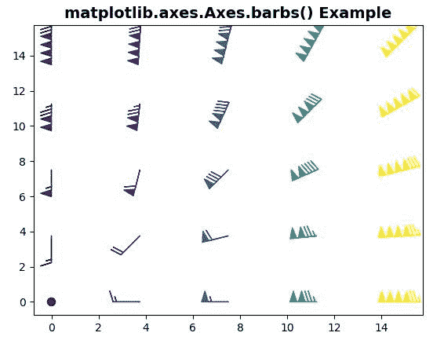

# Python 中的 matplotlib . axes . axes . barks()

> 原文:[https://www . geesforgeks . org/matplotlib-axes-axes-倒钩-in-python/](https://www.geeksforgeeks.org/matplotlib-axes-axes-barbs-in-python/)

**[Matplotlib](https://www.geeksforgeeks.org/python-introduction-matplotlib/)** 是 Python 中的一个库，是 NumPy 库的数值-数学扩展。**轴类**包含了大部分的图形元素:轴、刻度、线二维、文本、多边形等。，并设置坐标系。Axes 的实例通过回调属性支持回调。

## matplotlib . axes . axes . barks()函数

matplotlib 库的 Axes 模块中的**axes . barb()函数**也用于绘制倒刺的 2D 场。

> **语法:**axes . barks(self，*args，data=None，**kw)
> 
> **参数:**该方法接受以下描述的参数:
> 
> *   **X，Y :** 这些参数是倒钩位置的 X 和 Y 坐标。
> *   **U，V:** 这些参数是倒钩轴的 x 和 y 分量。
> *   **C :** 该参数包含通过 norm 和 cmap 进行颜色映射来定义倒钩颜色的数字数据。
> *   **长度:**该参数是倒钩的长度，以点为单位。
> *   **枢轴:**此参数是箭头锚定到 X，Y 网格的部分。
> *   **barbcolor :** 该参数类似于多边形的 edgecolor 参数，可以替代使用。
> *   **标志颜色:**该参数类似于多边形的 facecolor 参数。
> *   **尺寸:**此参数是系数字典，指定给定特征与倒钩长度的比率。
> *   **fill_empty :** 此参数用于用标志色填充空倒刺。
> *   **倒钩 _ 增量:**该参数是增量字典，指定与倒钩不同部分相关联的值。
> *   **flip_barb :** 此参数是应用于所有倒刺的单一值。
> 
> **返回:**该方法返回以下内容:
> 
> *   **倒刺:**此回 ***倒刺*** 。

**注意:**该功能在 Matplotlib 版本>中工作= 3.1

下面的例子说明了 matplotlib.axes.Axes.barbs()函数在 matplotlib.axes 中的作用:

**例 1:**

```
# Implementation of matplotlib function
import matplotlib.pyplot as plt
import numpy as np

x = np.linspace(0, 15, 5)

fig1, axs1 = plt.subplots()
axs1.barbs(x**3, x**3, x * 2, x * 2, x * 3,
           fill_empty = True)

axs1.set_title('matplotlib.axes.Axes.barbs()\
 Example', fontsize = 14, fontweight ='bold')
plt.show()
```

**输出:**


**例 2:**

```
# Implementation of matplotlib function
import matplotlib.pyplot as plt
import numpy as np

x = np.linspace(0, 15, 5)
X, Y = np.meshgrid(x, x)
U, V = X**2, Y**2

fig1, axs1 = plt.subplots()
axs1.barbs(X, Y, U, V, U * 2, fill_empty = True)

axs1.set_title('matplotlib.axes.Axes.barbs()\
 Example', fontsize = 14, fontweight ='bold')
plt.show()
```

**输出:**
