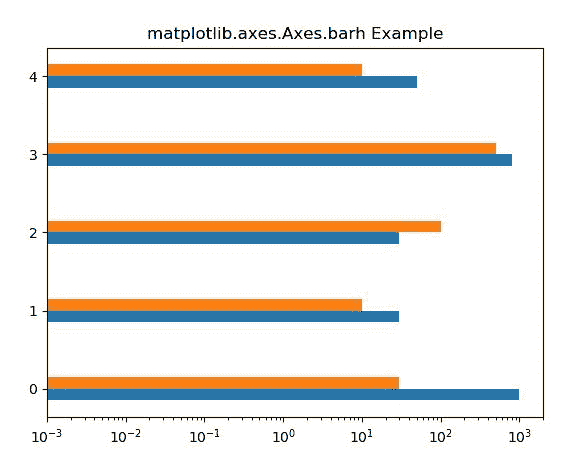
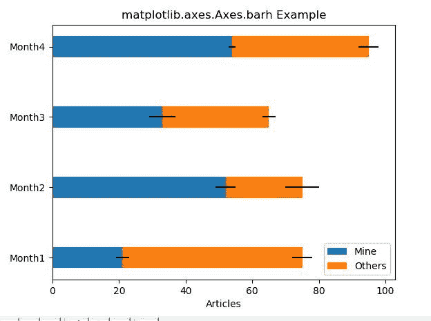

# matplotlib.axes.Axes.barh()用 Python

表示

> 哎哎哎:# t0]https://www . geeksforgeeks . org/matplot lib-axes-barh-in-python/

**[Matplotlib](https://www.geeksforgeeks.org/python-introduction-matplotlib/)** 是 Python 中的一个库，是 NumPy 库的数值-数学扩展。**轴类**包含了大部分的图形元素:轴、刻度、线二维、文本、多边形等。，并设置坐标系。Axes 的实例通过回调属性支持回调。

## matplotlib . axes . axes . barh()函数

matplotlib 库的 Axes 模块中的 **Axes.barh()函数**用于制作横条图。

> **语法:** Axes.barh(self，y，width，height=0.8，left=None，* align = ' center '，**kwargs)
> 
> **参数:**该方法接受以下描述的参数:
> 
> *   **y:** 该参数是条的 y 坐标序列。
> *   **高度:**该参数是杆的高度。
> *   **宽度:**此参数为可选参数。默认值为 *0.8* 的条宽。
> *   **左:**该参数也是可选参数。它是条左侧的 x 坐标。
> *   **对齐:**该参数也是可选参数。它用于将条与 y 坐标对齐。
> 
> **返回:**这将返回以下内容:
> 
> *   **BarContainer:** 这将返回包含所有条和可选错误条的容器。

下面的例子说明了 matplotlib.axes.Axes.barh()函数在 matplotlib.axes 中的作用:

**示例#1:**

```py
# Implementation of matplotlib function
import matplotlib.pyplot as plt
import numpy as np

data = ((1000, 30), (30, 10),
        (30, 100), (800, 500), 
        (50, 10))

dim = len(data[0])
w = 0.3
dimw = w / dim

fig, ax = plt.subplots()
x = np.arange(len(data))

for i in range(len(data[0])):
    y = [d[i] for d in data]
    b = ax.barh(x + i * dimw, y,
                dimw, left = 0.001)

ax.set_yticks(x + dimw / 2)
ax.set_yticklabels(map(str, x))
ax.set_xscale('log')

ax.set_title('matplotlib.axes.Axes.barh Example')

plt.show()
```

**输出:**


**例 2:**

```py
# ImpleMinetation of matplotlib function
import numpy as np
import matplotlib.pyplot as plt

labels = ['Month1', 'Month2', 
          'Month3', 'Month4']

mine = [21, 52, 33, 54]
others = [54, 23, 32, 41]
Mine_std = [2, 3, 4, 1]
Others_std = [3, 5, 2, 3]
width = 0.3

fig, ax = plt.subplots()

ax.barh(labels, mine, width,
        xerr = Mine_std, 
        label ='Mine')

ax.barh(labels, others, width, 
        xerr = Others_std, 
        left = mine, 
        label ='Others')

ax.set_xlabel('Articles')
ax.legend()

ax.set_title('matplotlib.axes.Axes.barh Example')

plt.show()
```

**输出:**
