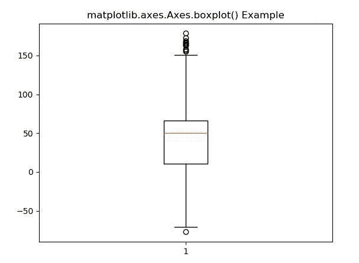
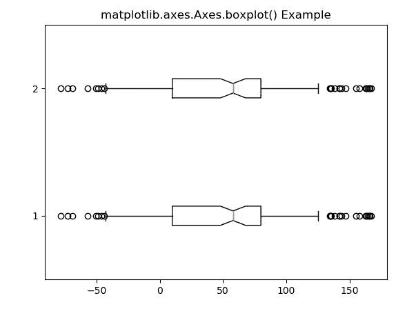

# matplot lib . axes . axes . box plot()用 Python

表示

> 哎哎哎:# t0]https://www . geeksforgeeks . org/matplot lib-axes-box plot-in-python/

**[Matplotlib](https://www.geeksforgeeks.org/python-introduction-matplotlib/)** 是 Python 中的一个库，是 NumPy 库的数值-数学扩展。**轴类**包含了大部分的图形元素:轴、刻度、线条 2D、文本、多边形等。，并设置坐标系。Axes 的实例通过回调属性支持回调。

## matplotlib.axes.Axes.boxplot()函数

matplotlib 库的 Axes 模块中的 **Axes.boxplot()函数**用于对 x 的每一列或序列 x 中的每一个向量做一个方框和须图。

> **语法:** Axes.boxplot(self，x，notch=None，sym=None，vert=None，whis=None，positions=None，widths = None，patch_artist=None，bootstrap=None，usermedians=None，conf_intervals=None，meanline=None，showmeans=None，showcaps=None，showbox=None，showfliers = None，boxprops=None，labels=None，flierprops = None，medianprops=None，meanprops=None，capprops = None，whi
> 
> **参数:**该方法接受以下描述的参数:
> 
> *   **x:** 这个参数是一个数据序列。
> *   **凹口:**如果为真，该参数将产生凹口方框图。否则，将生成一个矩形箱线图。
> *   **符号:**该参数为可选参数，包含字符串值。这是飞人积分的默认符号。
> *   **垂直:**该参数为可选参数，包含布尔值。如果是真的，它会使方框垂直。否则水平。
> *   **whis :** 该参数决定了须达到第一和第三个四分位数以外的范围。
> *   **引导:**该参数也是一个可选参数，它包含布尔值，并指定是否围绕凹口箱线图的中值引导置信区间。
> *   **usermedians :** 此参数是一个数组或序列，其第一维与 x 兼容。
> *   **conf_intervals :** 此参数也是一个数组或序列，其第一维与 x 兼容，第二维为 2
> *   **位置:**此参数用于设置箱子的位置。
> *   **宽度:**此参数用于用标量或序列设置每个方框的宽度。
> *   **patch_artist :** 如果该参数为假，则使用 Line2D artist 生成盒子。否则，带有 Patch 艺术家的框。
> *   **标签:**该参数是每个数据集的标签。
> *   **manage_ticks :** 此参数用于调整 tick 位置和标签。
> *   **zorder :** 该参数用于设置箱线图的 zorder。
> 
> **返回:**这将返回以下内容:
> 
> *   **结果:**这将返回字典，该字典将箱线图的每个组件映射到 matplotlib.lines.Line2D 的列表。

下面的例子说明了 matplotlib.axes.Axes.boxplot()函数在 matplotlib.axes 中的作用:

**示例-1:**

```py
# Implementation of matplotlib function
import numpy as np
import matplotlib.pyplot as plt

np.random.seed(10**7)

val1 = np.random.rand(50) * 80
val2 = np.ones(80) * 50
val3 = np.random.rand(50) * 80 + 100
val4 = np.random.rand(50) * -80
data = np.concatenate((val1, val2, val3, val4))

fig1, ax1 = plt.subplots()
ax1.boxplot(data)

ax1.set_title('matplotlib.axes.Axes.boxplot() Example')
plt.show()
```

**输出:**


**示例-2:**

```py
# Implementation of matplotlib function
import numpy as np
import matplotlib.pyplot as plt

np.random.seed(10**7)

val1 = np.random.rand(50) * 80
val2 = np.ones(25) * 80
val3 = np.random.rand(25) * 80 + 100
val4 = np.random.rand(25) * -80
data = np.concatenate((val1, val2, val3, val4))
data1 = np.concatenate((val2, val4, val1, val3))
data = [data, data1]

fig1, ax1 = plt.subplots()
ax1.boxplot(data, notch = True, vert = False, whis = 0.75)

ax1.set_title('matplotlib.axes.Axes.boxplot() Example')
plt.show()
```

**输出:**
