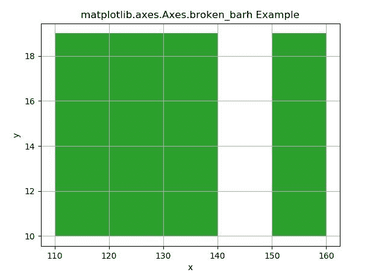
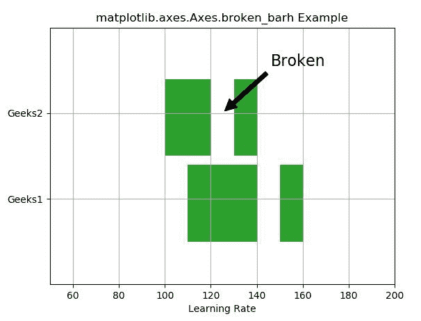

# matplotlib . axes . broken _ barh()用 Python

表示

> 哎哎哎:# t0]https://www . geeksforgeeks . org/matplot lib-axes-broken _ barh-in-python/

**[Matplotlib](https://www.geeksforgeeks.org/python-introduction-matplotlib/)** 是 Python 中的一个库，是 NumPy 库的数值-数学扩展。**轴类**包含了大部分的图形元素:轴、刻度、线二维、文本、多边形等。，并设置坐标系。Axes 的实例通过回调属性支持回调。

## matplotlib . axes . axes . breaked _ barh()函数

matplotlib 库的 Axes 模块中的**axes . breaked _ barh()函数**用于绘制矩形的水平序列。

> **语法:**
> 
> ```
> Axes.broken_barh(self, xranges, yrange, *, data=None, **kwargs)
> ```
> 
> **参数:**该方法接受以下描述的参数:
> 
> *   **y:** 该参数是条的 y 坐标序列。
> *   **xranges:** 这个参数是元组的序列(xmin，xwidth)。它是矩形的 x 位置和延伸。
> *   **吡喃格:**这个参数是元组的序列(ymin，yh8)。它是 y 位置，延伸到所有的矩形。
> 
> **返回:**这将返回以下内容:
> 
> *   **BrokenBarHCollection:** 这将返回包含所有 break _ barh 的容器。

下面的例子说明了 matplotlib.axes . axes . break _ barh()函数在 matplotlib . axes 中的作用:

**示例#1:**

```
# Implementation of matplotlib function
import matplotlib.pyplot as plt

fig, ax = plt.subplots()
ax.broken_barh([(110, 30), (150, 10)],
               (10, 9), 
               facecolors ='tab:green')

ax.set_xlabel('x')
ax.set_ylabel('y')
ax.grid(True)

ax.set_title('matplotlib.axes.Axes.\
broken_barh Example')
plt.show()
```

**输出:**


**例 2:**

```
# Implementation of matplotlib function
import matplotlib.pyplot as plt

fig, ax = plt.subplots()
ax.broken_barh([(110, 30), (150, 10)], 
               (10, 9), 
               facecolors ='tab:green')

ax.broken_barh([(100, 20),
                (130, 10)], 
               (20, 9), 
               facecolors =('tab:green'))

ax.set_ylim(5, 35)
ax.set_xlim(50, 200)
ax.set_xlabel('Learning Rate')
ax.set_yticks([15, 25])
ax.set_yticklabels(['Geeks1', 'Geeks2'])
ax.grid(True)

ax.annotate('Broken', (125, 25),
            xytext =(0.8, 0.9), 
            textcoords ='axes fraction',
            arrowprops = dict(facecolor ='black',
                              shrink = 0.05),
            fontsize = 16,
            horizontalalignment ='right', 
            verticalalignment ='top')

ax.set_title('matplotlib.axes.Axes.broken_barh Example')

plt.show()
```

**输出:**
