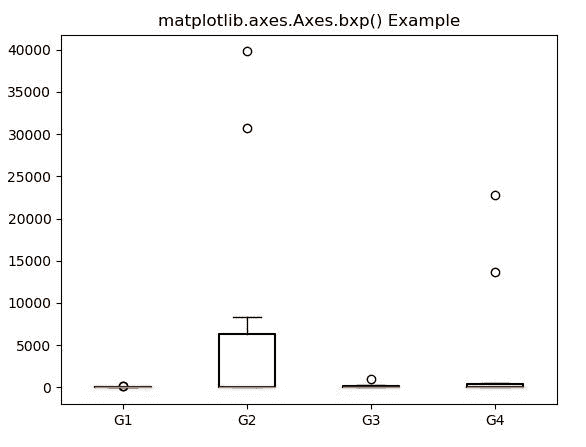
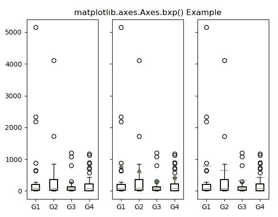

# matplotlib . axes . bxp()中的 Python

> 哎哎哎:# t0]https://www . geeksforgeeks . org/matplot lib-axes-bxp-in-python/

**[Matplotlib](https://www.geeksforgeeks.org/python-introduction-matplotlib/)** 是 Python 中的一个库，是 NumPy 库的数值-数学扩展。**轴类**包含了大部分的图形元素:轴、刻度、线二维、文本、多边形等。，并设置坐标系。Axes 的实例通过回调属性支持回调。

## matplotlib.axes.Axes.bxp()函数

matplotlib 库的 Axes 模块中的 **Axes.bxp()函数**用于对 x 的每一列或序列 x 中的每一个向量做一个方框和触须图。

> **语法:** Axes.bxp(self，bxpstats，positions=None，widths = None，vert=True，patch_artist=False，shownotches = False，showmeans=False，showcaps=True，showbox=True，showfliers = True，boxprops=None，whiskerprops = None，medianprops=None，capprops = None，meanprops=None，meanline=False，manage_ticks=True，zorder=None)
> 
> **参数:**该方法接受以下描述的参数:
> 
> *   **bxpstats :** 此参数是包含每个 boxplot 统计信息的字典列表。
> *   **位置:**该参数用于设置小提琴的位置。
> *   **垂直:**该参数为可选参数，包含布尔值。它使垂直小提琴情节如果是真的。否则水平。
> *   **宽度:**此参数用于用标量或序列设置每把小提琴的宽度。
> *   **patch_artist :** 如果该参数为假，则使用 Line2D artist 生成盒子。否则，带有 Patch 艺术家的框。
> *   **manage_ticks :** 此参数用于调整 tick 位置和标签。
> *   **zorder :** 该参数用于设置箱线图的 zorder。
> *   **显示等级:**该参数包含布尔值。它被用来产生一个缺口和矩形盒图。
> *   **显示方式:**该参数包含布尔值。它用于切换手段的呈现。
> *   **showcaps :** 此参数包含布尔值。它用于切换瓶盖的渲染。
> *   **showfliers :** 此参数包含布尔值。它用于切换传单的渲染。
> *   **盒子道具:**该参数用于设置盒子的出图风格。
> *   **胡须绘制:**该参数用于设置胡须的绘制风格。
> *   **瓶盖:**该参数用于设置瓶盖的打印样式。
> *   **传单:**此参数用于设置传单的打印样式。
> *   **中线点:**此参数用于设置中线的出图方式。
> *   **均值道具:**此参数用于设置均值的出图风格。
> 
> **返回:**这将返回以下内容:
> 
> *   **结果:**这将返回将 violinplot 的每个组件映射到 matplotlib . line . line 2d 实例列表的字典。

下面的例子说明了 matplotlib.axes.Axes.bxp()函数在 matplotlib.axes 中的作用:

**示例-1:**

```
import numpy as np
import matplotlib.pyplot as plt
import matplotlib.cbook as cbook

np.random.seed(10**7)
data = np.random.lognormal(size =(10, 4),
                           mean = 4.5, 
                           sigma = 4.75)

labels = ['G1', 'G2', 'G3', 'G4']

result = cbook.boxplot_stats(data,
                             labels = labels,
                             bootstrap = 1000)

for n in range(len(result)):
    result[n]['med'] = np.median(data)
    result[n]['mean'] *= 0.1

fig, axes1 = plt.subplots()
axes1.bxp(result)

axes1.set_title('matplotlib.axes.Axes.bxp() Example')
plt.show()
```

**输出:**


**示例-2:**

```
import numpy as np
import matplotlib.pyplot as plt
import matplotlib.cbook as cbook

np.random.seed(10**7)
data = np.random.lognormal(size =(37, 4),
                           mean = 4.5, 
                           sigma = 1.75)
labels = ['G1', 'G2', 'G3', 'G4']

stats = cbook.boxplot_stats(data, labels = labels, 
                            bootstrap = 100)

for n in range(len(stats)):
    stats[n]['med'] = np.median(data)
    stats[n]['mean'] *= 2

fig, [axes1, axes2, axes3] = plt.subplots(nrows = 1, 
                                          ncols = 3,
                                          sharey = True)

axes1.bxp(stats)
axes2.bxp(stats, showmeans = True)
axes3.bxp(stats, showmeans = True, meanline = True)

axes2.set_title('matplotlib.axes.Axes.bxp() Example')
plt.show()
```

**输出:**
