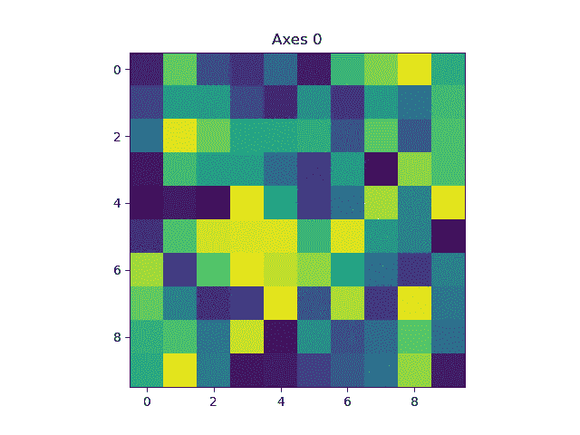
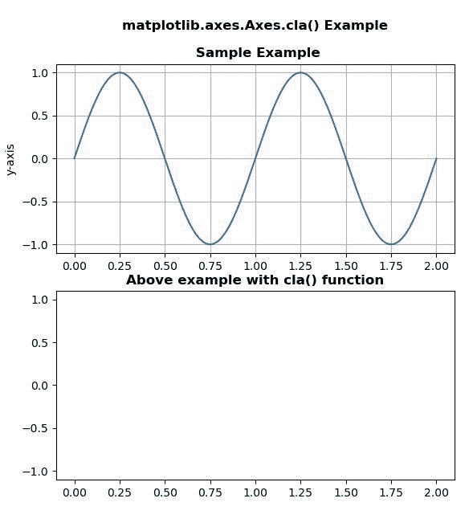

# Python 中的 Matplotlib.axes.Axes.cla()

> 原文:[https://www . geeksforgeeks . org/matplotlib-axes-axes-cla-in-python/](https://www.geeksforgeeks.org/matplotlib-axes-axes-cla-in-python/)

**[Matplotlib](https://www.geeksforgeeks.org/python-introduction-matplotlib/)** 是 Python 中的一个库，是 NumPy 库的数值-数学扩展。**轴类**包含了大部分的图形元素:轴、刻度、线二维、文本、多边形等。，并设置坐标系。Axes 的实例通过回调属性支持回调。

## matplotlib.axes.Axes.cla()函数

matplotlib 库的 Axes 模块中的 **Axes.cla()函数**用于清除当前轴。

> **语法:** Axes.cla(self)
> 
> **参数:**此方法不接受任何参数。
> 
> **返回:**该方法不返回任何值。

下面的例子说明了 matplotlib.axes.Axes.cla()函数在 matplotlib.axes 中的作用:

**例 1:**

```
# Implementation of matplotlib function
import numpy as np
import matplotlib.pyplot as plt

np.random.seed(19)
data = np.random.random((5, 10, 10))

fig, ax = plt.subplots()

for i in range(len(data)):
    ax.cla()
    ax.imshow(data[i])
    ax.set_title("Axes {}".format(i))
    plt.pause(0.1)
```

**输出:**


**例 2:**

```
# Implementation of matplotlib function
import numpy as np
import matplotlib.pyplot as plt

t = np.linspace(0.0, 2.0, 201)
s = np.sin(2 * np.pi * t)

fig, [ax, ax1] = plt.subplots(2, 1)

ax.set_ylabel('y-axis')
ax.plot(t, s)
ax.grid(True)
ax.set_title('matplotlib.axes.Axes.cla() Example\n\n Sample Example',
             fontsize = 12, fontweight ='bold')

ax1.set_ylabel('y-axis')
ax1.set_xlabel('x-axis')
ax1.plot(t, s)
ax1.grid(True)
ax1.cla()
ax1.set_title('Above example with cla()\
 function', fontsize = 12, fontweight ='bold')
plt.show()
```

**输出:**
