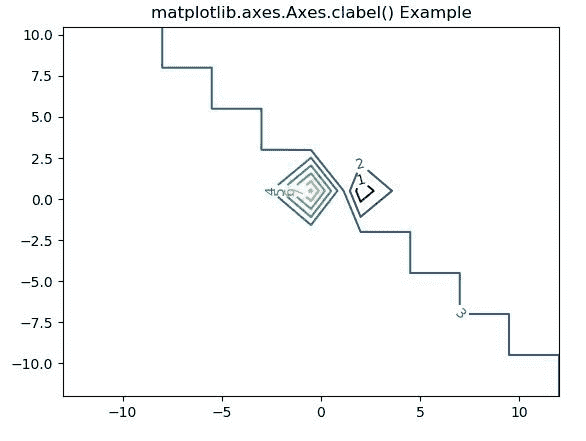
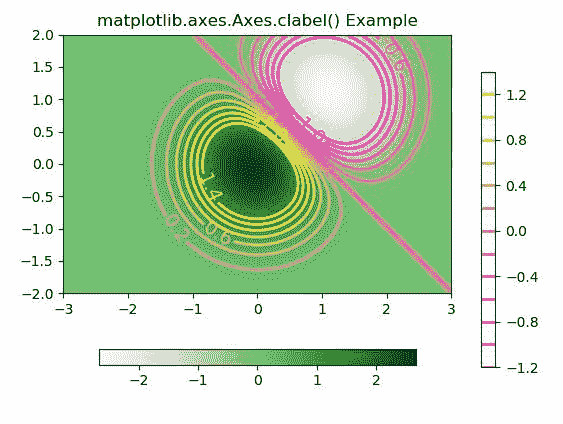

# Matplotlib.axes.Axes.clabel()用 Python

表示

> 哎哎哎:# t0]https://www . geeksforgeeks . org/matplotlib-axes-clabel-in-python/

**[Matplotlib](https://www.geeksforgeeks.org/python-introduction-matplotlib/)** 是 Python 中的一个库，是 NumPy 库的数值-数学扩展。**轴类**包含了大部分的图形元素:轴、刻度、线二维、文本、多边形等。，并设置坐标系。Axes 的实例通过回调属性支持回调。

## matplotlib.axes.Axes.clabel()函数

matplotlib 库的 Axes 模块中的 **Axes.clabel()函数**用于标注等高线图。

> **语法:**
> 
> ```
> Axes.clabel(self, CS, *args, **kwargs)
> ```
> 
> **参数:**该方法接受以下描述的参数:
> 
> *   **cs :** 该参数是要标注的控件。
> *   **fontsize :** 此参数是以磅为单位的大小。
> *   **gridsize :** 此参数表示 x 方向或两个方向的六边形数量。
> *   **颜色:**该参数用于给标签上色
> *   **内联:**此参数移除放置标签的基础轮廓。
> *   **inline_spacing :** 此参数是内联放置时在标签每一侧留下的空间(以像素为单位)。
> *   **边缘:**此参数用于将边缘密度绘制为沿 x 轴底部和 y 轴左侧的彩色矩形。
> *   **fmt :** 此参数是标签的格式字符串。
> *   **手动:**此参数用于使用鼠标放置连续标签。
> *   **右侧向上:**此参数用于旋转标签。
> *   **使用 _clabeltext :** 此参数用于创建标签。ClabelText 重新计算文本的旋转角度。
> 
> **返回:**这将返回以下内容:
> 
> *   **标签:**这将返回标签的文本实例列表。

下面的例子说明了 matplotlib.axes.Axes.clabel()函数在 matplotlib.axes 中的作用:

**示例-1:**

```
# Implementation of matplotlib function
import numpy as np
import matplotlib.pyplot as plt
import matplotlib.ticker as ticker
import matplotlib

delta = 2.5
x = np.arange(-13.0, 13.0, delta)
y = np.arange(-12.0, 12.0, delta)
X, Y = np.meshgrid(x, y)
Z = (np.exp(-X**2 - Y**2) - np.exp(-(X - 1)**2 - (Y - 1)**2)) * 3

fig1, ax1 = plt.subplots()
CS1 = ax1.contour(X, Y, Z)

fmt = {}
strs = ['1', '2', '3', '4', '5', '6', '7']
for l, s in zip(CS1.levels, strs):
    fmt[l] = s
ax1.clabel(CS1, CS1.levels, inline = True,
           fmt = fmt, fontsize = 10)

ax1.set_title('matplotlib.axes.Axes.clabel() Example')
plt.show()
```

**输出:**


**示例-2:**

```
# Implementation of matplotlib function
import matplotlib
import numpy as np
import matplotlib.cm as cm
import matplotlib.pyplot as plt

delta = 0.025
x = np.arange(-3.0, 3.0, delta)
y = np.arange(-2.0, 2.0, delta)
X, Y = np.meshgrid(x, y)
Z = (np.exp(-X**2 - Y**2) - np.exp(-(X - 1)**2 - (Y - 1)**2)) * 3

fig, ax = plt.subplots()
im = ax.imshow(Z, interpolation ='bilinear', origin ='lower',
               cmap ="Greens", extent =(-3, 3, -2, 2))

levels = np.arange(-1.2, 1.6, 0.2)
CS = ax.contour(Z, levels, origin ='lower', cmap ='spring',
                linewidths = 2, extent =(-3, 3, -2, 2))
zc = CS.collections[6]
plt.setp(zc, linewidth = 4)

ax.clabel(CS, levels[1::2], inline = 1, fmt ='% 1.1f',
          fontsize = 14)

CB = fig.colorbar(CS, shrink = 0.8, extend ='both')
CBI = fig.colorbar(im, orientation ='horizontal',
                   shrink = 0.8)

ax.set_title('matplotlib.axes.Axes.clabel() Example')
plt.show()
```

**输出:**
