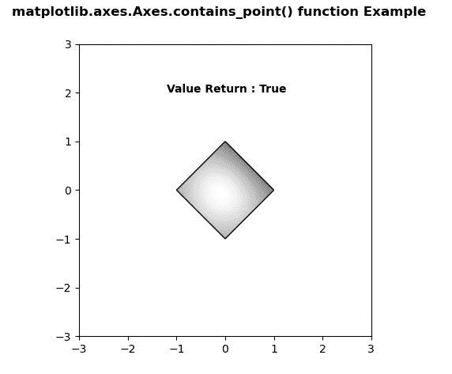
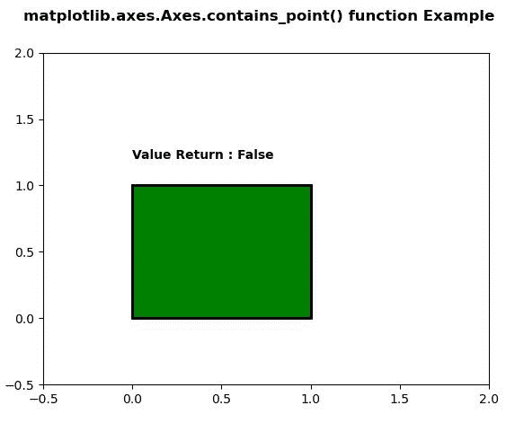

# Python 中的 matplotlib . axes . axes . contains _ point()

> 原文:[https://www . geeksforgeeks . org/matplotlib-axes-axes-contains _ point-in-python/](https://www.geeksforgeeks.org/matplotlib-axes-axes-contains_point-in-python/)

**[Matplotlib](https://www.geeksforgeeks.org/python-introduction-matplotlib/)** 是 Python 中的一个库，是 NumPy 库的数值-数学扩展。**轴类**包含了大部分的图形元素:轴、刻度、线二维、文本、多边形等。，并设置坐标系。Axes 的实例通过回调属性支持回调。

## matplotlib . axes . axes . contains _ point()函数

matplotlib 库的 Axes 模块中的 **Axes.contains_point()函数**用于返回点(像素坐标对)是否在 axes 面片内。

> **语法:** Axes.contains_point(自身，点)
> 
> **参数:**该方法只接受一个参数。
> 
> *   **点:**该参数为像素坐标对。
> 
> **返回:**该方法返回布尔值。

下面的例子说明了 matplotlib.axes . axes . contains _ point()函数在 matplotlib . axes 中的作用:

**例 1:**

```
# Implementation of matplotlib function
import numpy as np
import matplotlib.cm as cm
import matplotlib.pyplot as plt
import matplotlib.cbook as cbook
from matplotlib.path import Path
from matplotlib.patches import PathPatch

delta = 0.025
x = y = np.arange(-3.0, 3.0, delta)
X, Y = np.meshgrid(x, y)
Z1 = np.exp(-X**2 - Y**2)
Z2 = np.exp(-(X - 1)**2 - (Y - 1)**2)
Z = (Z1 - Z2) * 2

path = Path([[0, 1], [1, 0], [0, -1], 
             [-1, 0], [0, 1]])
patch = PathPatch(path, facecolor ='none')

fig, ax = plt.subplots()
ax.add_patch(patch)

im = ax.imshow(Z,
               interpolation ='bilinear',
               cmap = cm.gray,
               origin ='lower', 
               extent =[-3, 3, -3, 3],
               clip_path = patch, 
               clip_on = True)

im.set_clip_path(patch)

ax.text(-1.2, 2,
        "Value Return : "+ str(path.contains_point([0, 0])),
        fontweight ="bold", 
        fontsize = 10)

fig.suptitle('matplotlib.axes.Axes.contains_point() \
function Example', fontweight ="bold")

plt.show()
```

**输出:**


**例 2:**

```
# Implementation of matplotlib function
import matplotlib.pyplot as plt
from matplotlib.path import Path
import matplotlib.patches as patches

verts = [(0., 0.), (0., 1.), 
         (1., 1.), (1., 0.), 
         (0., 0.)]

codes = [Path.MOVETO, Path.LINETO,
         Path.LINETO, Path.LINETO, Path.CLOSEPOLY]

path = Path(verts, codes)

fig, ax = plt.subplots()
patch = patches.PathPatch(path, facecolor ='green', lw = 2)
ax.add_patch(patch)
ax.set_xlim(-0.5, 2)
ax.set_ylim(-0.5, 2)

ax.text(0, 1.2, 
        "Value Return : "+ str(path.contains_point([5, 5])), 
        fontweight ="bold",
        fontsize = 10)

fig.suptitle('matplotlib.axes.Axes.contains_point()\
function Example', fontweight ="bold")

plt.show()
```

**输出:**
