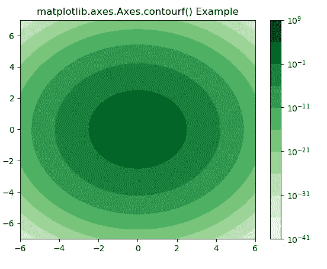
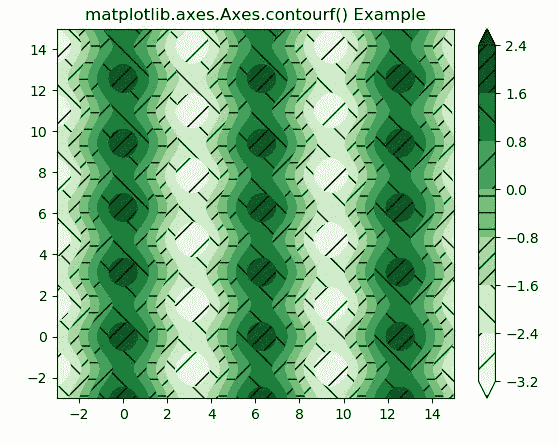

# matplotlib . axes . contourf()用 Python

表示

> 哎哎哎:# t0]https://www . geeksforgeeks . org/matplot lib-axes-contourf-in-python/

**[Matplotlib](https://www.geeksforgeeks.org/python-introduction-matplotlib/)** 是 Python 中的一个库，是 NumPy 库的数值-数学扩展。**轴类**包含了大部分的图形元素:轴、刻度、线二维、文本、多边形等。，并设置坐标系。Axes 的实例通过回调属性支持回调。

## matplotlib . axes . axes . contourf()函数

matplotlib 库的 Axes 模块中的 **Axes.contourf()函数**也用于绘制等高线。但是**轮廓图**绘制填充轮廓，而**轮廓图**绘制轮廓线。

> **语法:**
> 
> ```py
> Axes.contourf(self, *args, data=None, **kwargs)
> ```
> 
> **参数:**该方法接受以下描述的参数:
> 
> *   **X，Y:** 这些参数是 z 中数值的坐标
> *   **Z :** 该参数是绘制轮廓的高度值。
> *   **级别:**此参数用于确定轮廓线/区域的数量和位置。
> 
> **返回:**这将返回以下内容:
> 
> *   **c :** 这将返回**四通道**。

下面的例子说明了 matplotlib.axes.Axes.contourf()函数在 matplotlib.axes 中的作用:

**示例-1:**

```py
# Implementation of matplotlib function
import numpy as np
import matplotlib.pyplot as plt
from numpy import ma
from matplotlib import ticker, cm

N = 1000
x = np.linspace(-6.0, 6.0, N)
y = np.linspace(-7.0, 7.0, N)
X, Y = np.meshgrid(x, y)

Z1 = np.exp(-(X)**2 - (Y)**2)
z = 50 * Z1
z[:5, :5] = -1
z = ma.masked_where(z <= 0, z)

fig, ax = plt.subplots()
cs = ax.contourf(X, Y, z, locator = ticker.LogLocator(),
                 cmap ="Greens")

cbar = fig.colorbar(cs)
ax.set_title('matplotlib.axes.Axes.contourf() Example')

plt.show()
```

**输出:**


**示例-2:**

```py
# Implementation of matplotlib function
import matplotlib.pyplot as plt
import numpy as np

# invent some numbers, turning the
# x and y arrays into simple 2d arrays,
# which make combining them together easier.
x = np.linspace(-3, 15, 450).reshape(1, -1)
y = np.linspace(-3, 15, 720).reshape(-1, 1)
z = np.cos(x)*2 - np.sin(y)**2

# we no longer need x and y to be
# 2 dimensional, so flatten them.
x, y = x.flatten(), y.flatten()

fig1, ax1 = plt.subplots()
cs = ax1.contourf(x, y, z, hatches =['-', '/', '\\', '//'],
                  cmap ='Greens', extend ='both', alpha = 1)
fig1.colorbar(cs)
ax1.set_title('matplotlib.axes.Axes.contourf() Example')
plt.show()
```

**输出:**
