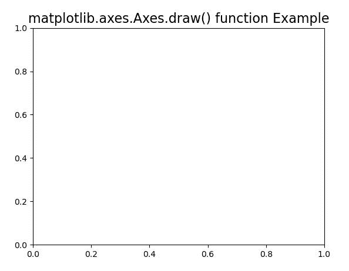
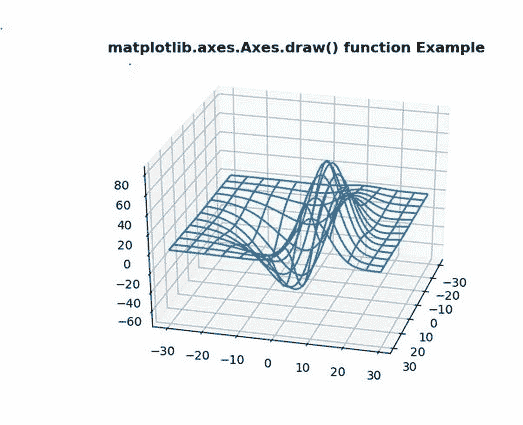

# Python 中的 Matplotlib.axes.Axes.draw()

> 原文:[https://www . geeksforgeeks . org/matplotlib-axes-axes-draw-in-python/](https://www.geeksforgeeks.org/matplotlib-axes-axes-draw-in-python/)

**[Matplotlib](https://www.geeksforgeeks.org/python-introduction-matplotlib/)** 是 Python 中的一个库，是 NumPy 库的数值-数学扩展。**轴类**包含了大部分的图形元素:轴、刻度、线二维、文本、多边形等。，并设置坐标系。Axes 的实例通过回调属性支持回调。

## matplotlib.axes.Axes.draw()函数

matplotlib 库的 Axes 模块中的 **Axes.draw()函数**用来绘制一切。

> **语法:** Axes.draw(self，渲染器=无，inframe=False)
> 
> **参数:**该方法接受以下参数。
> 
> *   **渲染器:**该参数为第一个参数，默认值为无。
> *   **inframe:** 该参数包含布尔值，默认值为 false。
> 
> **返回:**该方法不返回值。

下面的例子说明了 matplotlib.axes.Axes.draw()函数在 matplotlib.axes 中的作用:

**例 1:**

```
# Implementation of matplotlib function 
from mpl_toolkits.mplot3d import axes3d 
import matplotlib.pyplot as plt 

fig, ax = plt.subplots() 

def tellme(s): 
    ax.set_title(s, fontsize = 16) 
    fig.canvas.draw()
    renderer = fig.canvas.renderer
    ax.draw(renderer)

tellme('matplotlib.axes.Axes.draw() function Example') 
plt.show() 
```

**输出:**


**例 2:**

```
# Implementation of matplotlib function 
from mpl_toolkits.mplot3d import axes3d 
import matplotlib.pyplot as plt 

fig = plt.figure() 
ax = fig.add_subplot(111, projection ='3d') 

X, Y, Z = axes3d.get_test_data(0.1) 
ax.plot_wireframe(X, Y, Z, rstride = 5,  
                  cstride = 5) 

for angle in range(0, 90): 
    ax.view_init(30, angle)
    fig.canvas.draw()
    renderer = fig.canvas.renderer
    ax.draw(renderer) 
    plt.pause(.001) 
    ax.set_title('matplotlib.axes.Axes.draw()\
    function Example', fontweight ="bold") 
```

**输出:**
