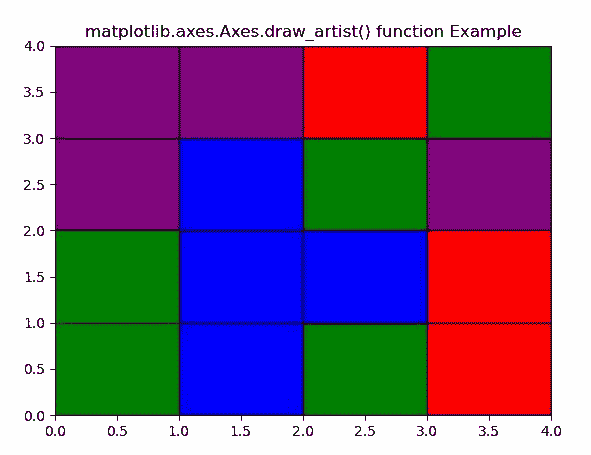
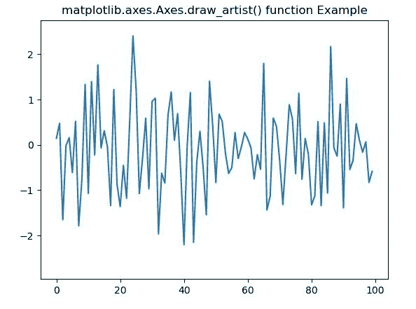

# Python 中的 matplotlib . axes . axes . draw _ artist()

> 原文:[https://www . geeksforgeeks . org/matplotlib-axes-axes-draw _ artist-in-python/](https://www.geeksforgeeks.org/matplotlib-axes-axes-draw_artist-in-python/)

**[Matplotlib](https://www.geeksforgeeks.org/python-introduction-matplotlib/)** 是 Python 中的一个库，是 NumPy 库的数值-数学扩展。**轴类**包含了大部分的图形元素:轴、刻度、线二维、文本、多边形等。，并设置坐标系。Axes 的实例通过回调属性支持回调。

## matplotlib . axes . axes . draw _ artist()函数

matplotlib 库的 axes 模块中的 **Axes.draw_artist()函数**用于高效更新 Axes 数据。

> **语法:** Axes.draw_artist(self，a)
> 
> **参数:**该方法接受以下参数。
> 
> *   **a:** 这个参数是要画的艺术家。
> 
> **返回:**该方法不返回值。

**注意:**该方法只能在缓存渲染器的初始绘制后使用。

下面的例子说明了 matplotlib.axes . axes . draw _ artist()函数在 matplotlib . axes 中的作用:

**例 1:**

```
# Implementation of matplotlib function 
from random import randint, choice
import time
import matplotlib.pyplot as plt
import matplotlib.patches as mpatches

back_color = "black"
colors = ['red', 'green', 'blue', 'purple']
width, height = 4, 4

fig, ax = plt.subplots()
ax.set(xlim =[0, width], ylim =[0, height])

fig.canvas.draw()

def update():
    x = randint(0, width - 1)
    y = randint(0, height - 1)

    arti = mpatches.Rectangle(
        (x, y), 1, 1,
        facecolor = choice(colors),
        edgecolor = back_color
    )
    ax.add_artist(arti)

    start = time.time()
    ax.draw_artist(arti)
    fig.canvas.blit(ax.bbox)
    print("Draw at time :", time.time() - start)

timer = fig.canvas.new_timer(interval = 1)
timer.add_callback(update)
timer.start()

ax.set_title('matplotlib.axes.Axes.draw_artist()\
 function Example') 

plt.show() 
```

**输出:**



```
Draw at time : 0.37501978874206543
Draw at time : 0.015624046325683594
Draw at time : 0.03127431869506836
Draw at time : 0.015625953674316406
Draw at time : 0.015601396560668945
Draw at time : 0.015614986419677734
........
so on...

```

**例 2:**

```
# Implementation of matplotlib function 
import matplotlib.pyplot as plt
import numpy as np
import time

fig, ax = plt.subplots()
line, = ax.plot(np.random.randn(100))

tstart = time.time()
num_plots = 0
fig.canvas.draw()

while time.time()-tstart < 5:
    line.set_ydata(np.random.randn(100))
    ax.draw_artist(ax.patch)
    ax.draw_artist(line)
    num_plots += 1

ax.set_title('matplotlib.axes.Axes.draw_artist() \
function Example') 

plt.show() 
```

**输出:**
