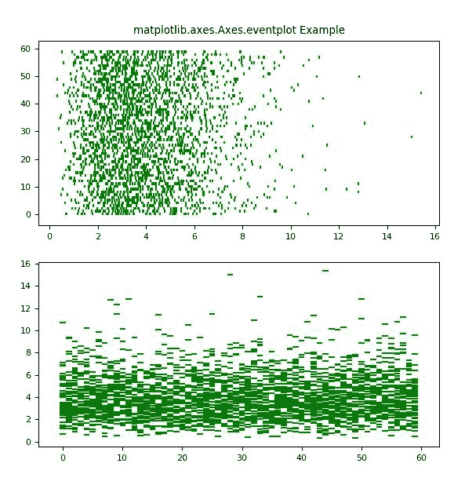

# matplotlib . axes . events plot()中的 Python

> 哎哎哎:# t0]https://www . geeksforgeeks . org/matplot lib-axes-events plot-in-python/

**[Matplotlib](https://www.geeksforgeeks.org/python-introduction-matplotlib/)** 是 Python 中的一个库，是 NumPy 库的数值-数学扩展。**轴类**包含了大部分的图形元素:轴、刻度、线二维、文本、多边形等。，并设置坐标系。Axes 的实例通过回调属性支持回调。

## matplotlib.axes.Axes.eventplot()函数

matplotlib 库的 Axes 模块中的 **Axes.eventplot()函数**用于在给定位置绘制相同的平行线。

> **语法:** Axes.eventplot(self，positions，orientation= '水平'，lineoffsets = 1，linelengths = 1，linewidths = None，colors=None，linestyles = ' solid '，*，data=None，**kwargs)
> 
> **参数:**该方法接受以下描述的参数:
> 
> *   **位置:**这个参数是对象的序列，每个值都是一个事件。
> *   **方向:**此参数用于控制事件集合的方向{ '水平'，'垂直' }。
> *   **线偏移:**此参数是线中心在与方向正交的方向上从原点的偏移。
> *   **线路长度:**该参数是线路的总高度。
> *   **线宽:**该参数是事件线的线宽，以磅为单位。
> 
> **返回:**这将返回以下内容:
> 
> *   **列表:**返回 EventCollection 对象列表。

下面的例子说明了 matplotlib.axes.Axes.eventplot()函数在 matplotlib.axes 中的作用:

**示例#1:**

```py
#Implementation of matplotlib function
import numpy as np
import matplotlib.pyplot as plt
import matplotlib

matplotlib.rcParams['font.size'] = 8.0

np.random.seed(789680)
data1 = np.random.random([6, 50])

colors1 = ['C{}'.format(i) for i in range(6)]
lineoffsets1 = np.array([-9, -13, 1, 
                         15, 6, 10])

linelengths1 = [5, 2, 9, 11, 3, 5]

fig, axs = plt.subplots()
axs.eventplot(data1, colors=colors1, 
              lineoffsets=lineoffsets1,
              linelengths=linelengths1)

axs.set_title('matplotlib.axes.Axes.eventplot Example')
plt.show()
```

**输出:**


**例 2:**

```py
# Implementation of matplotlib function
import numpy as np
import matplotlib.pyplot as plt
import matplotlib

matplotlib.rcParams['font.size'] = 8.0

np.random.seed(789680)
data1 = np.random.gamma(4, size =[60, 50])

lineoffsets1 = 1
linelengths1 = 1

fig, [axs1, axs2]= plt.subplots(2, 1)
axs1.eventplot(data1, colors ='green',
               lineoffsets = lineoffsets1, 
               linelengths = linelengths1)

axs2.eventplot(data1, colors ='green',
               lineoffsets = lineoffsets1,
               linelengths = linelengths1, 
               orientation ='vertical')

axs1.set_title('matplotlib.axes.Axes.eventplot Example')
plt.show()
```

