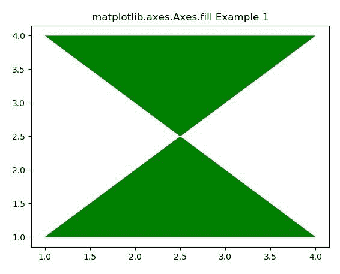
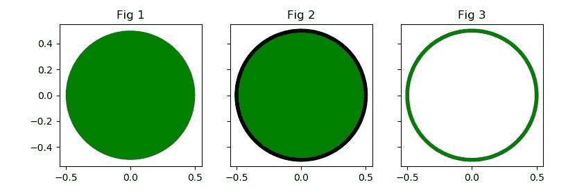

# Python 中的 Matplotlib.axes.Axes.fill()

> 原文:[https://www . geeksforgeeks . org/matplotlib-axes-axes-fill-in-python/](https://www.geeksforgeeks.org/matplotlib-axes-axes-fill-in-python/)

**[Matplotlib](https://www.geeksforgeeks.org/python-introduction-matplotlib/)** 是 Python 中的一个库，是 NumPy 库的数值-数学扩展。**轴类**包含了大部分的图形元素:轴、刻度、线二维、文本、多边形等。，并设置坐标系。Axes 的实例通过回调属性支持回调。

## matplotlib.axes.Axes.fill()函数

matplotlib 库的 Axes 模块中的 **Axes.fill()函数**用于绘制填充多边形。

> **语法:**
> 
> ```
> Axes.fill(self, *args, data=None, **kwargs)
> ```
> 
> **参数:**该方法接受以下描述的参数:
> 
> *   ***args:** 这些参数是其节点的 x 和 y 位置列表，可选地后跟颜色说明符。
> *   **数据:**该参数为可选参数，是一个带有标签数据的对象。
> 
> **返回:**返回多边形列表。

下面的例子说明了 matplotlib.axes.Axes.fill()函数在 matplotlib.axes 中的作用:

**示例-1:**

```
# Implementation of matplotlib function

import numpy as np
from matplotlib import patches
import matplotlib.pyplot as plt

x = np.array([1, 4, 1, 4])
y = np.array([1, 1, 4, 4])

fig, ax1 = plt.subplots()
ax1.fill(x, y, facecolor ='green')
ax1.set_title('matplotlib.axes.Axes.fill Example 1')
plt.show()
```

**输出:**


**示例-2:**

```
# Implementation of matplotlib function

import numpy as np
from matplotlib import patches
import matplotlib.pyplot as plt

theta = np.deg2rad(np.arange(0.0, 360.0, 1.0))
x = 0.5 * np.cos(theta)
y = 0.5 * np.sin(theta)

fig, (ax1, ax2, ax3) = plt.subplots(1, 3, figsize =(9, 3),
                                    subplot_kw ={'aspect': 'equal'},
                                    sharey = True)
ax1.fill(x, y, facecolor ='green')
ax1.set_title('Fig 1')

ax2.fill(x, y, facecolor ='green', edgecolor ='black',
         linewidth = 4)

ax2.set_title('Fig 2')

ax3.fill(x, y, facecolor ='none', edgecolor ='green', 
         linewidth = 4)
ax3.set_title('Fig 3')

plt.show()
```

**输出:**
