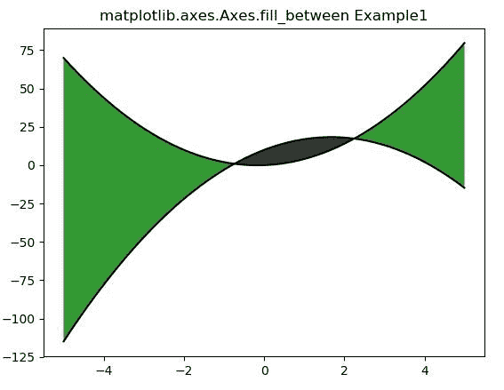
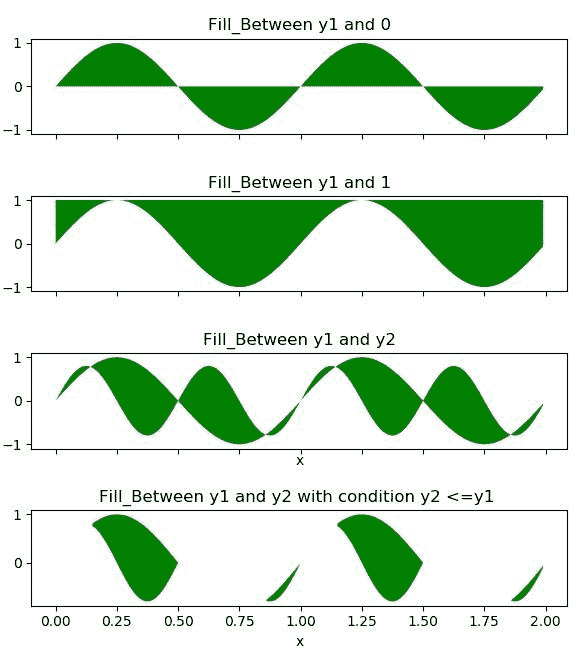

# Python 中的 matplotlib . axes . axes . fill _ between()

> 原文:[https://www . geeksforgeeks . org/matplotlib-axes-axes-fill _ in-python/](https://www.geeksforgeeks.org/matplotlib-axes-axes-fill_between-in-python/)

**[Matplotlib](https://www.geeksforgeeks.org/python-introduction-matplotlib/)** 是 Python 中的一个库，是 NumPy 库的数值-数学扩展。

**轴类**包含大部分图形元素:轴、刻度、线 2D、文本、多边形等。，并设置坐标系。Axes 的实例通过回调属性支持回调。

## matplotlib . axes . axes . fill _ between()函数

matplotlib 库的 Axes 模块中的 **Axes.fill_between()函数**用于填充两条水平曲线之间的区域。

> **语法:** Axes.fill_between(self，x，y1，y2=0，其中=None，interpolate = False，step=None，* data = None，**kwargs)
> 
> **参数:**该方法接受以下描述的参数:
> 
> *   **x:** 该参数包含用于定义曲线的数据点的水平坐标。
> *   **y1:** 该参数包含用于定义第一条曲线的数据点的 y 坐标
> *   **y2:** 该参数包含用于定义第二条曲线的数据点的 y 坐标。它是可选的，默认值为 0。
> *   **其中:**该参数为可选参数。并且用于排除一些水平区域被填充。
> *   **插值:**该参数也是可选参数。默认值为误差线的线宽*无*。
> *   **步骤:**该参数也是可选参数。它用于定义填充是否应该是阶跃函数。
> 
> **返回:**返回包含绘制多边形的多边形集合。

下面的例子说明了 matplotlib.axes . axes . fill _ better()函数在 matplotlib . axes 中的作用:

**示例-1:**

```
# Implementation of matplotlib function

import numpy as np
import matplotlib.pyplot as plt

x = np.arange(-5, 5, 0.01)
y1 = -3 * x*x + 10 * x + 10
y2 = 3 * x*x + x

fig, ax = plt.subplots()
ax.plot(x, y1, x, y2, color ='black')
ax.fill_between(x, y1, y2, where = y2 >y1, 
                facecolor ='green', alpha = 0.8)

ax.fill_between(x, y1, y2, where = y2 <= y1,
                facecolor ='black', alpha = 0.8)

ax.set_title('matplotlib.axes.Axes.fill_between Example1')
plt.show()
```

**输出:**


**示例-2:**

```
# Implementation of matplotlib function

import numpy as np
import matplotlib.pyplot as plt

x = np.arange(0.0, 2, 0.01)
y1 = np.sin(2 * np.pi * x)
y2 = 0.8 * np.sin(4 * np.pi * x)

fig, (ax1, ax2, ax3, ax4) = plt.subplots(4, 1,
                                         sharex = True,
                                         figsize =(6, 6))

ax1.fill_between(x, y1, facecolor ='green')
ax1.set_title('Fill_Between y1 and 0')

ax2.fill_between(x, y1, 1, facecolor ='green')
ax2.set_title('Fill_Between y1 and 1')

ax3.fill_between(x, y1, y2, facecolor ='green')
ax3.set_title('Fill_Between y1 and y2')
ax3.set_xlabel('x')
fig.tight_layout()

ax4.fill_between(x, y1, y2, where = y2 <= y1,
                 facecolor ='green')

ax4.set_title('Fill_Between y1 and y2 with condition y2 <= y1 ' )
ax4.set_xlabel('x')
fig.tight_layout()

plt.show()
```

**输出:**
