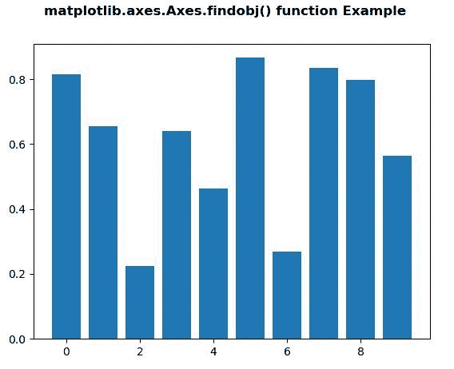
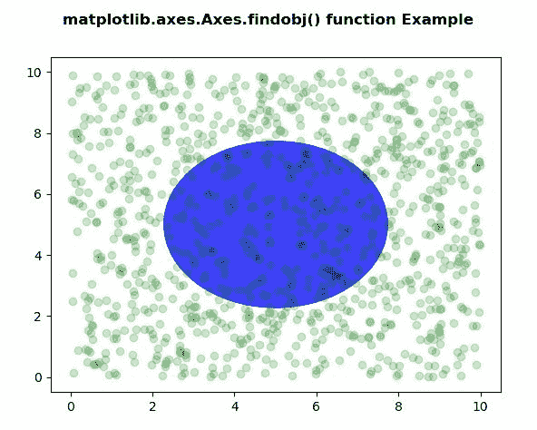

# matplotlib . axes . findobj()用 Python

表示

> 哎哎哎:# t0]https://www . geeksforgeeks . org/matplot lib-axes-findobj-in-python/

**[Matplotlib](https://www.geeksforgeeks.org/python-introduction-matplotlib/)** 是 Python 中的一个库，是 NumPy 库的数值-数学扩展。**轴类**包含了大部分的图形元素:轴、刻度、线二维、文本、多边形等。，并设置坐标系。Axes 的实例通过回调属性支持回调。

## matplotlib.axes.Axes.findobj()函数

matplotlib 库的 Axes 模块中的 **Axes.findobj()函数**用于查找艺术家对象。

> **语法:** Axes.findobj(self，match=None，include_self=True)
> 
> **参数:**该方法接受以下参数。
> 
> *   **匹配:**该参数是匹配的过滤标准。默认值为无。
> *   **include_self :** 此参数将 self 包含在要检查匹配的列表中。
> 
> **返回:**此法返回**艺人**(艺人列表)。

下面的例子说明了 matplotlib.axes.Axes.findobj()函数在 matplotlib.axes 中的作用:

**例 1:**

```py
# Implementation of matplotlib function
import matplotlib.pyplot as plt
from matplotlib.lines import Line2D
import numpy as np
from numpy.random import rand

fig, ax2 = plt.subplots()

ax2.bar(range(10), rand(10), picker = True)

for label in ax2.get_xticklabels(): 
    label.set_picker(True)

def onpick1(event):

    if isinstance(event.artist, Line2D):
        thisline = event.artist
        xdata = thisline.get_xdata()
        ydata = thisline.get_ydata()
        ind = event.ind
        print('onpick1 line:',
              np.column_stack([xdata[ind],
                               ydata[ind]]))

    elif isinstance(event.artist, Rectangle):
        patch = event.artist
        print('onpick1 patch:', patch.get_path())

    elif isinstance(event.artist, Text):
        text = event.artist
        print('onpick1 text:', text.get_text())

print("Value return : \n", *list(ax2.findobj()), sep ="\n")

fig.suptitle('matplotlib.axes.Axes.findobj() function Example',
             fontweight ="bold")

plt.show()
```

**输出:**


```py
Value return : 

Rectangle(xy=(-0.4, 0), width=0.8, height=0.815228, angle=0)
Rectangle(xy=(0.6, 0), width=0.8, height=0.655121, angle=0)
Rectangle(xy=(1.6, 0), width=0.8, height=0.225002, angle=0)
Rectangle(xy=(2.6, 0), width=0.8, height=0.639457, angle=0)
Rectangle(xy=(3.6, 0), width=0.8, height=0.463923, angle=0)
Rectangle(xy=(4.6, 0), width=0.8, height=0.865994, angle=0)
Rectangle(xy=(5.6, 0), width=0.8, height=0.269864, angle=0)
Rectangle(xy=(6.6, 0), width=0.8, height=0.834427, angle=0)
Rectangle(xy=(7.6, 0), width=0.8, height=0.79638, angle=0)
Rectangle(xy=(8.6, 0), width=0.8, height=0.564809, angle=0)
Spine
Spine
Spine
Spine
Text(0.5, 0, '')
Text(1, 0, '')
Line2D()
Line2D()
Line2D((0, 0), (0, 1))
Text(0, 0, '')
Text(0, 1, '')

Line2D()
Line2D()
Line2D((0, 0), (0, 1))
Text(0, 0, '')
Text(0, 1, '')

Line2D()
Line2D()
Line2D((0, 0), (0, 1))
Text(0, 0, '')
Text(0, 1, '')

Line2D()
Line2D()
Line2D((0, 0), (0, 1))
Text(0, 0, '')
Text(0, 1, '')

Line2D()
Line2D()
Line2D((0, 0), (0, 1))
Text(0, 0, '')
Text(0, 1, '')

Line2D()
Line2D()
Line2D((0, 0), (0, 1))
Text(0, 0, '')
Text(0, 1, '')

Line2D()
Line2D()
Line2D((0, 0), (0, 1))
Text(0, 0, '')
Text(0, 1, '')

XAxis(80.0, 52.8)
Text(0, 0.5, '')
Text(0, 0.5, '')
Line2D()
Line2D()
Line2D((0, 0), (1, 0))
Text(0, 0, '')
Text(1, 0, '')

Line2D()
Line2D()
Line2D((0, 0), (1, 0))
Text(0, 0, '')
Text(1, 0, '')

Line2D()
Line2D()
Line2D((0, 0), (1, 0))
Text(0, 0, '')
Text(1, 0, '')

Line2D()
Line2D()
Line2D((0, 0), (1, 0))
Text(0, 0, '')
Text(1, 0, '')

Line2D()
Line2D()
Line2D((0, 0), (1, 0))
Text(0, 0, '')
Text(1, 0, '')

Line2D()
Line2D()
Line2D((0, 0), (1, 0))
Text(0, 0, '')
Text(1, 0, '')

YAxis(80.0, 52.8)
Text(0.5, 1.0, '')
Text(0.0, 1.0, '')
Text(1.0, 1.0, '')
Rectangle(xy=(0, 0), width=1, height=1, angle=0)
AxesSubplot(0.125, 0.11;0.775x0.77)

```

**例 2:**

```py
# Implementation of matplotlib function
import numpy as np
import matplotlib.pyplot as plt
import matplotlib.patches as mpatches

fig, ax = plt.subplots()
x, y = 10 * np.random.rand(2, 1000)
ax.plot(x, y, 'go', alpha = 0.2)

circ = mpatches.Circle((0.5, 0.5), 0.25,
                       transform = ax.transAxes,
                       facecolor ='blue', 
                       alpha = 0.75)
ax.add_patch(circ)

print("Value return : \n", *list(ax.findobj()),
      sep ="\n")

fig.suptitle('matplotlib.axes.Axes.findobj()\
function Example', fontweight ="bold")

plt.show()
```

**输出:**


```py
Value return : 

Circle(xy=(0.5, 0.5), radius=0.25)
Line2D(_line0)
Spine
Spine
Spine
Spine
Text(0.5, 0, '')
Text(1, 0, '')
Line2D()
Line2D()
Line2D((0, 0), (0, 1))
Text(0, 0, '')
Text(0, 1, '')

Line2D()
Line2D()
Line2D((0, 0), (0, 1))
Text(0, 0, '')
Text(0, 1, '')

Line2D()
Line2D()
Line2D((0, 0), (0, 1))
Text(0, 0, '')
Text(0, 1, '')

Line2D()
Line2D()
Line2D((0, 0), (0, 1))
Text(0, 0, '')
Text(0, 1, '')

Line2D()
Line2D()
Line2D((0, 0), (0, 1))
Text(0, 0, '')
Text(0, 1, '')

Line2D()
Line2D()
Line2D((0, 0), (0, 1))
Text(0, 0, '')
Text(0, 1, '')

Line2D()
Line2D()
Line2D((0, 0), (0, 1))
Text(0, 0, '')
Text(0, 1, '')

Line2D()
Line2D()
Line2D((0, 0), (0, 1))
Text(0, 0, '')
Text(0, 1, '')

XAxis(80.0, 52.8)
Text(0, 0.5, '')
Text(0, 0.5, '')
Line2D()
Line2D()
Line2D((0, 0), (1, 0))
Text(0, 0, '')
Text(1, 0, '')

Line2D()
Line2D()
Line2D((0, 0), (1, 0))
Text(0, 0, '')
Text(1, 0, '')

Line2D()
Line2D()
Line2D((0, 0), (1, 0))
Text(0, 0, '')
Text(1, 0, '')

Line2D()
Line2D()
Line2D((0, 0), (1, 0))
Text(0, 0, '')
Text(1, 0, '')

Line2D()
Line2D()
Line2D((0, 0), (1, 0))
Text(0, 0, '')
Text(1, 0, '')

Line2D()
Line2D()
Line2D((0, 0), (1, 0))
Text(0, 0, '')
Text(1, 0, '')

Line2D()
Line2D()
Line2D((0, 0), (1, 0))
Text(0, 0, '')
Text(1, 0, '')

Line2D()
Line2D()
Line2D((0, 0), (1, 0))
Text(0, 0, '')
Text(1, 0, '')

YAxis(80.0, 52.8)
Text(0.5, 1.0, '')
Text(0.0, 1.0, '')
Text(1.0, 1.0, '')
Rectangle(xy=(0, 0), width=1, height=1, angle=0)
AxesSubplot(0.125, 0.11;0.775x0.77)

```