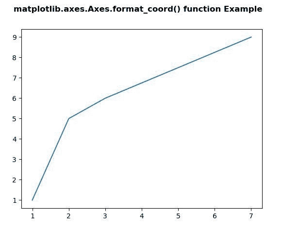
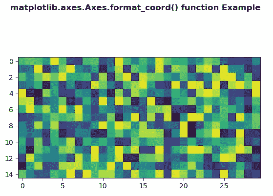

# matplotlib . axes . format _ coord()用 Python

表示

> 哎哎哎:# t0]https://www . geeksforgeeks . org/matplot lib-axes-axes-format _ coord-in-python/

**[Matplotlib](https://www.geeksforgeeks.org/python-introduction-matplotlib/)** 是 Python 中的一个库，是 NumPy 库的数值-数学扩展。**轴类**包含了大部分的图形元素:轴、刻度、线二维、文本、多边形等。，并设置坐标系。Axes 的实例通过回调属性支持回调。

## matplotlib . axes . axes . format _ coord()函数

matplotlib 库的 Axes 模块中的 **Axes.format_coord()函数**用于返回格式化 x，y 坐标的格式字符串。

> **语法:** Axes.format_coord(self，x，y)
> 
> **返回值:**这个方法返回一个格式化 x，y 坐标的格式字符串。

下面的例子说明了 matplotlib.axes 中的`matplotlib.axes.Axes.format_coord()`函数:

**示例-1:**

```
# Implementation of matplotlib function
import numpy as np
import matplotlib.pyplot as plt
import matplotlib.pyplot as plt
import numpy as np

# make an agg figure
fig, ax = plt.subplots()
ax.plot([1, 2, 3, 7], [1, 5, 6, 9])

def format_coord(x = 7, y = 9):
    col = int(x + 0.5)
    row = int(y + 0.5)
    if col >= 0 and col < 5 and row >= 0 and row < 5:
        z = row + col
        return 'x =% 1.4f, y =% 1.4f, z =% 1.4f' % (x, y, z)
    else:
        return 'x =% 1.4f, y =% 1.4f' % (x, y)

ax.format_coord = format_coord

fig.suptitle('matplotlib.axes.Axes.format_coord()\
 function Example', fontweight ="bold")
plt.show()
```

**输出:**


**示例-2:**

```
# Implementation of matplotlib function
import numpy as np
import matplotlib.pyplot as plt

# Fixing random state for reproducibility
np.random.seed(19680801)

X = np.random.rand(15, 30)

fig, ax = plt.subplots()
ax.imshow(X)

val1, val2 = X.shape

def format_coord(x, y):
    col = int(x + 2)
    row = int(y - 2)
    if col >= 0 and col < val2 and row >= 0 and row < val1:
        z = X[row, col]
        return 'x =% 2.0f, y =% 2.0f, z =% 2.0f' % (x, y, z)
    else:
        return 'x =% 2.0f, y =% 2.0f' % (x, y)

ax.format_coord = format_coord

fig.suptitle('matplotlib.axes.Axes.format_coord() \
function Example', fontweight ="bold")
plt.show()
```

**输出:**
