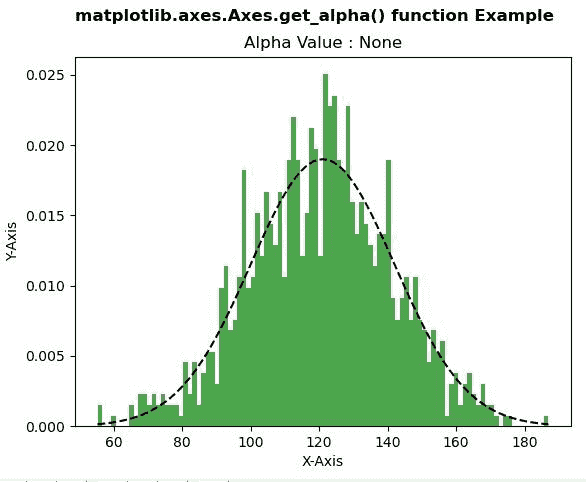

# matplotlib . axes . get _ alpha()用 Python

表示

> 哎哎哎:# t0]https://www . geeksforgeeks . org/matplot lib-axes-get _ alpha-in-python/

**[Matplotlib](https://www.geeksforgeeks.org/python-introduction-matplotlib/)** 是 Python 中的一个库，是 NumPy 库的数值-数学扩展。**轴类**包含了大部分的图形元素:轴、刻度、线二维、文本、多边形等。，并设置坐标系。Axes 的实例通过回调属性支持回调。

## matplotlib.axes.Axes.get_alpha()函数

matplotlib 库的 Axes 模块中的 **Axes.get_alpha()函数**用于获取用于混合的 alpha 值。

> **语法:** Axes.get_alpha(self)
> 
> **参数:**该方法不接受任何参数。
> 
> **返回:**此方法返回用于混合的 alpha 值。

下面的例子说明了 matplotlib.axes.Axes.get_alpha()函数在 matplotlib.axes 中的作用:

**例 1:**

```
# Implementation of matplotlib function
import matplotlib
import numpy as np
import matplotlib.pyplot as plt

np.random.seed(10**7)
mu = 121 
sigma = 21
x = mu + sigma * np.random.randn(1000)

num_bins = 100
fig, ax = plt.subplots()

n, bins, patches = ax.hist(x, num_bins,
                           density = 1,
                           color ='green',
                           alpha = 0.7)

y = ((1 / (np.sqrt(2 * np.pi) * sigma)) *
     np.exp(-0.5 * (1 / sigma * (bins - mu))**2))

ax.plot(bins, y, '--', color ='black')

ax.set_xlabel('X-Axis')
ax.set_ylabel('Y-Axis')

w = ax.get_alpha()
ax.set_title("Alpha Value : "+str(w))

fig.suptitle('matplotlib.axes.Axes.get_alpha() function \
Example', fontweight ="bold") 

plt.show() 
```

**输出:**


**例 2:**

```
# Implementation of matplotlib function
import matplotlib.pyplot as plt
import numpy as np

rx, ry = 3., 1.
value1 = rx * ry * np.pi
value2 = np.arange(0, 3 * np.pi + 0.01, 0.2)
value3 = np.column_stack([rx / value1 * np.cos(value2),
                          ry / value1 * np.sin(value2)])

x, y, s, c = np.random.rand(4, 99)
s *= 10**2.

fig, ax = plt.subplots()
ax.scatter(x, y, s, c, marker = value3)

ax.set_alpha(0.8)
w = ax.get_alpha()
ax.set_title("Alpha Value : "+str(w))

fig.suptitle('matplotlib.axes.Axes.get_alpha() \
function Example', fontweight ="bold") 

plt.show() 
```

**输出:**
