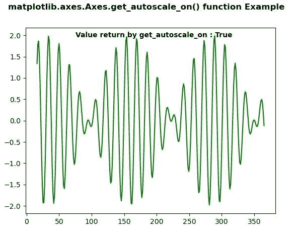
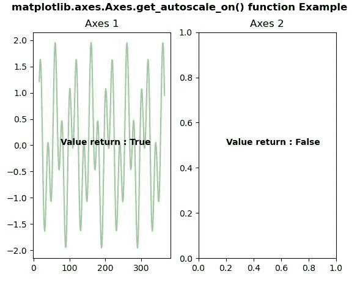

# Python 中的 matplotlib . axes . axes . get _ autoscale _ on()

> 原文:[https://www . geeksforgeeks . org/matplotlib-axes-axes-get _ autoscale _ on-in-python/](https://www.geeksforgeeks.org/matplotlib-axes-axes-get_autoscale_on-in-python/)

**[Matplotlib](https://www.geeksforgeeks.org/python-introduction-matplotlib/)** 是 Python 中的一个库，是 NumPy 库的数值-数学扩展。**轴类**包含了大部分的图形元素:轴、刻度、线二维、文本、多边形等。，并设置坐标系。Axes 的实例通过回调属性支持回调。

## matplotlib . axes . axes . get _ autoscale _ on()函数

matplotlib 库的 Axes 模块中的 **Axes.get_autoscale_on()函数**用于获取绘图命令中是否对两个轴都应用了自动缩放。

> **语法:** Axes.get_autoscale_on(self)
> 
> **参数:**该方法不接受任何参数。
> 
> **返回值:**该方法返回布尔值。

下面的例子说明了 matplotlib.axes . axes . get _ autoscale _ on()函数在 matplotlib . axes 中的作用:

**例 1:**

```
# ImpleIn Reviewtation of matplotlib function  
import numpy as np
import matplotlib.pyplot as plt

xdata = np.linspace(16, 365, 300)
ydata = np.sin(2 * np.pi * xdata / 15) + np.cos(2 * np.pi * xdata / 17)

fig, ax = plt.subplots()

ax.plot(xdata, ydata, 'g-')

w = ax.get_autoscale_on()
ax.text(75, 1.95, "Value return by get_autoscale_on : " 
        + str(w), fontweight ="bold")

fig.suptitle('matplotlib.axes.Axes.get_autoscale_on() \
function Example\n', fontweight ="bold")
fig.canvas.draw()
plt.show()
```

**输出:**


**例 2:**

```
# ImpleIn Reviewtation of matplotlib function  
import numpy as np
import matplotlib.pyplot as plt

xdata = np.linspace(16, 365, (365-16))
ydata = np.sin(2 * np.pi * xdata / 50) + np.cos(2 * np.pi * xdata / 20)

fig, (ax, ax1) = plt.subplots(1, 2)

ax.plot(xdata, ydata, 'g-', alpha = 0.4)
ax.set_title("Axes 1")
ax1.plot(xdata, ydata, 'g-')
ax1.set_autoscale_on(False)
ax1.set_title("Axes 2")

w = ax.get_autoscale_on()
ax.text(75, 0, "Value return : " + str(w), 
        fontweight ="bold")

w1 = ax1.get_autoscale_on()
ax1.text(0.2, 0.5, "Value return : " + str(w1), 
         fontweight ="bold")

fig.suptitle('matplotlib.axes.Axes.get_autoscale_on()\
function Example\n', fontweight ="bold")
fig.canvas.draw()
plt.show()
```

**输出:**
