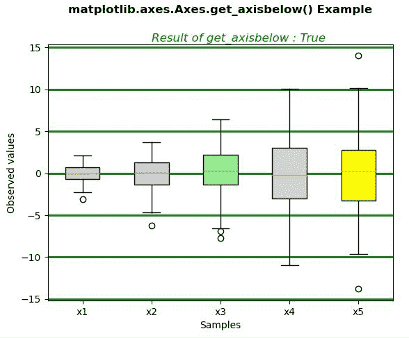
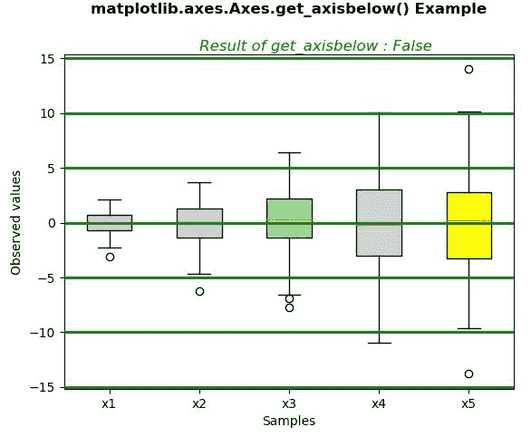

# Python 中的 matplotlib . axes . axes . get _ axis below()

> 原文:[https://www . geeksforgeeks . org/matplotlib-axes-axes-get _ axis below-in-python/](https://www.geeksforgeeks.org/matplotlib-axes-axes-get_axisbelow-in-python/)

**[Matplotlib](https://www.geeksforgeeks.org/python-introduction-matplotlib/)** 是 Python 中的一个库，是 NumPy 库的数值-数学扩展。**轴类**包含了大部分的图形元素:轴、刻度、线二维、文本、多边形等。，并设置坐标系。Axes 的实例通过回调属性支持回调。

## matplotlib . axes . axes . get _ axis below()函数

matplotlib 库的 Axes 模块中的 **Axes.get_axisbelow()函数**用来获取轴刻度和网格线是在大多数美工的上方还是下方。

> **语法:** Axes.get_axisbelow(self)
> 
> **参数:**此方法不接受任何参数。
> 
> **返回:**此方法返回 **axisbelow** 。这是一个值，通过它我们可以知道轴刻度和网格线是在大多数艺术家的上方还是下方。

下面的例子说明了 matplotlib.axes . axes . get _ axis below()函数在 matplotlib . axes 中的作用:

**例 1:**

```
# Implementation of matplotlib function
import matplotlib.pyplot as plt
import numpy as np

# Random test data
np.random.seed(19680801)
all_data = [np.random.normal(0, std, size = 100) for std in range(1, 6)]
labels = ['x1', 'x2', 'x3', 'x4', 'x5']

fig, ax = plt.subplots()

bplot = ax.boxplot(all_data,
                     vert = True,  
                     patch_artist = True,  
                     labels = labels) 
colors = ['lightpink', 'lightblue', 'lightgreen', 
          "lightgrey", "yellow"]

for patch, color in zip(bplot['boxes'], colors):
    patch.set_facecolor(color)

ax.yaxis.grid(True, color ="green", lw = 2)
ax.set_axisbelow(True)
ax.set_xlabel('Samples')
ax.set_ylabel('Observed values')
x = ax.get_axisbelow()
ax.text(2, 15.7, "Result of get_axisbelow : " +str(x),
        style ='italic', fontsize = 12, color ="green")

ax.set_title('matplotlib.axes.Axes.get_axisbelow() \
Example\n\n', fontsize = 12, fontweight ='bold')
plt.show()
```

**输出:**


**例 2:**

```
# Implementation of matplotlib function
import matplotlib.pyplot as plt
import numpy as np

# Random test data
np.random.seed(19680801)
all_data = [np.random.normal(0, std, size = 100) for std in range(1, 6)]
labels = ['x1', 'x2', 'x3', 'x4', 'x5']

fig, ax = plt.subplots()

bplot = ax.boxplot(all_data,
                     vert = True,  
                     patch_artist = True,  
                     labels = labels) 
colors = ['lightpink', 'lightblue', 'lightgreen',
          "lightgrey", "yellow"]
for patch, color in zip(bplot['boxes'], colors):
    patch.set_facecolor(color)

ax.yaxis.grid(True, color ="green", lw = 2)
ax.set_axisbelow(False)
ax.set_xlabel('Samples')
ax.set_ylabel('Observed values')
x = ax.get_axisbelow()
ax.text(2, 15.7, "Result of get_axisbelow : " +str(x), 
       style ='italic', fontsize = 12, color ="green")

ax.set_title('matplotlib.axes.Axes.get_axisbelow() \
Example\n\n', fontsize = 12, fontweight ='bold')
plt.show()
```

**输出:**
