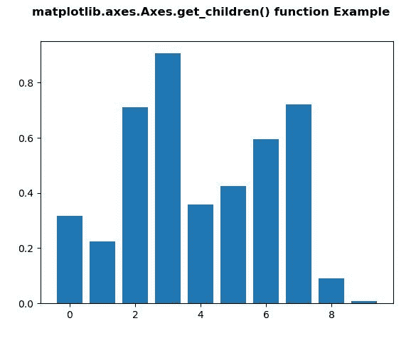
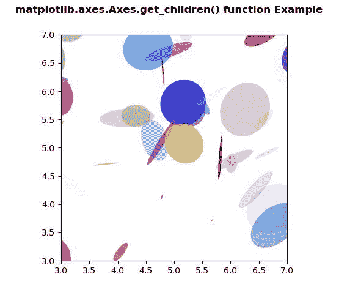

# Python 中的 matplotlib . axes . axes . get _ children()

> 原文:[https://www . geeksforgeeks . org/matplotlib-axes-axes-get _ children-in-python/](https://www.geeksforgeeks.org/matplotlib-axes-axes-get_children-in-python/)

**[Matplotlib](https://www.geeksforgeeks.org/python-introduction-matplotlib/)** 是 Python 中的一个库，是 NumPy 库的数值-数学扩展。**轴类**包含了大部分的图形元素:轴、刻度、线二维、文本、多边形等。，并设置坐标系。Axes 的实例通过回调属性支持回调。

## matplotlib . axes . axes . get _ children()函数

matplotlib 库的 Axes 模块中的 **Axes.get_children()函数**用于返回该艺术家的子艺术家列表。

> **语法:** Axes.get_children(self)
> 
> **参数:**此方法不接受任何参数。
> 
> **返回:**该方法返回该艺术家的子艺术家列表。

下面的例子说明了 matplotlib.axes . axes . get _ children()函数在 matplotlib . axes 中的作用:

**例 1:**

```
# Implementation of matplotlib function
import matplotlib.pyplot as plt
from matplotlib.lines import Line2D
import numpy as np
from numpy.random import rand

fig, ax2 = plt.subplots()

ax2.bar(range(10), rand(10), picker = True)

for label in ax2.get_xticklabels(): 
    label.set_picker(True)

def onpick1(event):

    if isinstance(event.artist, Line2D):
        thisline = event.artist
        xdata = thisline.get_xdata()
        ydata = thisline.get_ydata()
        ind = event.ind

        print('onpick1 line:',
              np.column_stack([xdata[ind],
                               ydata[ind]]))

    elif isinstance(event.artist, Rectangle):
        patch = event.artist
        print('onpick1 patch:', patch.get_path())

    elif isinstance(event.artist, Text):
        text = event.artist
        print('onpick1 text:', text.get_text())

print("List of the child Artists of this Artist \n",
      *list(ax2.get_children()), sep ="\n")

fig.suptitle('matplotlib.axes.Axes.get_children()\
function Example', fontweight ="bold")

plt.show()
```

**输出:**


```
List of the child Artists of this Artist 

Rectangle(xy=(-0.4, 0), width=0.8, height=0.317575, angle=0)
Rectangle(xy=(0.6, 0), width=0.8, height=0.225129, angle=0)
Rectangle(xy=(1.6, 0), width=0.8, height=0.711747, angle=0)
Rectangle(xy=(2.6, 0), width=0.8, height=0.905822, angle=0)
Rectangle(xy=(3.6, 0), width=0.8, height=0.357726, angle=0)
Rectangle(xy=(4.6, 0), width=0.8, height=0.425352, angle=0)
Rectangle(xy=(5.6, 0), width=0.8, height=0.594905, angle=0)
Rectangle(xy=(6.6, 0), width=0.8, height=0.720468, angle=0)
Rectangle(xy=(7.6, 0), width=0.8, height=0.0908192, angle=0)
Rectangle(xy=(8.6, 0), width=0.8, height=0.00946913, angle=0)
Spine
Spine
Spine
Spine
XAxis(80.0, 52.8)
YAxis(80.0, 52.8)
Text(0.5, 1.0, '')
Text(0.0, 1.0, '')
Text(1.0, 1.0, '')
Rectangle(xy=(0, 0), width=1, height=1, angle=0)

```

**例 2:**

```
# Implementation of matplotlib function
import matplotlib.pyplot as plt
import numpy as np
from matplotlib.patches import Ellipse

NUM = 200

ells = [Ellipse(xy = np.random.rand(2) * 10,
                width = np.random.rand(),
                height = np.random.rand(),
                angle = np.random.rand() * 360)
        for i in range(NUM)]

fig, ax = plt.subplots(subplot_kw ={'aspect': 'equal'})

for e in ells:
    ax.add_artist(e)
    e.set_clip_box(ax.bbox)
    e.set_alpha(np.random.rand())
    e.set_facecolor(np.random.rand(4))

ax.set_xlim(3, 7)
ax.set_ylim(3, 7)

print("List of the child Artists of this Artist \n", 
      *list(ax.get_children()), sep ="\n")

fig.suptitle('matplotlib.axes.Axes.get_children() \
function Example', fontweight ="bold")

plt.show()
```

**输出:**



```
List of the child Artists of this ArtistEllipse(xy=(0.668847518877268, 6.938675739674615), width=0.7296641185042964, height=0.0893037783885946, angle=224.41378373868537)
Ellipse(xy=(5.306564101346753, 5.6414743505376554), width=0.4832304987995424, height=0.5640541378173555, angle=151.88483080818298)
Ellipse(xy=(4.38744932068929, 8.857587055799286), width=0.4259613611748855, height=0.3595422876116724, angle=129.58828319517747)
Ellipse(xy=(8.121105826404722, 7.422123947610576), width=0.714809119557049, height=0.2909415357326306, angle=108.51022573801347)
Ellipse(xy=(1.0944856506422218, 4.114841876256491), width=0.8756241630121662, height=0.6297136306001118, angle=211.58332164398425)
Ellipse(xy=(5.680324678280178, 2.7526956083194962), width=0.26002961565328275, height=0.5638991468608816, angle=269.51683670695894)
Ellipse(xy=(1.759795460241057, 6.6086863716936515), width=0.9813407495350716, height=0.906416758470574, angle=200.18267967935813)
Ellipse(xy=(1.3266447835400441, 9.337065162177892), width=0.3011954429847411, height=0.4701679800332409, angle=155.80186880007344)
Ellipse(xy=(8.3826234222602, 3.588428218346799), width=0.06997850673347905, height=0.008478049066238724, angle=290.21461427371054)
Ellipse(xy=(5.718139291800139, 1.4568061334936755), width=0.6241044378074627, height=0.13159442120449694, angle=151.73230168099784)
Ellipse(xy=(6.33742168712369, 2.509445743956654), width=0.7396872540277428, height=0.8117831845488527, angle=193.47055838139028)
Ellipse(xy=(2.2574765926179508, 9.444597243698578), width=0.9078932751316021, height=0.3962198970414217, angle=270.5705744796087)
Ellipse(xy=(5.976463234465774, 9.965722788440821), width=0.7821474347151081, height=0.8236486270086005, angle=217.48307520265402)
Ellipse(xy=(1.611134135712473, 2.5497306246715743), width=0.2509070586774016, height=0.05431285754829929, angle=326.2319795741479)
Ellipse(xy=(6.188787081385608, 7.862836298527308), width=0.23192989082414306, height=0.29056785059245394, angle=145.0614286054921)
Ellipse(xy=(2.000280441372114, 4.00565706257049), width=0.6041821795179914, height=0.2344793963474182, angle=330.2508859583917)
Ellipse(xy=(7.596821021797267, 9.812335949562573), width=0.17741727727030243, height=0.875928177171972, angle=38.48450306219937)
Ellipse(xy=(1.902166793036052, 4.443949777428217), width=0.8302906423218748, height=0.04221678109738081, angle=313.266074251759)
Ellipse(xy=(2.9460004651214255, 5.913963843663993), width=0.525628867501478, height=0.7014876526859289, angle=9.423167050903931)
Ellipse(xy=(9.95615289516793, 2.4704815926985733), width=0.993610959169028, height=0.8635578087205207, angle=148.01944177675205)
Ellipse(xy=(7.6715140262779125, 6.1914335059209265), width=0.2427342662419859, height=0.5992847621526142, angle=74.00243554065965)
Ellipse(xy=(9.37124259467692, 3.3141900648003144), width=0.6760490238541932, height=0.3197915152759725, angle=286.3601657095787)
Ellipse(xy=(3.120890373388714, 4.378622912107614), width=0.21603691388966506, height=0.8554260328128318, angle=57.39981998879316)
Ellipse(xy=(4.895016111374236, 6.6982352431596), width=0.20602114082985268, height=0.8969470064794466, angle=108.23706208912736)
Ellipse(xy=(6.5955084166752975, 5.4856696718151134), width=0.46084655712792477, height=0.15670414293094592, angle=51.157007076546435)
Ellipse(xy=(8.977872911395865, 1.594978946174378), width=0.19370534108519422, height=0.65175768482454, angle=287.2785245154871)
Ellipse(xy=(9.867156824110896, 5.103434932082337), width=0.33065582074441346, height=0.9319298565441625, angle=39.747123546038395)
Ellipse(xy=(2.401720545005004, 9.876159792555402), width=0.009638279007150974, height=0.5285835646712311, angle=148.47661856715726)
Ellipse(xy=(6.634236224240931, 4.901904133168296), width=0.06521451401104872, height=0.4602401062945074, angle=115.86093023971345)
Ellipse(xy=(9.74075320744922, 4.388774491311609), width=0.6953480142650095, height=0.32975069493540243, angle=214.3641324591366)
Ellipse(xy=(9.930218446839318, 2.771779294923813), width=0.7139109731225234, height=0.9516327414411265, angle=75.20921853762026)
Ellipse(xy=(9.02500337954936, 4.811919504150149), width=0.7046697049621687, height=0.017089064247432728, angle=300.17567517269686)
Ellipse(xy=(6.444424441899182, 4.252911074512578), width=0.8385127161668413, height=0.2163138911513347, angle=48.266755225669094)
Ellipse(xy=(6.068626561347563, 4.793581810388597), width=0.18947496275439746, height=0.7151608339185527, angle=114.8913822273658)
Ellipse(xy=(6.582199015690588, 7.022236948784853), width=0.7631868102782919, height=0.31629756750797156, angle=210.76113531568035)
Ellipse(xy=(2.6605257126653727, 6.190744752043539), width=0.18533068802956, height=0.9313876409276954, angle=270.7107964027917)
Ellipse(xy=(9.729156805280512, 8.535296071205323), width=0.6973814402318527, height=0.4076421452296588, angle=12.519766569590086)
Ellipse(xy=(5.158630733114053, 5.793391658526172), width=0.8365063857496388, height=0.7906556047356088, angle=52.78366454465817)
Ellipse(xy=(2.8146123090401174, 0.18910000668226234), width=0.5798722295134174, height=0.7845645339337217, angle=67.59025285824337)
Ellipse(xy=(2.2583633093517284, 8.292815315946571), width=0.529387905458512, height=0.712715723215864, angle=177.92149933218994)
Ellipse(xy=(4.631325787219353, 9.62699307830136), width=0.5841009798263337, height=0.21339675310007455, angle=299.80837772457505)
Ellipse(xy=(6.4748034668429995, 8.291463495669596), width=0.7639076748407188, height=0.15808021094381897, angle=184.4915201031034)
Ellipse(xy=(7.248674871754, 6.688957553386371), width=0.8586501914207866, height=0.5481761887562997, angle=232.20590160225228)
Ellipse(xy=(7.704445468143085, 7.61745884266264), width=0.8409266322415021, height=0.28682960748964337, angle=289.91765053599465)
Ellipse(xy=(8.611191426543199, 2.8678462890240053), width=0.15969002963939927, height=0.5470491836155787, angle=179.5821453451883)
Ellipse(xy=(4.167729252633676, 5.530659393698279), width=0.3218705971948146, height=0.9692511174828298, angle=273.50061930136707)
Ellipse(xy=(8.512105177810646, 2.112607295791573), width=0.8746678310632856, height=0.869019924857299, angle=335.94263565243716)
Ellipse(xy=(9.73173795902476, 6.279161908246785), width=0.7122258589248008, height=0.5919503858929261, angle=23.582802913432914)
Ellipse(xy=(2.3994496524216835, 7.708066842494487), width=0.6069997832063707, height=0.8797454718598331, angle=110.490392579218)
Ellipse(xy=(4.907367417433841, 9.197431699642102), width=0.9928562060849883, height=0.45334202995563844, angle=70.94073543477016)
Ellipse(xy=(3.17505922094795, 7.205362813222376), width=0.7185715548376206, height=0.5987393803322225, angle=229.2742411211884)
Ellipse(xy=(4.74267513431181, 7.793398168146185), width=0.7301095097869225, height=0.5979994935616866, angle=328.86013565717474)
Ellipse(xy=(1.1707018974201644, 6.548875202861043), width=0.18245580525764316, height=0.6655598565875164, angle=308.8242677643016)
Ellipse(xy=(6.015327587358017, 0.689569774211295), width=0.8709017091532896, height=0.7218886825807544, angle=206.29861489260665)
Ellipse(xy=(6.783477058242565, 7.772818207598155), width=0.9783625334628132, height=0.6023733772108191, angle=160.54641199130248)
Ellipse(xy=(8.756821837986275, 5.961361594668747), width=0.8451532939732358, height=0.8162315800070612, angle=243.52295732344732)
Ellipse(xy=(5.58030888041365, 8.764262999559286), width=0.6522364078990662, height=0.5923871981274335, angle=311.6876945607257)
Ellipse(xy=(0.14425773936219688, 8.917202140214165), width=0.7794346288166322, height=0.013634204463058186, angle=108.96759788568812)
Ellipse(xy=(9.376054577085188, 3.3042195578946263), width=0.4331987101182867, height=0.8875598717231332, angle=336.2117278913084)
Ellipse(xy=(7.525533219054954, 5.6562396454442565), width=0.26075993137984477, height=0.24276721117768574, angle=34.11737977941636)
Ellipse(xy=(9.702211535070575, 7.63100396647755), width=0.9623083669806568, height=0.2948617435359967, angle=299.42804015546056)
Ellipse(xy=(1.8421360623416216, 1.7107226376931206), width=0.12852482867547244, height=0.17920662424313227, angle=32.37570052870707)
Ellipse(xy=(5.934047483045189, 9.771986168014589), width=0.0073678341004889125, height=0.19791916468962667, angle=330.0575613202844)
Ellipse(xy=(0.8059650143431119, 6.3465470482714), width=0.1529818218382447, height=0.6002588191418939, angle=248.45056525454828)
Ellipse(xy=(5.993866380522182, 0.7286727839436935), width=0.7044905993008711, height=0.382032358553583, angle=281.7900677112405)
Ellipse(xy=(7.61726412545868, 2.519953512883383), width=0.5691401269115373, height=0.5589647506121297, angle=22.44502757534153)
Ellipse(xy=(2.4011664305394422, 2.545162026679606), width=0.5445193574711369, height=0.6576890402324859, angle=123.34015522957043)
Ellipse(xy=(0.6340549586505939, 8.742445075918873), width=0.1938834235208282, height=0.7315629771795035, angle=243.90271331217255)
Ellipse(xy=(9.541058864625409, 0.6697689377232863), width=0.14518452883665167, height=0.29521890576587795, angle=284.4594404529576)
Ellipse(xy=(8.066378001006013, 3.89669988920459), width=0.6461569401478967, height=0.944251098441937, angle=306.4280082080216)
Ellipse(xy=(0.607824558088742, 4.590515334754568), width=0.695322211646517, height=0.1865608597070405, angle=243.11442355434647)
Ellipse(xy=(9.306598316038242, 1.2407997425230077), width=0.5555207351407375, height=0.6215626252252455, angle=239.2892297750927)
Ellipse(xy=(3.79491571535423, 1.3236446820598413), width=0.06249259151409492, height=0.40845601207609883, angle=91.31084521660753)
Ellipse(xy=(1.1211301714626942, 7.61890688855479), width=0.4433037252413474, height=0.0716365588476755, angle=128.9549556399145)
Ellipse(xy=(1.1641271985736013, 5.487886577090469), width=0.8216576258965638, height=0.16070186593683178, angle=193.15746415898508)
Ellipse(xy=(6.3444499122249205, 9.820356884793556), width=0.5649476591209335, height=0.9114952878256755, angle=14.425858590237004)
Ellipse(xy=(7.6765776416353395, 1.5012106076335108), width=0.26063928406639914, height=0.754227248346344, angle=246.3147408703943)
Ellipse(xy=(5.005778831284049, 7.23928807810479), width=0.8840283825435227, height=0.4043163237802925, angle=161.3339337891272)
Ellipse(xy=(7.389528001406022, 8.389226223438511), width=0.2568106577012401, height=0.9664098857701137, angle=219.59609395639566)
Ellipse(xy=(7.099424654721327, 3.8501049560606724), width=0.2829822191069111, height=0.32229440428870937, angle=18.500431586070295)
Ellipse(xy=(3.9566902775018664, 0.4067025592530982), width=0.07861368848981698, height=0.47722362493710235, angle=271.42347405572207)
Ellipse(xy=(3.9568434217251323, 2.7652204676029934), width=0.8267033436070933, height=0.1328463160768787, angle=15.824080741183968)
Ellipse(xy=(2.570933879504466, 9.691841287629465), width=0.9003414497816434, height=0.012705200248589898, angle=106.02106933452329)
Ellipse(xy=(7.428638203631618, 7.741733659779567), width=0.8024238675617912, height=0.4256586643619179, angle=312.02083986962714)
Ellipse(xy=(1.8746878691000812, 5.049056839088849), width=0.9985112779006605, height=0.30608766089591477, angle=96.76990294970527)
Ellipse(xy=(3.161446936828669, 2.6669531605663455), width=0.22363837998872138, height=0.2372779075013517, angle=271.24735370199613)
Ellipse(xy=(1.9061776827920318, 0.7241173575884485), width=0.10649791831268485, height=0.3221113018327313, angle=332.41719173120833)
Ellipse(xy=(8.165726182869385, 7.44772525983586), width=0.19769169600536296, height=0.8789055874349184, angle=273.27582233254776)
Ellipse(xy=(2.6769142321411907, 6.677125617807695), width=0.6849796688666562, height=0.9369785346437093, angle=218.37217231252006)
Ellipse(xy=(0.5667527969953889, 8.639848929318427), width=0.21093736672413366, height=0.21205382012894547, angle=241.02723827929393)
Ellipse(xy=(8.613375488649046, 2.7183622964823018), width=0.7183823279806187, height=0.7666599983065047, angle=83.51891675714246)
Ellipse(xy=(2.8862175185328787, 2.101082533907798), width=0.19328525633554283, height=0.13982559628396074, angle=202.23791353024706)
Ellipse(xy=(7.120159562271498, 8.698208219365103), width=0.5316418776865408, height=0.043356150491557166, angle=316.6039290112145)
Ellipse(xy=(1.5797551887408467, 1.8797639106737185), width=0.4585297910123912, height=0.20580813272545428, angle=277.41078634882155)
Ellipse(xy=(5.375221040682447, 0.17510559445457874), width=0.05445482901459808, height=0.8835754263354147, angle=121.66014639072468)
Ellipse(xy=(4.0516062705720515, 3.157611225447691), width=0.38979779252022884, height=0.1324398101179709, angle=233.47555723433612)
Ellipse(xy=(6.019100104232259, 4.721951346252819), width=0.3402917500409208, height=0.20085304818853789, angle=84.82965863649584)
Ellipse(xy=(1.1610413475040848, 4.221365208117063), width=0.48369126120458306, height=0.6527634871362749, angle=359.0833632161427)
Ellipse(xy=(0.8488251012971204, 2.7040018163521973), width=0.8777837060080514, height=0.5860482780946802, angle=8.881718748822367)
Ellipse(xy=(2.213855593533316, 7.725249702673878), width=0.5118819468249786, height=0.8559030533541322, angle=181.1177688669634)
Ellipse(xy=(4.479418497126153, 8.745743608414815), width=0.036585042646454013, height=0.7905387189538934, angle=127.48581773578897)
Ellipse(xy=(9.90055799459894, 9.467258495102866), width=0.32372676431137215, height=0.6424733625003582, angle=202.42835451831235)
Ellipse(xy=(9.402647994013515, 7.059093724627723), width=0.7316869982074832, height=0.7325343475501098, angle=319.64419462907324)
Ellipse(xy=(3.8521032858031665, 8.134520483566991), width=0.9056823391101309, height=0.9459405313453993, angle=320.8351641487031)
Ellipse(xy=(4.537035844741725, 6.765255916234985), width=0.780301925049206, height=0.897117184479119, angle=109.83253540756232)
Ellipse(xy=(2.510248857871362, 4.123450907242016), width=0.44895153896380857, height=0.49719682637587537, angle=22.34130107005772)
Ellipse(xy=(5.98646999862284, 8.887835177578365), width=0.18129234466330058, height=0.8002734747456769, angle=170.45693635431795)
Ellipse(xy=(4.463939316760924, 0.04692014571602399), width=0.4603659492721608, height=0.29365851495309636, angle=269.32300360237446)
Ellipse(xy=(8.74091699194771, 3.0410726338180947), width=0.17561045676600684, height=0.6091679564154108, angle=188.64817398327776)
Ellipse(xy=(4.300327194790343, 5.539672293436032), width=0.2899832074936405, height=0.005090891407135478, angle=170.99332762849085)
Ellipse(xy=(4.852570081338255, 1.3151478457349486), width=0.17248195474585137, height=0.5529963778270177, angle=56.09571464282798)
Ellipse(xy=(1.622019540666303, 2.051227824330356), width=0.08378046398845174, height=0.6529463490620127, angle=164.7219358079546)
Ellipse(xy=(7.883383203955766, 1.6566218368750973), width=0.9555430826361369, height=0.4226551946876287, angle=347.1038713452697)
Ellipse(xy=(6.787692255540065, 0.9390904169221215), width=0.87740801693085, height=0.10841797584167279, angle=356.80001116378276)
Ellipse(xy=(5.8182633690116115, 4.8277855656630475), width=0.7919947911018321, height=0.05209031316684687, angle=85.83493534576093)
Ellipse(xy=(7.4857578801454885, 2.659586262797118), width=0.28787103970970884, height=0.7640954521257486, angle=243.84196768408472)
Ellipse(xy=(6.843517024816277, 2.5367687874075715), width=0.3495248745480881, height=0.2431818856381891, angle=185.47025218556396)
Ellipse(xy=(0.1450871496477235, 3.888644945715023), width=0.1623098825755105, height=0.8709731036709487, angle=31.76833882373775)
Ellipse(xy=(7.120873061660118, 6.470913727831053), width=0.7206419502804188, height=0.8814870761923835, angle=175.94386309166507)
Ellipse(xy=(2.5835639586316694, 2.7031387586821607), width=0.9297961242315986, height=0.8597661884288729, angle=22.575750625652205)
Ellipse(xy=(9.214502832925543, 4.9493332692290295), width=0.035805016015276525, height=0.1349784715695892, angle=98.9096869941367)
Ellipse(xy=(0.34490531166002425, 8.800434906703046), width=0.42419679680723865, height=0.9502338197855281, angle=93.10672745788301)
Ellipse(xy=(4.657040826509387, 5.131493684616598), width=0.45024270649115916, height=0.7516796372619488, angle=18.451186524799578)
Ellipse(xy=(7.462257394567314, 9.386636059194785), width=0.01638197835535049, height=0.5717552611788383, angle=100.8543077585435)
Ellipse(xy=(6.761895860125714, 3.917110827842939), width=0.8271852905517983, height=0.9897636767730058, angle=120.18682548808397)
Ellipse(xy=(6.474589912370247, 9.093582766032334), width=0.7178488043178122, height=0.14876688629908397, angle=259.6124646225528)
Ellipse(xy=(3.3256808086785314, 7.347313010058132), width=0.5013585641812571, height=0.5067743814839958, angle=291.2901567037347)
Ellipse(xy=(8.919701915459902, 3.2950746088411287), width=0.16514144678249087, height=0.3986171306871371, angle=304.9470135696479)
Ellipse(xy=(7.045434191687772, 8.39793859560831), width=0.7810468108538515, height=0.8959009832792548, angle=12.252923924415743)
Ellipse(xy=(3.4819168125653888, 2.4600567389106076), width=0.09854215721177906, height=0.913495107075073, angle=60.59418438822965)
Ellipse(xy=(4.169393038660385, 0.27282742452785613), width=0.8813392102790615, height=0.7812342795220584, angle=309.1696146187731)
Ellipse(xy=(2.9165938524531665, 5.314655504170116), width=0.04038299381652222, height=0.4087846810212279, angle=141.41126414809384)
Ellipse(xy=(8.595787700321003, 6.94954077304457), width=0.3358594150545179, height=0.10902881009038001, angle=59.79963009137035)
Ellipse(xy=(0.6171604915836904, 0.21375260550365982), width=0.12492555271358541, height=0.4491889158755794, angle=67.99402049188795)
Ellipse(xy=(4.803882278876037, 6.325487193806416), width=0.026943932425451123, height=0.5025284650509421, angle=4.854855413378196)
Ellipse(xy=(3.200744897752265, 7.626762266721467), width=0.07023152172108293, height=0.4096064442771794, angle=42.19175133162322)
Ellipse(xy=(9.953265804057308, 3.9956450506415777), width=0.7851643439637556, height=0.27363075006404625, angle=75.76583005045347)
Ellipse(xy=(2.653182399420213, 2.0913469885447986), width=0.8738678428234593, height=0.5605302231086166, angle=140.8525173795356)
Ellipse(xy=(3.7911041224442013, 4.710972234026732), width=0.02468325268750604, height=0.4447021520524539, angle=95.88186255437915)
Ellipse(xy=(0.4593121499439756, 3.932383585038991), width=0.9209126097184794, height=0.49451567367970306, angle=206.5069894661395)
Ellipse(xy=(7.267040864713902, 0.38134347962522686), width=0.650431814652329, height=0.7429079595723411, angle=253.23065517650403)
Ellipse(xy=(4.4039950427734444, 7.8434825089218565), width=0.8395074468280044, height=0.6120864658445537, angle=294.4418468474879)
Ellipse(xy=(7.760401147258467, 3.810531367560764), width=0.2501769405185993, height=0.13938267048266906, angle=287.39376209178965)
Ellipse(xy=(5.667185749277626, 3.7080962850883203), width=0.04160316443624579, height=0.012727722946666908, angle=232.78171670099152)
Ellipse(xy=(5.242819867655949, 1.4110248878120402), width=0.09041080450583117, height=0.22876443599529872, angle=114.81686874363834)
Ellipse(xy=(3.422496569784127, 2.258948001463814), width=0.8444531570441802, height=0.12435027257501718, angle=131.28672435136787)
Ellipse(xy=(5.08491939228584, 1.9316710925986758), width=0.23435584069057513, height=0.0829583252165158, angle=305.6825944231072)
Ellipse(xy=(7.707356183292529, 1.0348193669883798), width=0.8104156305243981, height=0.989170332464418, angle=0.3887842919852602)
Ellipse(xy=(0.6992528643666795, 8.782149063752122), width=0.22071481275172544, height=0.46738992746501096, angle=108.63719504893795)
Ellipse(xy=(6.28879235880331, 2.186443575202659), width=0.8930150158099328, height=0.29662965628940285, angle=209.17375171637303)
Ellipse(xy=(5.567746188639262, 0.15935488958906507), width=0.16105967900966867, height=0.5683632498999407, angle=106.3342311133972)
Ellipse(xy=(4.775448129328367, 5.0991179841074), width=0.9519386413443932, height=0.11251091510658151, angle=58.31506516404754)
Ellipse(xy=(0.41322800014229055, 3.8883173220949283), width=0.26006846889542856, height=0.617478636067363, angle=151.34275045509776)
Ellipse(xy=(8.315225192108167, 8.145498100135718), width=0.44714551586998785, height=0.6168367102756676, angle=99.81000892860618)
Ellipse(xy=(9.91743356124714, 3.2395661792105046), width=0.13545436629571994, height=0.5057940282094489, angle=223.5894939702502)
Ellipse(xy=(9.442630981782441, 6.414185573192443), width=0.9641221543619544, height=0.828602427026741, angle=59.16139175279629)
Ellipse(xy=(5.174549447440607, 5.0742713382798375), width=0.7365032028342787, height=0.6637042772395441, angle=125.96400481248716)
Ellipse(xy=(1.014933782088363, 8.783344336474295), width=0.30574978235709693, height=0.1977208873274644, angle=342.96784966644674)
Ellipse(xy=(5.410240175708894, 5.870380430797674), width=0.18784244459317856, height=0.7116133626382679, angle=217.24617521191445)
Ellipse(xy=(1.793269171025148, 9.344189698987726), width=0.8899459569471313, height=0.8267937071655456, angle=104.08401821644438)
Ellipse(xy=(9.685752762910996, 3.1694207158603707), width=0.013661088423718715, height=0.33166264484789154, angle=272.4824587673908)
Ellipse(xy=(5.883900414024042, 0.9894513550205308), width=0.4930438373802849, height=0.14488366866645352, angle=154.82680195393218)
Ellipse(xy=(9.282386911674918, 2.1693379337046528), width=0.93443740725129, height=0.6135683305859451, angle=332.1306904103611)
Ellipse(xy=(1.7608421733360102, 7.837910343946799), width=0.5126839153001934, height=0.6394320767052872, angle=339.1261840800061)
Ellipse(xy=(0.7431636033567968, 6.865886344340132), width=0.45049836114549324, height=0.703842555534892, angle=232.7583717376376)
Ellipse(xy=(7.995798882427289, 2.3068405198707174), width=0.15170700375068702, height=0.8899969378174513, angle=92.22460510894405)
Ellipse(xy=(3.1499790433722428, 1.6890023745303473), width=0.0709416589111298, height=0.535201395408696, angle=245.75159081372337)
Ellipse(xy=(2.943493929727614, 9.98626291194012), width=0.17563386932402236, height=0.6493568415580202, angle=106.69872100592397)
Ellipse(xy=(4.28120713432453, 0.1083139606806316), width=0.36279935362723303, height=0.37848105748121375, angle=258.1683575752698)
Ellipse(xy=(6.256603476837197, 5.673801700345163), width=0.9776215390920983, height=0.8550257917950215, angle=240.92761723697132)
Ellipse(xy=(3.788948991163137, 0.4083528516294943), width=0.5173457630322812, height=0.24321266109681605, angle=107.09128330934871)
Ellipse(xy=(7.319511907536068, 9.358912095273844), width=0.5897344400129294, height=0.007672580743614099, angle=140.4999955993736)
Ellipse(xy=(8.099393554292167, 4.269592950637174), width=0.11428942105360218, height=0.3350608967430442, angle=29.623679322597795)
Ellipse(xy=(7.450047847134113, 9.38461681299056), width=0.29546833443246123, height=0.27945613568322025, angle=99.50353257894857)
Ellipse(xy=(6.364583093731793, 1.8660920396448333), width=0.8136972444005562, height=0.34186002005773497, angle=245.92560658139095)
Ellipse(xy=(1.3989983778859438, 9.502578670125105), width=0.8077691536703742, height=0.533477919199432, angle=348.6978370765189)
Ellipse(xy=(5.669423771764302, 5.910506440744476), width=0.6228196489047672, height=0.1375282264491926, angle=30.03469650656454)
Ellipse(xy=(2.8298323435366637, 2.2865957089501943), width=0.7290981235813544, height=0.15531732949247856, angle=43.465664981286494)
Ellipse(xy=(4.560403751506098, 8.24245389966242), width=0.24535253258171696, height=0.3228885408184674, angle=68.97163640883723)
Ellipse(xy=(5.989196500726978, 2.358692650030588), width=0.43269153685798833, height=0.11539423502944024, angle=175.03053348332074)
Ellipse(xy=(8.480344002985918, 8.683372831216143), width=0.5665556982039888, height=0.7082974228822998, angle=117.47355053906878)
Ellipse(xy=(4.699103783122065, 2.3353124912555767), width=0.1556524072918194, height=0.27499024142918216, angle=331.11005749101577)
Ellipse(xy=(4.385603312102296, 7.317678976155497), width=0.12701520476880934, height=0.4097973179243326, angle=24.446519079708654)
Ellipse(xy=(4.323085242422907, 5.563827321419307), width=0.39486616910038097, height=0.519046162209439, angle=270.3501808164801)
Ellipse(xy=(1.7402290206148097, 8.806245289169876), width=0.7485678957414375, height=0.2890641522961954, angle=146.8280247103875)
Ellipse(xy=(6.832054622998427, 1.583379801743251), width=0.6139923379909854, height=0.9944490190923841, angle=124.66357786319792)
Ellipse(xy=(2.8080416723178647, 3.007330136824473), width=0.7156227161934305, height=0.8319940170719552, angle=344.1537271725228)
Ellipse(xy=(9.504252322068204, 3.6292350834411824), width=0.6607057546587658, height=0.5094738070556111, angle=204.5812101350351)
Ellipse(xy=(9.103360172935497, 4.4895440914055795), width=0.5646078890176074, height=0.9728483104016592, angle=27.04215163220433)
Ellipse(xy=(8.508185467410652, 3.910539625021172), width=0.03918350085963762, height=0.7524051542892056, angle=235.05887082208992)
Ellipse(xy=(4.779782619018197, 4.125111177749595), width=0.09786314066934676, height=0.022344663634253137, angle=251.4865193077345)
Ellipse(xy=(5.205952586822708, 7.1427785320647965), width=0.27118935406504097, height=0.5597117466572645, angle=178.52594992492476)
Ellipse(xy=(1.6193786216712347, 6.523310288638735), width=0.19185738083170945, height=0.5347670038099471, angle=297.81536015002087)
Ellipse(xy=(3.1925223870652033, 9.020835229346115), width=0.43436218418079486, height=0.6159104274276263, angle=11.382128284181743)
Ellipse(xy=(6.226132985986038, 1.9053357481131838), width=0.2513753661357543, height=0.029175573913596153, angle=151.5045855643129)
Ellipse(xy=(0.7384664903859928, 2.585007672579481), width=0.839049031328316, height=0.005416506981683833, angle=207.84736494007365)
Ellipse(xy=(6.781789752098288, 3.62554577641915), width=0.6161766444806014, height=0.9771311008898304, angle=130.54947824263428)
Ellipse(xy=(1.7098589913239903, 0.9479924749984514), width=0.578627039926376, height=0.27514530849517826, angle=148.5398003660125)
Ellipse(xy=(9.62380143591764, 1.5147685481897222), width=0.5018198318969181, height=0.6916401811509747, angle=346.2480502885752)
Ellipse(xy=(1.172736065878266, 6.210410130081946), width=0.32844227218240174, height=0.848755504543119, angle=174.02670821351606)
Spine
Spine
Spine
Spine
XAxis(80.0, 52.8)
YAxis(80.0, 52.8)
Text(0.5, 1.0, ”)
Text(0.0, 1.0, ”)
Text(1.0, 1.0, ”)
Rectangle(xy=(0, 0), width=1, height=1, angle=0)
```