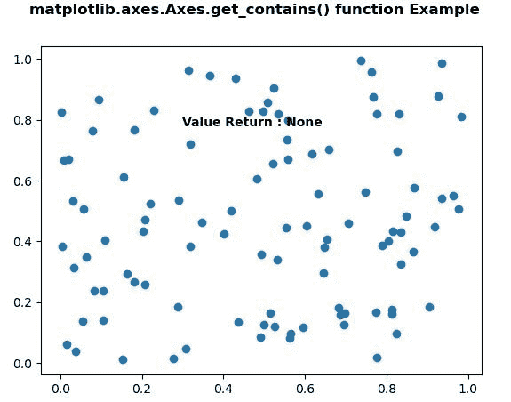

# Python 中的 matplotlib . axes . axes . get _ contains()

> 原文:[https://www . geeksforgeeks . org/matplotlib-axes-axes-get _ contains-in-python/](https://www.geeksforgeeks.org/matplotlib-axes-axes-get_contains-in-python/)

**[Matplotlib](https://www.geeksforgeeks.org/python-introduction-matplotlib/)** 是 Python 中的一个库，是 NumPy 库的数值-数学扩展。**轴类**包含了大部分的图形元素:轴、刻度、线二维、文本、多边形等。，并设置坐标系。Axes 的实例通过回调属性支持回调。

## matplotlib . axes . axes . get _ contains()函数

matplotlib 库的 Axes 模块中的 **Axes.get_contains()函数**用于返回艺术家的自定义 contains 函数。

> **语法:** Axes.get_contains(self)
> 
> **参数:**此方法不接受任何参数。
> 
> **返回:**此方法返回艺术家的自定义包含函数。

下面的例子说明了 matplotlib.axes . axes . get _ contains()函数在 matplotlib . axes 中的作用:

**例 1:**

```
# Implementation of matplotlib function
import matplotlib.pyplot as plt
from matplotlib.lines import Line2D
import numpy as np
from numpy.random import rand

fig, ax2 = plt.subplots()

ax2.bar(range(10), rand(10), picker = True)

for label in ax2.get_xticklabels(): 
    label.set_picker(True)

def onpick1(event):

    if isinstance(event.artist, Line2D):
        thisline = event.artist
        xdata = thisline.get_xdata()
        ydata = thisline.get_ydata()
        ind = event.ind
        print('onpick1 line:',
               np.column_stack([xdata[ind], 
                               ydata[ind]]))

    elif isinstance(event.artist, Rectangle):
        patch = event.artist
        print('onpick1 patch:', patch.get_path())

    elif isinstance(event.artist, Text):
        text = event.artist
        print('onpick1 text:', text.get_text())

ax2.set_contains(onpick1)

ax2.text(0.5, 0.9,
         "Value Return : "+ str(ax2.get_contains()), 
         fontweight ="bold", fontsize = 10)

fig.suptitle('matplotlib.axes.Axes.get_contains() function\
Example', fontweight ="bold")

plt.show()
```

**输出:**


**例 2:**

```
# Implementation of matplotlib function
import matplotlib.pyplot as plt
from matplotlib.lines import Line2D
import numpy as np
from numpy.random import rand

fig, ax2 = plt.subplots()

ax2.bar(range(10), rand(10), picker = True)

for label in ax2.get_xticklabels(): 
    label.set_picker(True)

def onpick1(event):

    if isinstance(event.artist, Line2D):
        thisline = event.artist
        xdata = thisline.get_xdata()
        ydata = thisline.get_ydata()
        ind = event.ind
        print('onpick1 line:',
               np.column_stack([xdata[ind], 
                                ydata[ind]]))

    elif isinstance(event.artist, Rectangle):
        patch = event.artist
        print('onpick1 patch:', patch.get_path())

    elif isinstance(event.artist, Text):
        text = event.artist
        print('onpick1 text:', text.get_text())

ax2.set_contains(onpick1)

ax2.text(0.5, 0.9,
         "Value Return : "+ str(ax2.get_contains()), 
         fontweight ="bold", fontsize = 10)

fig.suptitle('matplotlib.axes.Axes.get_contains() function\
Example', fontweight ="bold")

plt.show()
```

**输出:**
