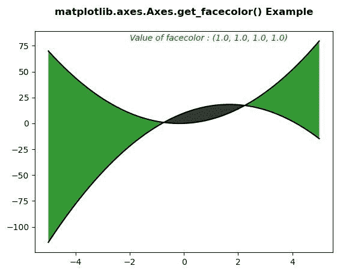
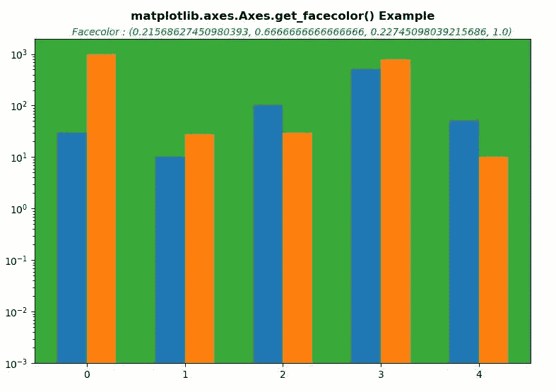

# matplotlib . axes . get _ face color()用 Python

表示

> 哎哎哎:# t0]https://www . geeksforgeeks . org/matplotlib-axes-get _ face color-in-python/

**[Matplotlib](https://www.geeksforgeeks.org/python-introduction-matplotlib/)** 是 Python 中的一个库，是 NumPy 库的数值-数学扩展。**轴类**包含了大部分的图形元素:轴、刻度、线二维、文本、多边形等。，并设置坐标系。Axes 的实例通过回调属性支持回调。

## matplotlib . axes . axes . get _ face color()函数

matplotlib 库的 axes 模块中的 **Axes.get_facecolor()函数**用于获取 Axes 的 facecolor..

> **语法:** Axes.get_facecolor(self)
> 
> **参数:**此方法不接受任何参数。
> 
> **返回:**该方法返回坐标轴的面颜色值。

下面的例子说明了 matplotlib.axes . axes . get _ face color()函数在 matplotlib . axes 中的作用:

**例 1:**

```
# Implementation of matplotlib function
import numpy as np
import matplotlib.pyplot as plt

x = np.arange(-5, 5, 0.01)
y1 = -3 * x*x + 10 * x + 10
y2 = 3 * x*x + x

fig, ax = plt.subplots()
ax.plot(x, y1, x, y2, color ='black')
ax.fill_between(x, y1, y2, where = y2 >y1,
                facecolor ='green', alpha = 0.8)
ax.fill_between(x, y1, y2, where = y2 <= y1,' 
               facecolor ='black', alpha = 0.8)

x = ax.get_facecolor()
ax.text(-2, 80, "Value of facecolor : " +str(x),
        style ='italic', fontsize = 10, 
        color ="green")
ax.set_title('matplotlib.axes.Axes.get_facecolor()\
 Example\n', fontsize = 12, fontweight ='bold')
plt.show()
```

**输出:**


**例 2:**

```
# Implementation of matplotlib function
import matplotlib.pyplot as plt
import numpy as np

data = ((30, 1000), (10, 28), (100, 30),
        (500, 800), (50, 10))

dim = len(data[0])
w = 0.6
dimw = w / dim

fig, ax = plt.subplots()
x = np.arange(len(data))
for i in range(len(data[0])):
    y = [d[i] for d in data]
    b = ax.bar(x + i * dimw, y, dimw, bottom = 0.001)

ax.set_xticks(x + dimw / 2)
ax.set_xticklabels(map(str, x))
ax.set_yscale('log')

x = ax.get_facecolor()
ax.text(1, 2.3*(10**3), "Value of facecolor : " +str(x), 
        style ='italic', fontsize = 10, 
        color ="green")
ax.set_title('matplotlib.axes.Axes.get_facecolor()\
 Example\n', fontsize = 12, fontweight ='bold')
plt.show()
```

**输出:**
