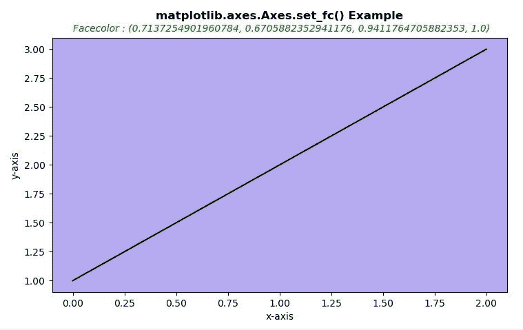
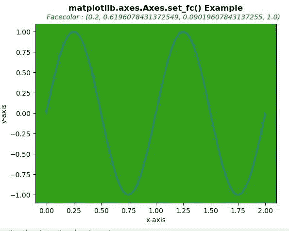

# matplotlib . axes . get _ fc()用 Python

表示

> 哎哎哎:# t0]https://www . geeksforgeeks . org/matplot lib-axes-get _ fc-in-python/

**[Matplotlib](https://www.geeksforgeeks.org/python-introduction-matplotlib/)** 是 Python 中的一个库，是 NumPy 库的数值-数学扩展。**轴类**包含了大部分的图形元素:轴、刻度、线二维、文本、多边形等。，并设置坐标系。Axes 的实例通过回调属性支持回调。

## matplotlib.axes.Axes.get_fc()函数

matplotlib 库的 axes 模块中的 **Axes.get_fc()函数**用于获取 Axes 的面颜色。

> **语法:** Axes.get_fc(self)
> 
> **参数:**此方法不接受任何参数。
> 
> **返回:**该方法返回 facecolor 值。

下面的例子说明了 matplotlib.axes.Axes.get_fc()函数在 matplotlib.axes 中的作用:

**例 1:**

```py
# Implementation of matplotlib function
import numpy as np
import matplotlib.pyplot as plt

fig, ax = plt.subplots()

ax.set_fc('# B6ABF0')
ax.set_xlabel('x-axis')
ax.set_ylabel('y-axis')
ax.plot([1, 2, 3], color ="black")

x = ax.get_fc()
ax.text(0, 3.15, "Facecolor : " +str(x), 
        style ='italic', fontsize = 10,
        color ="green")
ax.set_title('matplotlib.axes.Axes.set_fc() \
Example\n', fontsize = 12, fontweight ='bold')
plt.show()
```

**输出:**


**例 2:**

```py
# Implementation of matplotlib function
import numpy as np
import matplotlib.pyplot as plt

t = np.linspace(0.0, 2.0, 201)
s = np.sin(2 * np.pi * t)

fig, ax = plt.subplots()
ax.set_fc('# 339E17')
ax.set_xlabel('x-axis')
ax.set_ylabel('y-axis')
ax.plot(t, s)
x = ax.get_fc()
ax.text(0, 1.15, "Facecolor : " +str(x), 
       style ='italic', fontsize = 10, 
       color ="green")

ax.set_title('matplotlib.axes.Axes.set_fc()\
 Example\n', fontsize = 12, fontweight ='bold')
plt.show()
```

**输出:**
