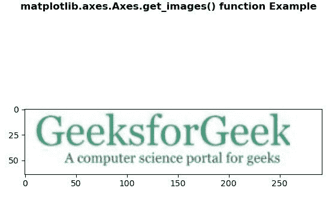
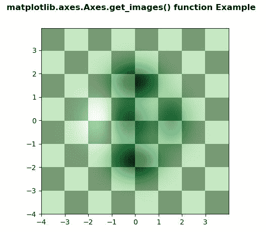

# Python 中的 matplotlib . axes . axes . get _ images()

> 原文:[https://www . geeksforgeeks . org/matplotlib-axes-axes-get _ images-in-python/](https://www.geeksforgeeks.org/matplotlib-axes-axes-get_images-in-python/)

**[Matplotlib](https://www.geeksforgeeks.org/python-introduction-matplotlib/)** 是 Python 中的一个库，是 NumPy 库的数值-数学扩展。**轴类**包含了大部分的图形元素:轴、刻度、线二维、文本、多边形等。，并设置坐标系。Axes 的实例通过回调属性支持回调。

## matplotlib . axes . axes . get _ images()函数

matplotlib 库的 axes 模块中的 **Axes.get_images()函数**用于返回 Axes 包含的 Axes 图像列表

> **语法:** Axes.get_images(self)
> 
> **参数:**此方法不接受任何参数。
> 
> **返回:**该方法返回坐标轴包含的坐标轴图像列表。

下面的例子说明了 matplotlib.axes . axes . get _ images()函数在 matplotlib . axes 中的作用:

**例 1:**

```py
# Implementation of matplotlib function
import matplotlib.pyplot as plt
import matplotlib.patches as patches
import matplotlib.cbook as cbook

# image used is 
# https://media.geeksforgeeks.org/
# wp-content/uploads/20200402214740/geek.jpg
with cbook.get_sample_data('geek.jpg') as image_file:
    image = plt.imread(image_file)

fig, ax = plt.subplots()
im = ax.imshow(image)

patch = patches.Rectangle((0, 0), 260, 200,
                          transform = ax.transData)
im.set_clip_path(patch)

print("List of the child Artists of this Artist \n",
      *list(ax.get_images()), sep ="\n")

fig.suptitle('matplotlib.axes.Axes.get_images() \
function Example', fontweight ="bold")

plt.show()
```

**输出:**


```py
List of the Axes images contained by the Axes

AxesImage(80, 52.8;496x369.6)

```

**例 2:**

```py
# Implementation of matplotlib function
import matplotlib.pyplot as plt
import numpy as np
from matplotlib.colors import LogNorm

dx, dy = 0.015, 0.05
x = np.arange(-4.0, 4.0, dx)
y = np.arange(-4.0, 4.0, dy)
X, Y = np.meshgrid(x, y)

extent = np.min(x), np.max(x), np.min(y), np.max(y)

fig, ax = plt.subplots()

Z1 = np.add.outer(range(8), range(8)) % 2
ax.imshow(Z1, cmap ="binary_r",
          interpolation ='nearest',
          extent = extent, alpha = 1)

def geeks(x, y):
    return (1 - x / 2 + x**5 + y**6) * np.exp(-(x**2 + y**2))

Z2 = geeks(X, Y)

ax.imshow(Z2, cmap ="Greens", alpha = 0.7,
          interpolation ='bilinear',
          extent = extent)

print("List of the Axes images contained by the Axes \n",
      *list(ax.get_images()), sep ="\n")

fig.suptitle('matplotlib.axes.Axes.get_images() function\
 Example', fontweight ="bold")
plt.show()
```

**输出:**



```py
List of the Axes images contained by the Axes 

AxesImage(80, 52.8;496x369.6)
AxesImage(80, 52.8;496x369.6)
```