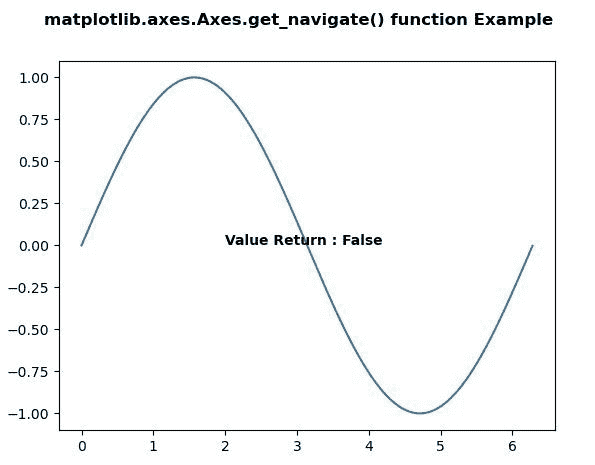
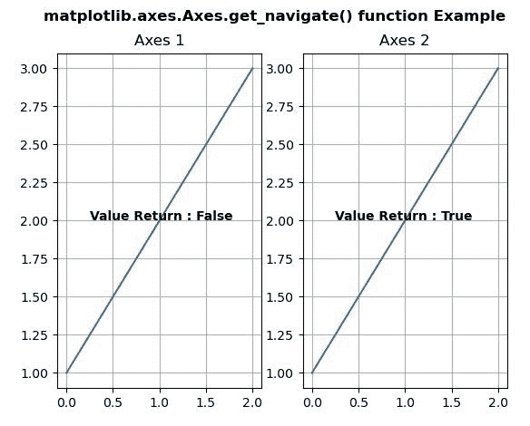

# Python 中的 matplotlib . axes . axes . get _ navigate()

> 原文:[https://www . geeksforgeeks . org/matplotlib-axes-axes-get _ navigate-in-python/](https://www.geeksforgeeks.org/matplotlib-axes-axes-get_navigate-in-python/)

**[Matplotlib](https://www.geeksforgeeks.org/python-introduction-matplotlib/)** 是 Python 中的一个库，是 NumPy 库的数值-数学扩展。**轴类**包含了大部分的图形元素:轴、刻度、线二维、文本、多边形等。，并设置坐标系。Axes 的实例通过回调属性支持回调。

## matplotlib . axes . axes . set _ navigate()函数

matplotlib 库的 Axes 模块中的 **Axes.get_navigate()函数**用于获取轴是否响应导航命令。

> **语法:** Axes.get_navigate(self)
> 
> **参数:**此方法不接受任何参数。
> 
> **返回值:**此方法返回导航点。

以下示例说明了 matplotlib . axes . axes . get _ navigate()函数在 matplotlib.axes:
**示例 1:**

```py
# Implementation of matplotlib function
import matplotlib.pyplot as plt
from mpl_toolkits.axisartist.axislines import SubplotZero
import numpy as np

fig, ax = plt.subplots()

xx = np.arange(0, 2 * np.pi, 0.01)
ax.plot(xx, np.sin(xx))

ax.set_navigate(False)
w = ax.get_navigate()

ax.text(2, 0, "Value Return : " + str(w),
        fontweight ="bold")

fig.suptitle('matplotlib.axes.Axes.get_navigate() function\
 Example\n\n', fontweight ="bold")

plt.show()
```

**输出:**


**例 2:**

```py
# Implementation of matplotlib function
import matplotlib.pyplot as plt
import numpy as np

fig, (ax, ax1)= plt.subplots(1, 2)
ax.plot([1, 2, 3])
ax.grid()

ax1.plot([1, 2, 3])
ax1.grid()
ax.set_navigate(False)

ax.set_title("Axes 1")
ax1.set_title("Axes 2")

w = ax.get_navigate()
ax.text(0.25, 2, "Value Return : " + str(w),
        fontweight ="bold")

w = ax1.get_navigate()
ax1.text(0.25, 2, "Value Return : " + str(w),
         fontweight ="bold")

fig.suptitle('matplotlib.axes.Axes.get_navigate()\
 function Example\n\n', fontweight ="bold")

plt.show()
```

**输出:**
