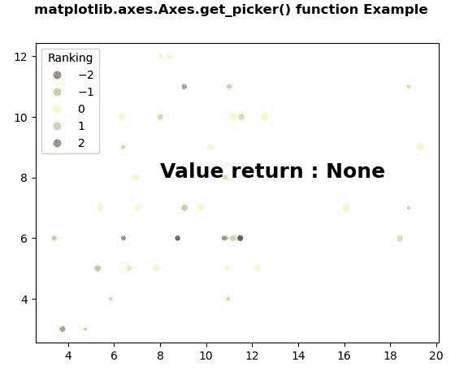
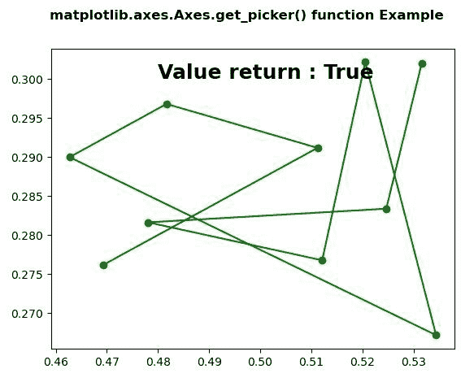

# Python 中的 matplotlib . axes . axes . get _ picker()

> 原文:[https://www . geeksforgeeks . org/matplotlib-axes-axes-get _ picker-in-python/](https://www.geeksforgeeks.org/matplotlib-axes-axes-get_picker-in-python/)

**[Matplotlib](https://www.geeksforgeeks.org/python-introduction-matplotlib/)** 是 Python 中的一个库，是 NumPy 库的数值-数学扩展。**轴类**包含了大部分的图形元素:轴、刻度、线二维、文本、多边形等。，并设置坐标系。Axes 的实例通过回调属性支持回调。

## matplotlib . axes . axes . get _ picker()函数

matplotlib 库的 Axes 模块中的 **Axes.get_picker()函数**用于返回艺术家的拾取行为。

> **语法:** Axes.get_picker(self)
> 
> **参数:**此方法不接受任何参数。
> 
> **返回:**此方法返回艺术家的采摘行为。

下面的例子说明了 matplotlib.axes . axes . get _ picker()函数在 matplotlib . axes 中的作用:

**例 1:**

```
#Implementation of matplotlib function
import numpy as np
np.random.seed(19680801)
import matplotlib.pyplot as plt

volume = np.random.rayleigh(7, size=40)
amount = np.random.poisson(7, size=40)
ranking = np.random.normal(size=40)
price = np.random.uniform(1, 7, size=40)

fig, ax = plt.subplots()

scatter = ax.scatter(volume,
                     amount,
                     c = ranking,
                     s = price*3,
                     vmin = -3, 
                     vmax = 3,
                     cmap = "Spectral")

legend1 = ax.legend(*scatter.legend_elements(num=5),
                    loc = "upper left",
                    title = "Ranking")

ax.add_artist(legend1)

ax.text(8, 8,"Value return : " + str(ax.get_picker()),
        fontweight = "bold",
        fontsize=18)

fig.suptitle('matplotlib.axes.Axes.get_picker() function \
Example', fontweight="bold")

plt.show()
```

**输出:**


**例 2:**

```
# Implementation of matplotlib function
import numpy as np
import matplotlib.pyplot as plt

X = np.random.rand(10, 200)
xs = np.mean(X, axis = 1)
ys = np.std(X, axis = 1)

fig = plt.figure()
ax = fig.add_subplot(111)
line, = ax.plot(xs, ys, 'go-', picker = 5)

ax.set_picker(True)

ax.text(0.48, 0.3, "Value return : " + str(ax.get_picker()),
        fontweight = "bold",
        fontsize = 18)

fig.suptitle('matplotlib.axes.Axes.get_picker()\
function Example', fontweight ="bold")

plt.show()
```

**输出:**
