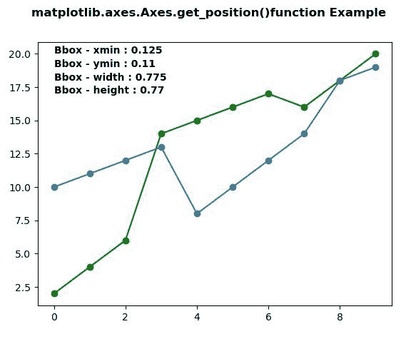
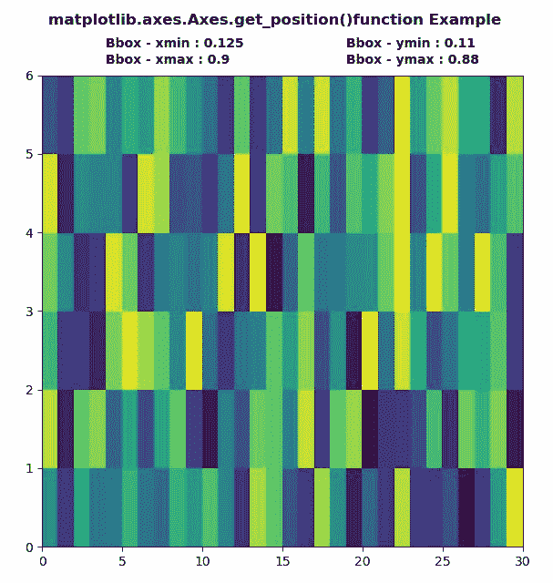

# Python 中的 matplotlib . axes . axes . get _ position()

> 原文:[https://www . geeksforgeeks . org/matplotlib-axes-axes-get _ position-in-python/](https://www.geeksforgeeks.org/matplotlib-axes-axes-get_position-in-python/)

**[Matplotlib](https://www.geeksforgeeks.org/python-introduction-matplotlib/)** 是 Python 中的一个库，是 NumPy 库的数值-数学扩展。**轴类**包含了大部分的图形元素:轴、刻度、线二维、文本、多边形等。，并设置坐标系。Axes 的实例通过回调属性支持回调。

## matplotlib . axes . axes . get _ position()函数

matplotlib 库的 Axes 模块中的 **Axes.set_position()函数**用于获取一个轴矩形的副本作为 Bbox..

> **语法:** Axes.get_position(self，original=False)
> 
> **参数:**
> 
> *   **原始:**如果为真，该参数用于返回原始位置。否则返回活动位置。
> 
> **返回值:**该方法将轴矩形的副本作为 Bbox 返回。

下面的例子说明了 matplotlib.axes . axes . get _ position()函数在 matplotlib . axes 中的作用:

**例 1:**

```py
# Implementation of matplotlib function
import matplotlib.pyplot as plt
import numpy as np

x = np.arange(10)
y = [2, 4, 6, 14, 15, 16, 17, 16, 18, 20]
y2 = [10, 11, 12, 13, 8, 10, 12, 14, 18, 19]

fig, ax1 = plt.subplots()

ax1.plot(x, y, "go-", label ='Line 1', )
ax1.plot(x, y2, "o-", label ='Line 2')

chartBox = ax1.get_position()
x, y, w, h = chartBox.x0, chartBox.y0, chartBox.width, chartBox.height

ax1.text(0, 20, "Bbox - xmin : "+str(x), 
         fontweight ="bold")
ax1.text(0, 19, "Bbox - ymin : "+str(round(y, 2)), 
         fontweight ="bold")
ax1.text(0, 18, "Bbox - width : "+str(w), 
         fontweight ="bold")
ax1.text(0, 17, "Bbox - height : "+str(h), 
         fontweight ="bold")
fig.suptitle('matplotlib.axes.Axes.get_position()\
function Example\n', fontweight ="bold")
plt.show()
```

**输出:**


**例 2:**

```py
# Implementation of matplotlib function
import matplotlib.pyplot as plt
import numpy as np
from matplotlib.colors import LogNorm

Z = np.random.rand(6, 30)

fig, ax1 = plt.subplots()

ax1.pcolor(Z)

chartBox = ax1.get_position()
x, y, x1, y1 = chartBox.x0, chartBox.y0, chartBox.x1, chartBox.y1

ax1.text(4, 6.35, "Bbox - xmin : "+str(x),
         fontweight ="bold")
ax1.text(19, 6.35, "Bbox - ymin : "+str(round(y, 2)),
         fontweight ="bold")
ax1.text(4, 6.15, "Bbox - xmax : "+str(x1), 
         fontweight ="bold")
ax1.text(19, 6.15, "Bbox - ymax : "+str(y1), 
         fontweight ="bold")
fig.suptitle('matplotlib.axes.Axes.get_position()\
function Example\n', fontweight ="bold")
plt.show()
```

**输出:**
