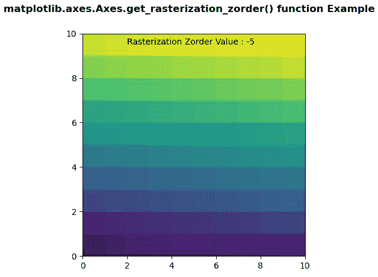
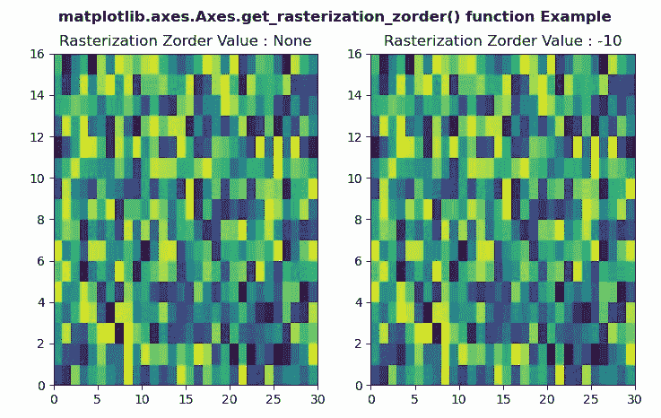

# Python 中的 matplotlib . axes . axes . get _ 栅格化 _zorder()

> 原文:[https://www . geeksforgeeks . org/matplotlib-axes-axes-get _ rasterization _ zorder-in-python/](https://www.geeksforgeeks.org/matplotlib-axes-axes-get_rasterization_zorder-in-python/)

**[Matplotlib](https://www.geeksforgeeks.org/python-introduction-matplotlib/)** 是 Python 中的一个库，是 NumPy 库的数值-数学扩展。**轴类**包含了大部分的图形元素:轴、刻度、线二维、文本、多边形等。，并设置坐标系。Axes 的实例通过回调属性支持回调。

## matplotlib . axes . axes . get _ 栅格化 _zorder()函数

matplotlib 库的 Axes 模块中的**Axis . get _ rasterization _ zorder()函数**用于返回 zorder 值，低于该值的艺术家将被光栅化。

> **语法:**Axis . get _ 栅格化 _zorder(self)
> 
> **参数:**该方法不接受任何参数。
> 
> **返回:**该方法返回 zorder 值，低于该值，艺术家将被光栅化。

下面的例子说明了 matplotlib.axes . axes . get _ rasterization _ zorder()函数在 matplotlib . axes 中的作用:

**例 1:**

```py
# Implementation of matplotlib function 
import numpy as np 
import matplotlib.pyplot as plt 

d = np.arange(100).reshape(10, 10) 
xx, yy = np.meshgrid(np.arange(11), np.arange(11)) 

fig, ax = plt.subplots() 

ax.set_aspect(1) 
m = ax.pcolormesh(xx, yy, d) 
m.set_zorder(-15) 
ax.set_rasterization_zorder(-5) 

w = ax.get_rasterization_zorder()
ax.text( 2, 9.5, "Rasterization Zorder Value : " + str(w))

fig.suptitle('matplotlib.axes.Axes.get_rasterization_zorder() \
function Example', fontweight ="bold") 

plt.show() 
```

**输出:**


**例 2:**

```py
# Implementation of matplotlib function 
import numpy as np 
import matplotlib.pyplot as plt 

xx = np.random.rand(16, 30) 

fig, (ax3, ax4) = plt.subplots(1, 2) 

m = ax3.pcolor(xx) 
m.set_zorder(-20) 

w = ax3.get_rasterization_zorder()
ax3.set_title("Rasterization Zorder Value : " + str(w)) 

m = ax4.pcolor(xx) 
m.set_zorder(-20) 

ax4.set_rasterization_zorder(-10) 
w = ax4.get_rasterization_zorder()
ax4.set_title("Rasterization Zorder Value : " + str(w))

fig.suptitle('matplotlib.axes.Axes.get_rasterization_zorder()\
 function Example', fontweight ="bold") 

plt.show() 
```

**输出:**
