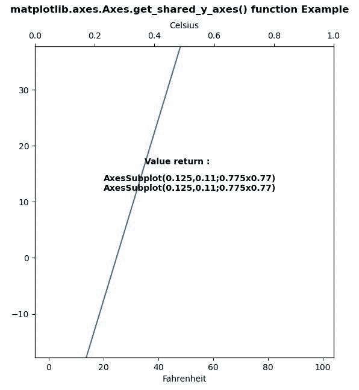
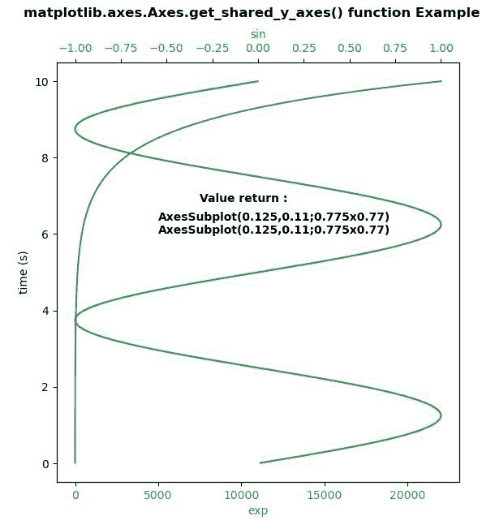

# Python 中的 matplotlib . axes . axes . get _ shared _ y _ axes()

> 原文:[https://www . geeksforgeeks . org/matplotlib-axes-axes-get _ shared _ y _ axes-in-python/](https://www.geeksforgeeks.org/matplotlib-axes-axes-get_shared_y_axes-in-python/)

**[Matplotlib](https://www.geeksforgeeks.org/python-introduction-matplotlib/)** 是 Python 中的一个库，是 NumPy 库的数值-数学扩展。**轴类**包含了大部分的图形元素:轴、刻度、线二维、文本、多边形等。，并设置坐标系。Axes 的实例通过回调属性支持回调。

## matplotlib . axes . axes . get _ shared _ y _ axes()函数

matplotlib 库的 Axes 模块中的**Axis . get _ shared _ y _ axes()函数**用于返回对 y 轴的共享轴 Grouper 对象的引用。

**语法:**

```py
Axes.get_shared_y_axes(self)

```

下面的例子说明了 matplotlib.axes . axes . get _ shared _ y _ axes()函数在 matplotlib . axes 中的作用:

**例 1:**

```py
# Implementation of matplotlib function
import matplotlib.pyplot as plt
import numpy as np

def GFG1(temp):
    return (5\. / 9.) * (temp - 32)

def GFG2(ax1):
    y1, y2 = ax1.get_ylim()
    ax_twin .set_ylim(GFG1(y1), GFG1(y2))
    ax_twin .figure.canvas.draw()

fig, ax1 = plt.subplots()
ax_twin = ax1.twiny()

ax1.callbacks.connect("ylim_changed", GFG2)
ax1.plot(np.linspace(-40, 120, 100))
ax1.set_ylim(0, 100)

ax1.set_xlabel('Fahrenheit')
ax_twin .set_xlabel('Celsius')

w = ax1.get_shared_y_axes()
w1 = ax_twin.get_shared_y_axes()
for i in w:
    x, y = list(i)
    ax1.text(35, 15, "Value return : \n", 
             fontweight ="bold")
    ax1.text(20, 12, str(x)+"\n"+str(y), 
             fontweight ="bold")

fig.suptitle('matplotlib.axes.Axes.get_shared_y_axes() \
function Example\n\n', fontweight ="bold")
plt.show()
```

**输出:**


**例 2:**

```py
# Implementation of matplotlib function
import numpy as np
import matplotlib.pyplot as plt

# Create some mock data
t = np.arange(0.01, 10.0, 0.001)
data1 = np.exp(t)
data2 = np.sin(0.4 * np.pi * t)

fig, ax1 = plt.subplots()

color = 'tab:blue'
ax1.set_ylabel('time (s)')
ax1.set_xlabel('exp', color = color)
ax1.plot(data1, t, color = color)
ax1.tick_params(axis ='x', labelcolor = color)

ax2 = ax1.twiny()

color = 'tab:green'
ax2.set_xlabel('sin', color = color)
ax2.plot(data2, t, color = color)
ax2.tick_params(axis ='x', labelcolor = color)

w = ax1.get_shared_y_axes()
w1 = ax2.get_shared_y_axes()
for i in w:
    x, y = list(i)
    ax1.text(7500, 6.5, "Value return : \n",
             fontweight ="bold")

    ax1.text(5000, 6, str(x)+"\n"+str(y), 
             fontweight ="bold")

fig.suptitle('matplotlib.axes.Axes.get_shared_y_axes() \
function Example\n\n', fontweight ="bold")
plt.show()
```

**输出:**
