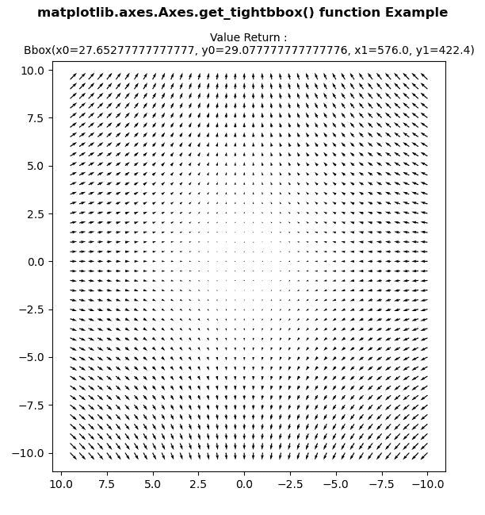
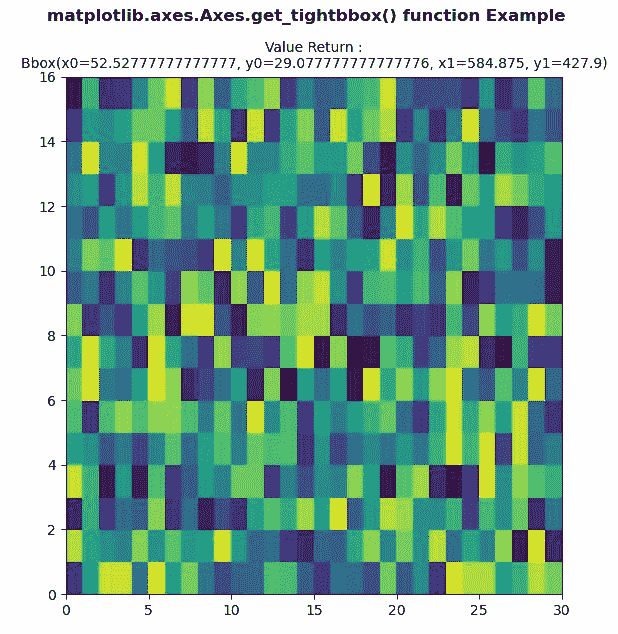

# matplotlib . axes . get _ tightbbox()用 Python

表示

> 哎哎哎:# t0]https://www . geeksforgeeks . org/matplotlib-axes-get _ tightbbox-in-python/

**[Matplotlib](https://www.geeksforgeeks.org/python-introduction-matplotlib/)** 是 Python 中的一个库，是 NumPy 库的数值-数学扩展。**轴类**包含了大部分的图形元素:轴、刻度、线二维、文本、多边形等。，并设置坐标系。Axes 的实例通过回调属性支持回调。

## matplotlib . axes . axes . get _ tightbbox()函数

matplotlib 库的 Axes 模块中的**axes . get _ 紧密 box()函数**用于返回轴的紧密包围盒，包括轴及其装饰器。

> **语法:**axes . get _ tight box(self，渲染器，call_axes_locator=True，bbox_extra_artists=None)
> 
> **参数:**该方法接受以下参数。
> 
> *   **渲染器:**该参数是将用于绘制图形的渲染器渲染实例
>     渲染器。
> *   **bbox_extra_artists :** 此参数是要包含在紧密包围盒中的艺术家列表。
> *   **call_axes_locator :** 此参数是要包含在紧密包围盒中的艺术家列表。
> 
> **返回:**该方法返回图形像素坐标中的包围盒。

下面的例子说明了 matplotlib.axes . axes . get _ tybbox()函数在 matplotlib . axes 中的作用:

**例 1:**

```
# Implementation of matplotlib function
import matplotlib.pyplot as plt
import numpy as np

X = np.arange(-10, 10, 0.5)
Y = np.arange(-10, 10, 0.5)
U, V = np.meshgrid(X, Y)

fig, ax = plt.subplots()
ax.quiver(X, Y, U, V)
ax.invert_xaxis()
w = ax.get_tightbbox(fig.canvas.get_renderer(),
                     call_axes_locator = True, 
                     bbox_extra_artists = None)

ax.set_title("Value Return :\n"+str(w), 
              fontsize = 10)

fig.suptitle('matplotlib.axes.Axes.get_tightbbox()\
 function Example', fontweight ="bold") 

plt.show() 
```

**输出:**


**例 2:**

```
# Implementation of matplotlib function 
import numpy as np 
import matplotlib.pyplot as plt 

xx = np.random.rand(16, 30) 

fig, ax = plt.subplots() 

m = ax.pcolor(xx) 
m.set_zorder(-20) 
w = ax.get_tightbbox(fig.canvas.get_renderer(), 
                     call_axes_locator = True,
                     bbox_extra_artists = None)

ax.set_title("Value Return :\n"+str(w),
              fontsize = 10)

fig.suptitle('matplotlib.axes.Axes.get_tightbbox()\
 function Example', fontweight ="bold") 

plt.show() 
```

**输出:**
