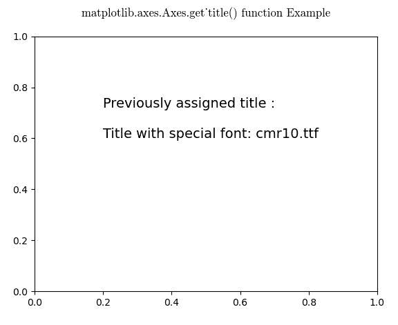
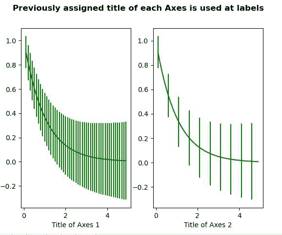

# Python 中的 Matplotlib.axes.Axes.get_title()

> 原文:[https://www . geeksforgeeks . org/matplotlib-axes-axes-get _ title-in-python/](https://www.geeksforgeeks.org/matplotlib-axes-axes-get_title-in-python/)

**[Matplotlib](https://www.geeksforgeeks.org/python-introduction-matplotlib/)** 是 Python 中的一个库，是 NumPy 库的数值-数学扩展。**轴类**包含了大部分的图形元素:轴、刻度、线二维、文本、多边形等。，并设置坐标系。Axes 的实例通过回调属性支持回调。

## matplotlib.axes.Axes.get_title()函数

matplotlib 库的 Axes 模块中的 **Axes.get_title()函数**用于获取一个 axes 标题。

> **语法:** Axes.get_title(self，loc='center ')
> 
> **参数:**该方法接受以下参数。
> 
> *   **loc :** 此参数为可选参数，用于获取哪个标题。
> 
> **返回:**该函数返回标题文本字符串。

下面的例子说明了 matplotlib.axes.Axes.get_title()函数在 matplotlib.axes 中的作用:

**例 1:**

```py
# Implementation of matplotlib function
import os
from matplotlib import font_manager as fm, rcParams
import matplotlib.pyplot as plt

fig, ax = plt.subplots()

fpath = os.path.join(rcParams["datapath"], 
                     "fonts / ttf / cmr10.ttf")
prop = fm.FontProperties(fname = fpath)
fname = os.path.split(fpath)[1]
ax.set_title('Title with special font: {}'.format(fname),
             fontproperties = prop, fontsize = 14)

w = ax.get_title()
ax.text(0.2, 0.6, "Previously assigned title : \n\n"+str(w),
        fontsize = 14)
ax.set_title("matplotlib.axes.Axes.get_title() \
function Example\n", fontweight ="bold")
plt.show()
```

**输出:**


**例 2:**

```py
# Implementation of matplotlib function
import numpy as np
import matplotlib.pyplot as plt

x = np.arange(0.1, 5, 0.1)
y = np.exp(-x)

yerr = 0.1 + 0.1 * np.sqrt(x)

fig, (ax, ax1) = plt.subplots(nrows = 1,
                              ncols = 2,
                              sharex = True)

ax.errorbar(x, y, yerr = yerr, color ="green")
ax.set_title('Title of Axes 1', fontweight ="bold")

ax1.errorbar(x, y, yerr = yerr, errorevery = 5,
             color ="green")
ax1.set_title('Title of Axes 2', fontweight ="bold")

w = ax.get_title()
ww = ax1.get_title()
ax.set_title("")
ax1.set_title("")

ax.set_xlabel(w)
ax1.set_xlabel(ww)

fig.suptitle("Previously assigned title of each Axes is\
 used at labels\n", fontweight ="bold")
plt.show()
```

**输出:**
