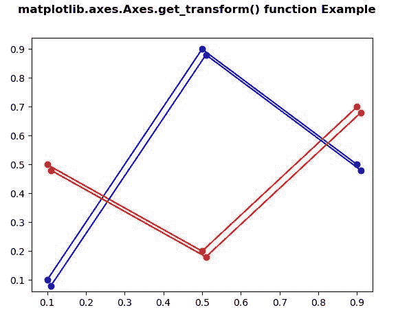
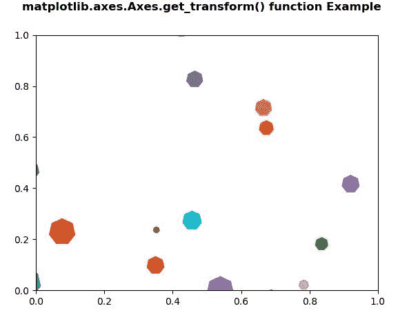

# Python 中的 matplotlib . axes . axes . get _ transform()

> 原文:[https://www . geeksforgeeks . org/matplotlib-axes-axes-get _ transform-in-python/](https://www.geeksforgeeks.org/matplotlib-axes-axes-get_transform-in-python/)

**[Matplotlib](https://www.geeksforgeeks.org/python-introduction-matplotlib/)** 是 Python 中的一个库，是 NumPy 库的数值-数学扩展。**轴类**包含了大部分的图形元素:轴、刻度、线二维、文本、多边形等。，并设置坐标系。Axes 的实例通过回调属性支持回调。

## matplotlib . axes . axes . get _ transform()函数

matplotlib 库的 Axes 模块中的 **Axes.get_transform()函数**用于获取该艺术家使用的 **Transform** 实例

> **语法:** Axes.get_transform(self)
> 
> **参数:**该方法不接受任何参数。
> 
> **返回:**该方法返回该艺术家使用的变换实例

下面的例子说明了 matplotlib.axes . axes . get _ transform()函数在 matplotlib . axes 中的作用:

**例 1:**

```
# Implementation of matplotlib function 
import numpy as np 
import matplotlib.pyplot as plt
import matplotlib.transforms as mtransforms

fig, ax = plt.subplots() 
l1, = ax.plot([0.1, 0.5, 0.9], [0.1, 0.9, 0.5], "bo-")
l2, = ax.plot([0.1, 0.5, 0.9], [0.5, 0.2, 0.7], "ro-")

for l in [l1, l2]:
    xx = l.get_xdata()
    yy = l.get_ydata()
    shadow, = ax.plot(xx, yy)
    shadow.update_from(l)

    ot = mtransforms.offset_copy(l.get_transform(),
                                 ax.figure,
                                 x = 4.0, y =-6.0,
                                 units ='points')

    shadow.set_transform(ot)

fig.suptitle('matplotlib.axes.Axes.get_transform() \
function Example', fontweight ="bold") 

plt.show() 
```

**输出:**


**例 2:**

```
# Implementation of matplotlib function  
import matplotlib.pyplot as plt
from matplotlib import collections, colors, transforms
import numpy as np

nverts = 50
npts = 100

r = np.arange(nverts)
theta = np.linspace(0, 2 * np.pi, nverts)

xx = r * np.sin(theta)
yy = r * np.cos(theta)

spiral = np.column_stack([xx, yy])

rs = np.random.RandomState(19680801)

xyo = rs.randn(npts, 2)

colors = [colors.to_rgba(c)
          for c in plt.rcParams['axes.prop_cycle'].by_key()['color']]

fig, ax1 = plt.subplots()

col = collections.RegularPolyCollection(
    7, sizes = np.abs(xx) * 10.0, 
    offsets = xyo,
    transOffset = ax1.transData)

trans = transforms.Affine2D().scale(fig.dpi / 72.0)
col.set_transform(trans) 

ax1.add_collection(col, autolim = True)
col.set_color(colors)

print("Value Return by get_transform() :\n",
       col.get_transform())

fig.suptitle('matplotlib.axes.Axes.get_transform() \
function Example', fontweight ="bold") 

plt.show() 
```

**输出:**



```
Value Return by get_transform() :
 Affine2D(
    [[1.38888889 0\.         0\.        ]
     [0\.         1.38888889 0\.        ]
     [0\.         0\.         1\.        ]])

```