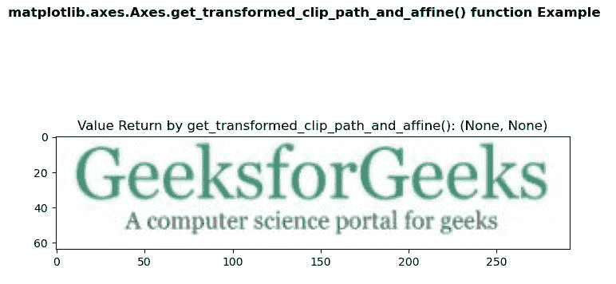
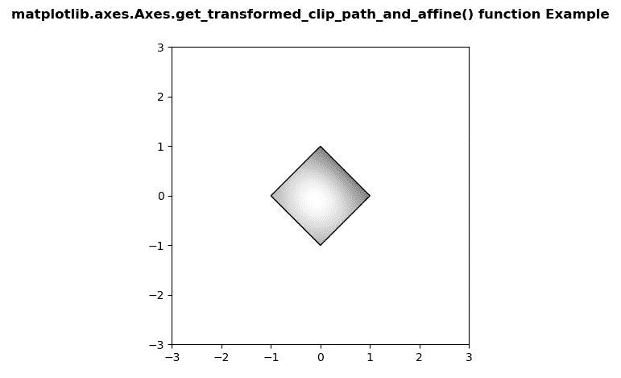

# Python 中的 matplotlib . axes . axes . get _ transformed _ clip _ path _ and _ 仿射()

> 原文:[https://www . geeksforgeeks . org/matplotlib-axes-axes-get _ transformed _ clip _ path _ and _ 仿射-in-python/](https://www.geeksforgeeks.org/matplotlib-axes-axes-get_transformed_clip_path_and_affine-in-python/)

**[Matplotlib](https://www.geeksforgeeks.org/python-introduction-matplotlib/)** 是 Python 中的一个库，是 NumPy 库的数值-数学扩展。**轴类**包含了大部分的图形元素:轴、刻度、线二维、文本、多边形等。，并设置坐标系。Axes 的实例通过回调属性支持回调。

## matplotlib . axes . axes . get _ transformed _ clip _ path _ and _ 仿射()函数

matplotlib 库的 Axes 模块中的**axes . get _ transformed _ clip _ path _ and _ affine()函数**用于获取应用了其变换的非仿射部分以及其变换的剩余仿射部分的裁剪路径。

> **语法:**axes . get _ transformed _ clip _ path _ and _ affine(self)
> 
> **参数:**该方法不接受任何参数。
> 
> **返回:**该方法返回应用了变换的非仿射部分和变换的剩余仿射部分的剪辑路径。

下面的例子说明了 matplotlib.axes . axes . get _ transformed _ clip _ path _ and _ 仿射()函数在 matplotlib . axes 中的作用:

**例 1:**

**使用的图像:**


```
# Implementation of matplotlib function
import matplotlib.pyplot as plt
import matplotlib.patches as patches
import matplotlib.cbook as cbook

with cbook.get_sample_data('loggf.PNG') as image_file:
    image = plt.imread(image_file)

fig, ax = plt.subplots()
im = ax.imshow(image)
patch = patches.Rectangle((0, 0), 260, 200, 
                          transform = ax.transData)

ax.set_title("Value Return by get_transformed_clip_path_and_affine(): "
             +str(im.get_transformed_clip_path_and_affine()))

fig.suptitle('matplotlib.axes.Axes.get_transformed_clip_path_and_affine()\
 function Example\n\n', fontweight ="bold")

plt.show()
```

**输出:**


**例 2:**

```
# Implementation of matplotlib function
import numpy as np
import matplotlib.cm as cm
import matplotlib.pyplot as plt
from matplotlib.path import Path
from matplotlib.patches import PathPatch

delta = 0.025

x = y = np.arange(-3.0, 3.0, delta)
X, Y = np.meshgrid(x, y)

Z1 = np.exp(-X**2 - Y**2)
Z2 = np.exp(-(X - 1)**2 - (Y - 1)**2)
Z = (Z1 - Z2) * 2

path = Path([[0, 1], [1, 0], [0, -1], [-1, 0], [0, 1]])
patch = PathPatch(path, facecolor ='none')

fig, ax = plt.subplots()
ax.add_patch(patch)
im = ax.imshow(Z,
               interpolation ='bilinear', 
               cmap = cm.gray,
               origin ='lower',
               extent =[-3, 3, -3, 3],
               clip_path = patch,
               clip_on = True)

print("Value Return by get_transformed_clip_path_and_affine(): ")

for i in im.get_transformed_clip_path_and_affine():
    print(i)

fig.suptitle('matplotlib.axes.Axes.get_transformed_clip_path_and_affine()\
 function Example\n\n', fontweight ="bold")

plt.show()
```

**输出:**



```
Value Return by get_transformed_clip_path_and_affine(): 
Path(array([[ 0.,  1.],
       [ 1.,  0.],
       [ 0., -1.],
       [-1.,  0.],
       [ 0.,  1.]]), None)
Affine2D(
    [[ 82.66666667   0\.         328\.        ]
     [  0\.          61.6        237.6       ]
     [  0\.           0\.           1\.        ]])

```