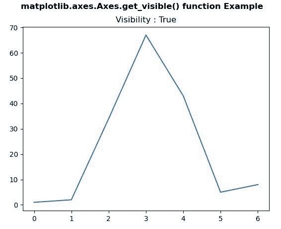
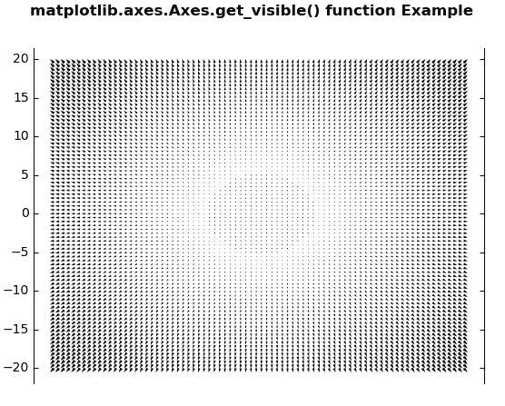

# Python 中的 matplotlib . axes . axes . get _ visible()

> 原文:[https://www . geeksforgeeks . org/matplotlib-axes-axes-get _ visible-in-python/](https://www.geeksforgeeks.org/matplotlib-axes-axes-get_visible-in-python/)

**[Matplotlib](https://www.geeksforgeeks.org/python-introduction-matplotlib/)** 是 Python 中的一个库，是 NumPy 库的数值-数学扩展。**轴类**包含了大部分的图形元素:轴、刻度、线二维、文本、多边形等。，并设置坐标系。Axes 的实例通过回调属性支持回调。

## matplotlib . axes . axes . get _ visible()函数

matplotlib 库的 Axes 模块中的 **Axes.get_visible()函数**用于获取可见性。

> **语法:** Axes.get_visible(self)
> 
> **参数:**该方法不接受任何参数。
> 
> **返回:**此方法返回可见性。

下面的例子说明了 matplotlib.axes . axes . get _ visible()函数在 matplotlib . axes 中的作用:

**例 1:**

```py
# Implementation of matplotlib function
import matplotlib.pyplot as plt
from mpl_toolkits.axisartist.axislines import Subplot

fig, ax = plt.subplots()

ax.plot([1, 2, 34, 67, 43, 5, 8])

ax.set_title("Visibility : " +str(ax.get_visible()))

fig.suptitle('matplotlib.axes.Axes.get_visible()\
 function Example\n', fontweight ="bold")

plt.show()
```

**输出:**


**例 2:**

```py
# Implementation of matplotlib function
import numpy as np
import matplotlib.pyplot as plt
from mpl_toolkits.axisartist.axislines import Subplot

fig = plt.figure()

ax = Subplot(fig, 111)
fig.add_subplot(ax)

X = np.arange(-20, 20, 0.5)
Y = np.arange(-20, 20, 0.5)
U, V = np.meshgrid(X, Y)

ax.quiver(X, Y, U, V)

ax.axis["bottom"].set_visible(False)
ax.axis["top"].set_visible(False)

print("Visibilities of Axis")
print("Bottom :", ax.axis["bottom"].get_visible(),
      "\nTop :", ax.axis["top"].get_visible(),
      "\nLeft :", ax.axis["left"].get_visible(),
      "\nRight :", ax.axis["right"].get_visible())

fig.suptitle('matplotlib.axes.Axes.get_visible() \
function Example\n', fontweight ="bold")

plt.show()
```

**输出:**



```py
Visibilities of Axis
Bottom : False 
Top : False 
Left : True 
Right : True

```