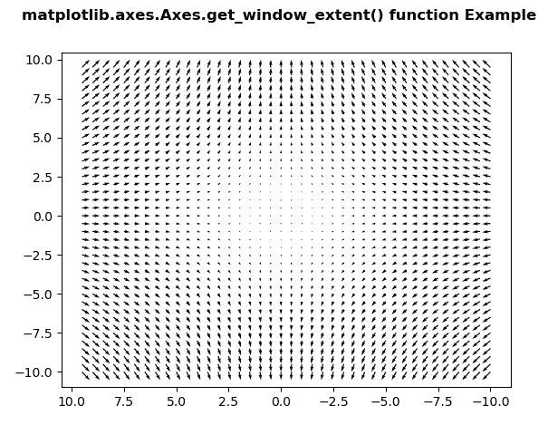
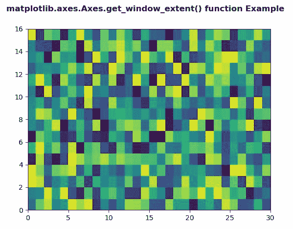

# Python 中的 matplotlib . axes . axes . get _ window _ extent()

> 原文:[https://www . geeksforgeeks . org/matplotlib-axes-axes-get _ window _ extend-in-python/](https://www.geeksforgeeks.org/matplotlib-axes-axes-get_window_extent-in-python/)

**[Matplotlib](https://www.geeksforgeeks.org/python-introduction-matplotlib/)** 是 Python 中的一个库，是 NumPy 库的数值-数学扩展。**轴类**包含了大部分的图形元素:轴、刻度、线二维、文本、多边形等。，并设置坐标系。Axes 的实例通过回调属性支持回调。

## matplotlib . axes . axes . get _ window _ extent()函数

matplotlib 库的 Axes 模块中的 **Axes.get_window_extent()函数**用于返回显示间隔中的轴边界框。

> **语法:** Axes.get_window_extent(self，*args，*\*kwargs)
> 
> 这里，args 和 kwargs 是空的。
> **参数:**此方法不接受任何参数。
> 
> **返回:**该方法返回显示空间中的轴边界框。

下面的例子说明了 matplotlib.axes . axes . get _ window _ extent()函数在 matplotlib . axes 中的作用:

**例 1:**

```py
# Implementation of matplotlib function
import matplotlib.pyplot as plt
import numpy as np

X = np.arange(-10, 10, 0.5)
Y = np.arange(-10, 10, 0.5)
U, V = np.meshgrid(X, Y)

fig, ax = plt.subplots()
ax.quiver(X, Y, U, V)
ax.invert_xaxis()
w = ax.get_window_extent()
print(str(w))

fig.suptitle('matplotlib.axes.Axes.get_window_extent()\
 function Example', fontweight ="bold") 

plt.show() 
```

**输出:**



```py
TransformedBbox(
    Bbox(x0=0.125, y0=0.10999999999999999, x1=0.9, y1=0.88),
    BboxTransformTo(
        TransformedBbox(
            Bbox(x0=0.0, y0=0.0, x1=6.4, y1=4.8),
            Affine2D(
                [[100\.   0\.   0.]
                 [  0\. 100\.   0.]
                 [  0\.   0\.   1.]]))))

```

**例 2:**

```py
# Implementation of matplotlib function 
import numpy as np 
import matplotlib.pyplot as plt 

xx = np.random.rand(16, 30) 

fig, ax3 = plt.subplots() 

m = ax3.pcolor(xx) 
m.set_zorder(-20) 
w = ax3.get_window_extent()
print(str(w))

fig.suptitle('matplotlib.axes.Axes.get_window_extent() \
function Example', fontweight ="bold") 

plt.show() 
```

**输出:**



```py
TransformedBbox(
    Bbox(x0=0.125, y0=0.10999999999999999, x1=0.9, y1=0.88),
    BboxTransformTo(
        TransformedBbox(
            Bbox(x0=0.0, y0=0.0, x1=6.4, y1=4.8),
            Affine2D(
                [[100\.   0\.   0.]
                 [  0\. 100\.   0.]
                 [  0\.   0\.   1.]]))))

```