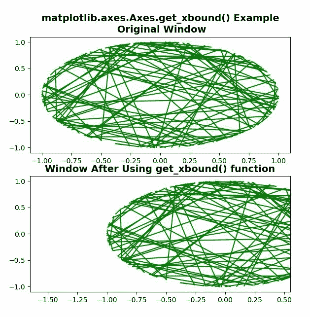
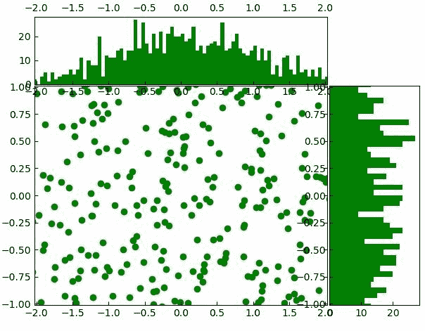

# Python 中的 matplotlib . axes . axes . get _ xbound()

> 原文:[https://www . geeksforgeeks . org/matplotlib-axes-axes-get _ xbound-in-python/](https://www.geeksforgeeks.org/matplotlib-axes-axes-get_xbound-in-python/)

**[Matplotlib](https://www.geeksforgeeks.org/python-introduction-matplotlib/)** 是 Python 中的一个库，是 NumPy 库的数值-数学扩展。**轴类**包含了大部分的图形元素:轴、刻度、线二维、文本、多边形等。，并设置坐标系。Axes 的实例通过回调属性支持回调。

## matplotlib . axes . axes . get _ xbound()函数

matplotlib 库的 Axes 模块中的 **Axes.get_xbound()函数**用于以递增的顺序返回 x 轴的数值上下限

> **语法:** Axes.get_xbound(self)
> 
> **参数:**该方法不接受任何参数。
> 
> **返回:**该方法返回以下内容
> 
> *   **下限、上限:**这将返回当前 x 轴的下限和上限。

**注意:**该功能可以在各种情况下代替 get_xlim 使用。

下面的例子说明了 matplotlib.axes . axes . get _ xbound()函数在 matplotlib . axes 中的作用:

**例 1:**

```
# Implementation of matplotlib function
from matplotlib.widgets import Cursor
import numpy as np
import matplotlib.pyplot as plt

fig, [ax, ax1] = plt.subplots(2, 1)
t = 4*(np.random.rand(2, 100) - .5)
x = np.cos(2 * np.pi * t)
y = np.sin(2 * np.pi * t)

ax.plot(x, y, 'g')
lower, upper = ax.get_xbound()
ax.set_title('matplotlib.axes.Axes.get_xbound()\
 Example\n Original Window',
             fontsize = 14, fontweight ='bold')

ax1.plot(x, y, 'g')
ax1.set_xbound(1.5 * lower, 0.5 * upper)
ax1.set_title('Window After Using get_xbound() function',
             fontsize = 14, fontweight ='bold')
plt.show()
```

**输出:**


**例 2:**

```
import numpy as np
import matplotlib.pyplot as plt

# Fixing random state for
# reproducibility
np.random.seed(19680801)

# the random data
x = np.random.randn(1000)
y = np.random.randn(1000)

# definitions for the axes
left, width = 0.1, 0.65
bottom, height = 0.1, 0.65
spacing = 0.005

rect_scatter = [left, bottom,
                width, height]

rect_histx = [left,
              bottom + height + spacing,
              width, 0.2]

rect_histy = [left + width + spacing,
              bottom, 0.2, height]

# start with a rectangular Figure
plt.figure()

ax_scatter = plt.axes(rect_scatter)
ax_scatter.tick_params(direction ='in',
                       bottom = True, 
                       right = True)

ax_histx = plt.axes(rect_histx)
ax_histx.tick_params(direction ='in',
                     labeltop = True)

ax_histy = plt.axes(rect_histy)
ax_histy.tick_params(direction ='in',
                     labelleft = True)

# the scatter plot:
ax_scatter.scatter(2 * x, y * 2, color ="green")

# now determine nice limits by hand:
binwidth = 0.05
lim = np.ceil(np.abs([x, y]).max() / binwidth) * binwidth
ax_scatter.set_xbound((-0.5 * lim, 0.5 * lim))
ax_scatter.set_ybound((-0.25 * lim, 0.25 * lim))

bins = np.arange(-lim, lim + binwidth, binwidth)
ax_histx.hist(x, bins = bins,
              color ="green")
ax_histy.hist(y, bins = bins, 
              color ="green", 
              orientation ='horizontal')

ax_histx.set_xbound(ax_scatter.get_xbound())
ax_histy.set_ybound(ax_scatter.get_ybound())

plt.show()
```

**输出:**
