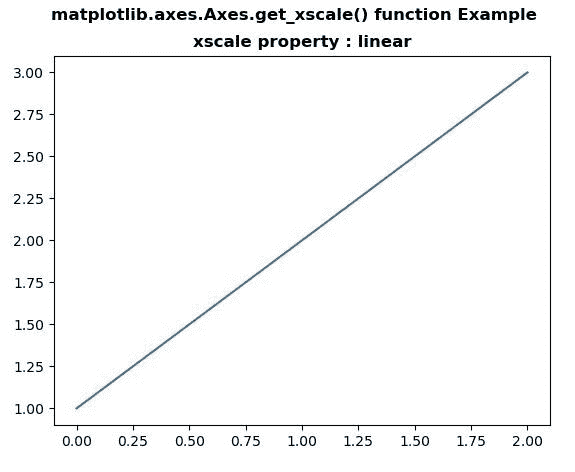
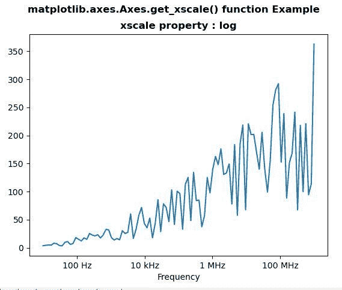

# matplotlib . axes . get _ xscale()用 Python

表示

> 原文:[https://www . geeksforgeeks . org/matplotlib-axes-axes-get _ xscale-in-python/](https://www.geeksforgeeks.org/matplotlib-axes-axes-get_xscale-in-python/)

**[Matplotlib](https://www.geeksforgeeks.org/python-introduction-matplotlib/)** 是 Python 中的一个库，是 NumPy 库的数值-数学扩展。**轴类**包含了大部分的图形元素:轴、刻度、线二维、文本、多边形等。，并设置坐标系。Axes 的实例通过回调属性支持回调。

## matplotlib . axes . axes . get _ xscale()函数

matplotlib 库的 Axes 模块中的 **Axes.get_xscale()函数**用于将 x 轴比例作为字符串返回。

> **语法:** Axes.get_xscale(self)
> 
> **参数:**该方法不接受任何参数。
> 
> **返回:**该函数将 x 轴刻度作为字符串返回。

下面的例子说明了 matplotlib.axes . axes . set _ yscale()函数在 matplotlib . axes 中的作用:

**例 1:**

```py
# Implementation of matplotlib function
import matplotlib.pyplot as plt
import numpy as np

fig, ax = plt.subplots()

ax.plot([1, 2, 3])

w = ax.get_xscale()

ax.set_title("xscale property : "+ str(w),
              fontweight ="bold")
fig.suptitle('matplotlib.axes.Axes.get_xscale()\
 function Example\n', fontweight ="bold")

fig.canvas.draw()
plt.show()
```

**输出:**


**例 2:**

```py
# Implementation of matplotlib function
import matplotlib.pyplot as plt
import numpy as np
from matplotlib.ticker import EngFormatter

val = np.random.RandomState(19680801)
xs = np.logspace(1, 9, 100)
ys = (0.8 + 4 * val.uniform(size = 100)) * np.log10(xs)**2

fig, ax0 = plt.subplots()
ax0.set_xscale('log')
formatter0 = EngFormatter(unit ='Hz')
ax0.xaxis.set_major_formatter(formatter0)
ax0.plot(xs, ys)
ax0.set_xlabel('Frequency')

w = ax0.get_xscale()

ax0.set_title("xscale property : "+ str(w),
              fontweight ="bold")
fig.suptitle('matplotlib.axes.Axes.get_xscale()\
 function Example\n', fontweight ="bold")

fig.canvas.draw()
plt.show()
```

**输出:**
