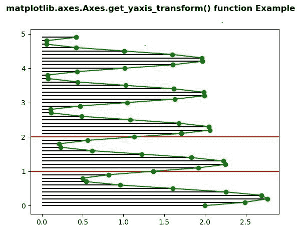
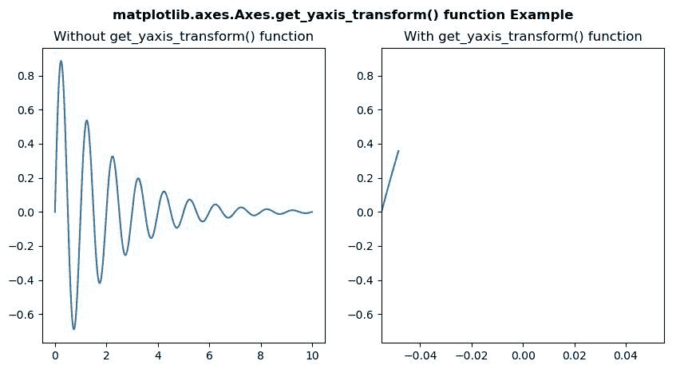

# Python 中的 matplotlib . axes . axes . get _ yaxis _ transform()

> 原文:[https://www . geeksforgeeks . org/matplotlib-axes-axes-get _ yaxis _ transform-in-python/](https://www.geeksforgeeks.org/matplotlib-axes-axes-get_yaxis_transform-in-python/)

**[Matplotlib](https://www.geeksforgeeks.org/python-introduction-matplotlib/)** 是 Python 中的一个库，是 NumPy 库的数值-数学扩展。**轴类**包含了大部分的图形元素:轴、刻度、线二维、文本、多边形等。，并设置坐标系。Axes 的实例通过回调属性支持回调。

## matplotlib . axes . axes . get _ yaxis _ transform()函数

matplotlib 库的 Axes 模块中的**Axis . get _ yaxis _ transform()函数**用于获取绘制 y 轴标签、刻度和网格线的变换。

> **语法:**axes . get _ yaxis _ transform(self，即='grid ')
> 
> **参数:**该方法不接受任何参数。
> 
> **返回值:**此方法返回用于绘制 y 轴标签、刻度和网格线的变换。

下面的例子说明了 matplotlib.axes . axes . get _ yaxis _ transform()函数在 matplotlib . axes 中的作用:

**例 1:**

```
# Implementation of matplotlib function
import matplotlib.pyplot as plt
import numpy as np

t = np.arange(0.0, 5.0, 0.1)
s = np.exp(-t) + np.sin(2 * np.pi * t) + 1
nse = np.random.normal(0.0, 0.3, t.shape) * s

fig, vax = plt.subplots()

vax.plot(s, t, 'go-')
vax.hlines(t, [0], s)
vax.hlines([1, 2], 0, 1,
           transform = vax.get_yaxis_transform(),
           colors ='r')

fig.suptitle('matplotlib.axes.Axes.get_yaxis_transform()\
 function Example', fontweight ="bold")

plt.show()
```

**输出:**


**例 2:**

```
# Implementation of matplotlib function
import numpy as np
import matplotlib.pyplot as plt
import matplotlib.patches as mpatches

x = np.arange(0, 10, 0.005)
y = np.exp(-x / 2.) * np.sin(2 * np.pi * x)

fig, [ax, ax1] = plt.subplots(1, 2)

ax.plot(x, y)
ax.set_title("Without get_yaxis_transform() function")

ax1.plot(x, y, transform = ax1.get_yaxis_transform())
ax1.set_title("With get_yaxis_transform() function")

fig.suptitle('matplotlib.axes.Axes.get_yaxis_transform()\
 function Example', fontweight ="bold")

plt.show()
```

**输出:**
