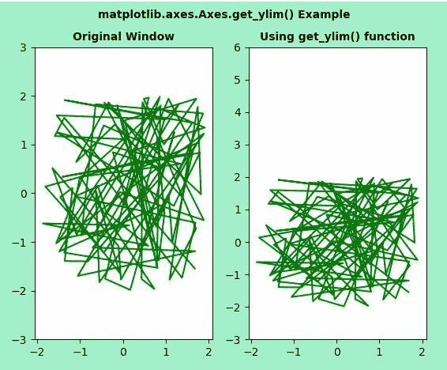
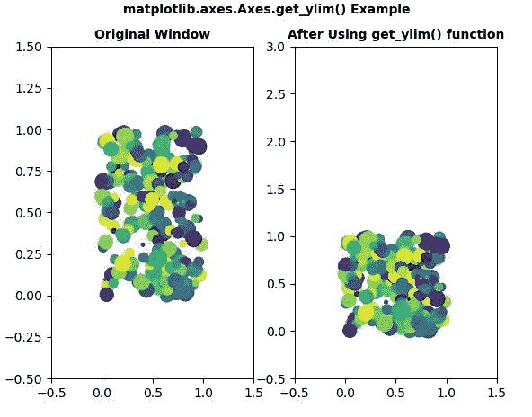
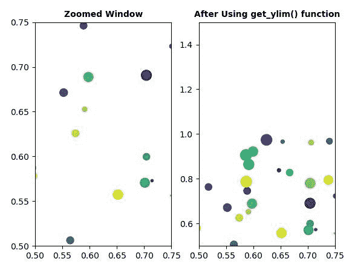

# matplotlib . axes . get _ ylim()用 Python

表示

> 哎哎哎:# t0]https://www . geeksforgeeks . org/matplot lib-axes-get _ ylim-in-python/

**[Matplotlib](https://www.geeksforgeeks.org/python-introduction-matplotlib/)** 是 Python 中的一个库，是 NumPy 库的数值-数学扩展。**轴类**包含了大部分的图形元素:轴、刻度、线二维、文本、多边形等。，并设置坐标系。Axes 的实例通过回调属性支持回调。

## matplotlib.axes.Axes.get_ylim()函数

matplotlib 库的 Axes 模块中的 **Axes.get_ylim()函数**用于获取 y 轴视图限制。

> **语法:** Axes.get_ylim(self)
> 
> **返回:**该方法返回以下内容
> 
> *   **底部，顶部:**这返回数据坐标中的当前 y 轴限制。

下面的例子说明了 matplotlib.axes.Axes.get_ylim()函数在 matplotlib.axes 中的作用:

**例 1:**

```py
# Implementation of matplotlib function
from matplotlib.widgets import Cursor
import numpy as np
import matplotlib.pyplot as plt

np.random.seed(19680801)

fig, (ax, ax1) = plt.subplots(1, 2,
                              facecolor ='#A0F0CC')

x, y = 4*(np.random.rand(2, 100) - .5)
ax.plot(x, y, 'g')
ax.set_ylim(-3, 3)

xmin, xmax = ax.get_ylim()
ax.set_title('Original Window', 
             fontsize = 10,
             fontweight ='bold')

ax1.plot(x, y, 'g')
ax1.set_ylim(xmin, 2 * xmax)
ax1.set_title('Using get_ylim() function',
             fontsize = 10, 
              fontweight ='bold')

fig.suptitle('matplotlib.axes.Axes.get_ylim(\
Example\n', fontsize = 10, fontweight ='bold')
plt.show()
```

**输出:**


**例 2:**

```py
# Implementation of matplotlib function
import matplotlib.pyplot as plt
import numpy as np

fig1, (ax1, ax11) = plt.subplots(1, 2)
fig2, (ax2, ax22) = plt.subplots(1, 2)
ax1.set(xlim =(-0.5, 1.5), 
        ylim =(-0.5, 1.5), 
        autoscale_on = False)

ax2.set(xlim =(0.5, 0.75), 
        ylim =(0.5, 0.75), 
        autoscale_on = False)

ax11.set(xlim =(-0.5, 1.5),
         ylim =(-0.5, 1.5), 
         autoscale_on = False)

ax22.set(xlim =(0.5, 0.75), 
         ylim =(0.5, 0.75), 
         autoscale_on = False)

x, y, s, c = np.random.rand(4, 200)
s *= 200

ax1.scatter(x, y, s, c)
ax2.scatter(x, y, s, c)
ax11.scatter(x, y, s, c)
ax22.scatter(x, y, s, c)

def GFG(event):
    if event.button != 1:
        return
    x, y = event.xdata, event.ydata
    ax2.set_xlim(x - 0.1, x + 0.1)
    ax2.set_ylim(y - 0.1, y + 0.1)
    ax22.set_xlim(x - 0.1, x + 0.1)
    ax22.set_ylim(y - 0.1, y + 0.1)
    fig2.canvas.draw()

fig1.canvas.mpl_connect('button_press_event',
                        GFG)  

xmin, xmax = ax1.get_ylim()
ax1.set_title('Original Window', fontsize = 10,
              fontweight ='bold')

ax11.set_ylim(xmin, 2 * xmax)
ax11.set_title('After Using get_ylim() function',
             fontsize = 10, fontweight ='bold')

xmin, xmax = ax2.get_ylim()
ax2.set_title('Zoomed Window', fontsize = 10,
              fontweight ='bold')

ax22.set_ylim(xmin, 2 * xmax)
ax22.set_title('After Using get_ylim() function',
             fontsize = 10, fontweight ='bold')

fig1.suptitle('matplotlib.axes.Axes.get_ylim()\
Example\n', fontsize = 10, fontweight ='bold')
plt.show()
```

**输出:**


