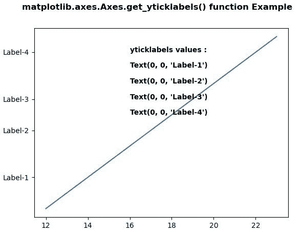
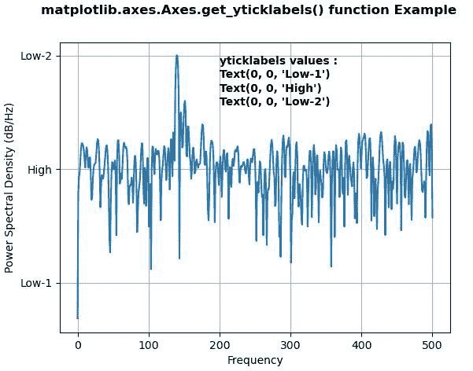

# matplotlib . axes . get _ yticklabels()用 Python

表示

> 哎哎哎:# t0]https://www . geeksforgeeks . org/matplotlib-axes-get _ yticklabels-in-python/

**[Matplotlib](https://www.geeksforgeeks.org/python-introduction-matplotlib/)** 是 Python 中的一个库，是 NumPy 库的数值-数学扩展。**轴类**包含了大部分的图形元素:轴、刻度、线二维、文本、多边形等。，并设置坐标系。Axes 的实例通过回调属性支持回调。

## matplotlib . axes . axes . get _ yticklabels()函数

matplotlib 库的 Axes 模块中的**Axis . get _ yticklabels()函数**用于将 y 刻度作为位置列表返回。

> **语法:** Axes.get_yticks(self，minor=False)
> 
> **参数:**该方法接受以下参数。
> 
> *   **次要:**此参数用于设置主要刻度还是次要刻度
> 
> **返回值:**此方法不返回值

下面的例子说明了 matplotlib.axes . axes . get _ yticklabels()函数在 matplotlib . axes 中的作用:

**例 1:**

```
# Implementation of matplotlib function
import matplotlib.pyplot as plt
import matplotlib.transforms as mtransforms

fig, ax = plt.subplots()
ax.plot(range(12, 24), range(12))
ax.set_yticks((2, 5, 7, 10))
ax.set_yticklabels(("Label-1", "Label-2", 
                    "Label-3", "Label-4"))

w = ax.get_yticklabels()
ax.text(16, 10, "yticklabels values : ",
       fontweight ="bold")
x = 10
for i in list(w):
    ax.text(16, x-1, str(i), fontweight ="bold")
    x-= 1

fig.suptitle('matplotlib.axes.Axes.get_yticklabels()\
 function Example\n\n', fontweight ="bold")
plt.show()
```

**输出:**


**例 2:**

```
# Implementation of matplotlib function
import matplotlib.pyplot as plt
import numpy as np
import matplotlib.mlab as mlab
import matplotlib.gridspec as gridspec

fs = 1000
t = np.linspace(0, 0.3, 301)
A = np.array([2, 8]).reshape(-1, 1)
f = np.array([150, 140]).reshape(-1, 1)
xn = (A * np.sin(2 * np.pi * f * t)).sum(axis = 0)
xn += 5 * np.random.randn(*t.shape)

fig, ax = plt.subplots()

yticks = [-40, -15, 10]

ax.psd(xn, NFFT = 301, 
       Fs = fs, 
       window = mlab.window_none,
       pad_to = 1024,
       scale_by_freq = True)

ax.set_yticks(yticks)
ax.set_yticklabels(("Low-1", "High", "Low-2"))
ax.grid(True)

w = ax.get_yticklabels()
ax.text(200, 8, "yticklabels values : ", 
        fontweight ="bold")
x = 8
for i in list(w):
    ax.text(200, x-3, str(i), fontweight ="bold")
    x-= 3

fig.suptitle('matplotlib.axes.Axes.get_yticklabels()\
 function Example\n\n', fontweight ="bold")
plt.show()
```

**输出:**
