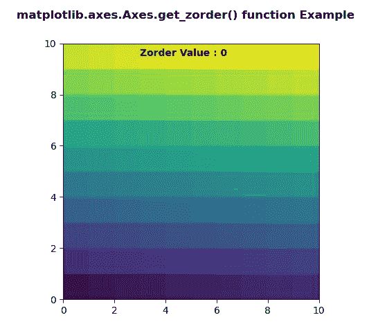
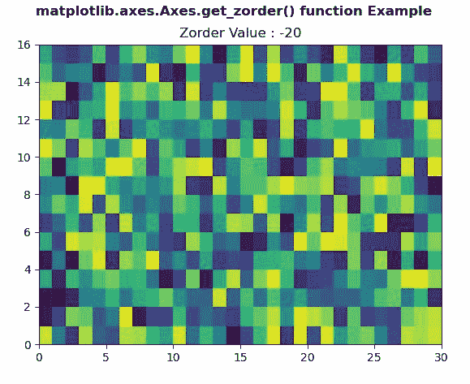

# Python 中的 matplotlib . axes . axes . get _ zorder()

> 原文:[https://www . geeksforgeeks . org/matplotlib-axes-axes-get _ zorder-in-python/](https://www.geeksforgeeks.org/matplotlib-axes-axes-get_zorder-in-python/)

**[Matplotlib](https://www.geeksforgeeks.org/python-introduction-matplotlib/)** 是 Python 中的一个库，是 NumPy 库的数值-数学扩展。**轴类**包含了大部分的图形元素:轴、刻度、线二维、文本、多边形等。，并设置坐标系。Axes 的实例通过回调属性支持回调。

## matplotlib . axes . axes . get _ zorder()函数

matplotlib 库的 Axes 模块中的 **Axes.get_zorder()函数**用于获取艺术家的 zorder。

> **语法:** Axes.get_zorder(self)
> 
> **参数:**该方法不接受任何参数。
> 
> **返回:**此方法返回艺术家的 zorder。

下面的例子说明了 matplotlib.axes . axes . get _ zorder()函数在 matplotlib . axes 中的作用:

**例 1:**

```
# Implementation of matplotlib function
import numpy as np
import matplotlib.pyplot as plt

d = np.arange(100).reshape(10, 10)
xx, yy = np.meshgrid(np.arange(11), np.arange(11))

fig, ax = plt.subplots()

ax.set_aspect(1)
ax.pcolormesh(xx, yy, d)

ax.text(3, 9.5, "Zorder Value : "
        + str(ax.get_zorder()),
        fontweight ="bold")

fig.suptitle('matplotlib.axes.Axes.get_zorder() \
function Example', fontweight ="bold")

plt.show()
```

**输出:**


**例 2:**

```
# Implementation of matplotlib function
import numpy as np
import matplotlib.pyplot as plt

xx = np.random.rand(16, 30)

fig, ax = plt.subplots()

ax.pcolor(xx)
ax.set_zorder(-20)

ax.set_title("Zorder Value : "
             + str(ax.get_zorder()))

fig.suptitle('matplotlib.axes.Axes.get_zorder() \
function Example', fontweight ="bold")

plt.show()
```

**输出:**
