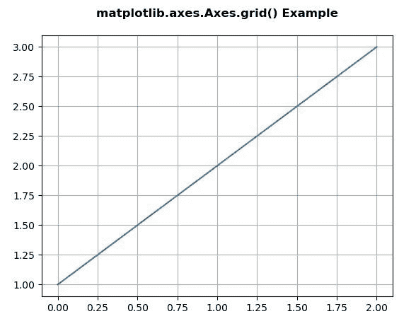
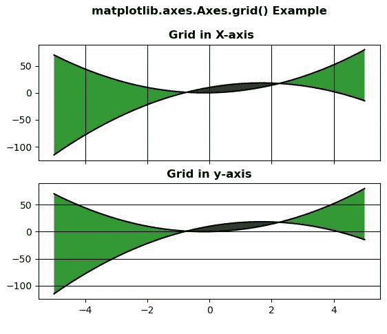

# Python 中的 Matplotlib.axes.Axes.grid()

> 原文:[https://www . geeksforgeeks . org/matplotlib-axes-axes-grid-in-python/](https://www.geeksforgeeks.org/matplotlib-axes-axes-grid-in-python/)

**[Matplotlib](https://www.geeksforgeeks.org/python-introduction-matplotlib/)** 是 Python 中的一个库，是 NumPy 库的数值-数学扩展。**轴类**包含了大部分的图形元素:轴、刻度、线二维、文本、多边形等。，并设置坐标系。Axes 的实例通过回调属性支持回调。

## matplotlib.axes.Axes.grid()函数

matplotlib 库的 Axes 模块中的 **Axes.grid()函数**用于配置网格线。

> **语法:** Axes.grid(self，b=None，其中= ' major '，axis='both '，**kwargs)
> 
> **参数:**该方法接受以下参数。
> 
> *   **b :** 该参数为可选参数，是否显示网格线。
> *   **哪个:**这个参数也是可选参数，是要应用更改的网格线。
> *   **轴:**该参数也是可选参数，是应用更改的轴。
> 
> **返回:**该方法不返回值。

下面的例子说明了 matplotlib.axes.Axes.grid()函数在 matplotlib.axes 中的作用:

**例 1:**

```
# Implementation of matplotlib function   
import matplotlib.pyplot as plt
import numpy as np

fig, ax = plt.subplots()
ax.plot([1, 2, 3])
ax.grid()
ax.set_title('matplotlib.axes.Axes.grid() Example\n',
             fontsize = 12, fontweight ='bold')
plt.show()
```

**输出:**


**例 2:**

```
# Implementation of matplotlib function
import numpy as np
import matplotlib.pyplot as plt

x = np.arange(-5, 5, 0.01)
y1 = -3 * x*x + 10 * x + 10
y2 = 3 * x*x + x

fig, [ax, ax1] = plt.subplots(2, 1, 
                              sharex = True)

ax.plot(x, y1, x, y2, color ='black')
ax.fill_between(x, y1, y2, where = y2 >y1,
                facecolor ='green',
                alpha = 0.8)

ax.fill_between(x, y1, y2, where = y2 <= y1, 
                facecolor ='black', 
                alpha = 0.8)

ax.xaxis.grid(True, color ="black")
ax.set_title('matplotlib.axes.Axes.grid() \
Example\n\n Grid in X-axis',
             fontsize = 12, fontweight ='bold')

ax1.plot(x, y1, x, y2, color ='black')
ax1.fill_between(x, y1, y2, where = y2 >y1, 
                 facecolor ='green',
                 alpha = 0.8)

ax1.fill_between(x, y1, y2, where = y2 <= y1,
                 facecolor ='black', 
                 alpha = 0.8)

ax1.yaxis.grid(True, color ="black")
ax1.set_title('Grid in y-axis',
             fontsize = 12, fontweight ='bold')
plt.show()
```

**输出:**
