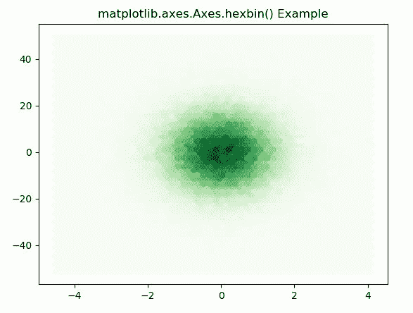
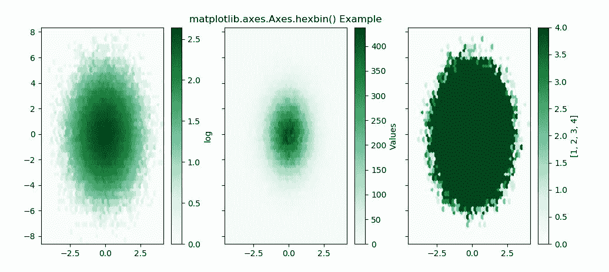

# Matplotlib.axes.Axes.hexbin()用 Python

表示

> 哎哎哎:# t0]https://www . geeksforgeeks . org/matplotlib-axes-hex bin-in-python/

**[Matplotlib](https://www.geeksforgeeks.org/python-introduction-matplotlib/)** 是 Python 中的一个库，是 NumPy 库的数值-数学扩展。**轴类**包含了大部分的图形元素:轴、刻度、线二维、文本、多边形等。，并设置坐标系。Axes 的实例通过回调属性支持回调。

## matplotlib.axes.Axes.hexbin()函数

matplotlib 库的 Axes 模块中的 **Axes.hexbin()函数**用于制作点 x，y，

> **语法:** Axes.hexbin(self，x，y，C=None，gridsize=100，bins =None，xscale='linear '，yscale='linear '，extension = None，cmap=None，norm=None，vmin=None，vmax=None，alpha=None，线宽= None，edgecolors='face '，reduce_C_function=，mincnt=None，marginals=False，*，data=None，**kwargs)
> 
> **参数:**该方法接受以下描述的参数:
> 
> *   **x，y:** 这些参数是数据的序列。x 和 y 的长度必须相同。
> *   **C :** 该参数是箱中累积的值。
> *   **gridsize :** 此参数表示 x 方向或两个方向的六边形数量。
> *   **xscale :** 此参数在横轴上使用线性或 log10 刻度。
> *   **xycale :** 此参数在垂直轴上使用线性或 log10 刻度。
> *   **mincnt :** 此参数用于显示单元格中点数超过 mincnt 的单元格。
> *   **边缘:**此参数用于将边缘密度绘制为沿 x 轴底部和 y 轴左侧的彩色矩形。
> *   **范围:**该参数是箱的极限。
> 
> **返回:**这将返回以下内容:
> 
> *   **多集合:**返回定义六边形面元的多集合。

下面的例子说明了 matplotlib.axes.Axes.hexbin()函数在 matplotlib.axes 中的作用:

**示例-1:**

```
# Implementation of matplotlib function
import matplotlib.pyplot as plt
import numpy as np

np.random.seed(19680801)

n = 100000
x = np.random.standard_normal(n)
y = 12 * np.random.standard_normal(n)

fig, ax = plt.subplots()
ax.hexbin(x, y, gridsize = 50, cmap ='Greens')
ax.set_title('matplotlib.axes.Axes.hexbin() Example')
plt.show()
```

**输出:**


**示例-2:**

```
# Implementation of matplotlib function
import matplotlib.pyplot as plt
import numpy as np

np.random.seed(19680801)

n = 100000
x = np.random.standard_normal(n)
y = 2 * np.random.standard_normal(n)
z =[1, 2, 3, 4]
xmin = x.min()
xmax = x.max()
ymin = y.min()
ymax = y.max()

fig, axs = plt.subplots(ncols = 3,
                        sharey = True)

ax = axs[0]
hb = ax.hexbin(x, y, gridsize = 50, 
               bins ='log', 
               cmap ='BuGn')

ax.set(xlim =(xmin, xmax), 
       ylim =(ymin, ymax))

cb = fig.colorbar(hb, ax = ax)
cb.set_label('log')

ax = axs[1]
hb = ax.hexbin(x, y, gridsize = 50,
               cmap ='Greens')

ax.set(xlim =(xmin, xmax), 
       ylim =(ymin, ymax))

cb = fig.colorbar(hb, ax = ax)
cb.set_label('Values')

ax.set_title('matplotlib.axes.Axes.\
hexbin() Example')

ax = axs[2]
hb = ax.hexbin(x, y, gridsize = 50,
               bins = z, cmap ='BuGn')

ax.set(xlim =(xmin, xmax), 
       ylim =(ymin, ymax))

cb = fig.colorbar(hb, ax = ax)
cb.set_label(z)
plt.show()
```

**输出:**
