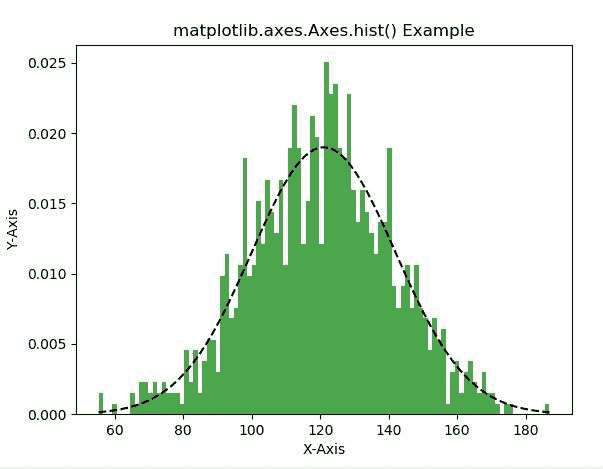
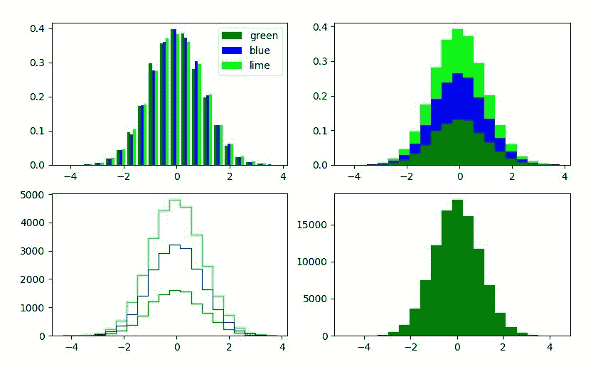

# Python 中的 Matplotlib.axes.Axes.hist()

> 原文:[https://www . geeksforgeeks . org/matplotlib-axes-axes-hist-in-python/](https://www.geeksforgeeks.org/matplotlib-axes-axes-hist-in-python/)

**[Matplotlib](https://www.geeksforgeeks.org/python-introduction-matplotlib/)** 是 Python 中的一个库，是 NumPy 库的数值-数学扩展。**轴类**包含了大部分的图形元素:轴、刻度、线二维、文本、多边形等。，并设置坐标系。Axes 的实例通过回调属性支持回调。

## matplotlib . axes . axes()函数

matplotlib 库的 Axes 模块中的 **Axes.hist()函数**用于绘制直方图。

> **语法:** Axes.hist(self，x，bins = None，range=None，density=None，weights=None，累计=False，bottom=None，histtype='bar '，align='mid '，orientation='vertical '，rwidth=None，log=False，color=None，label=None，stacked=False，normed=None，*，data=None，**kwargs)
> 
> **参数:**该方法接受以下描述的参数:
> 
> *   **x :** 这个参数是数据的顺序。
> *   **bin:**该参数为可选参数，包含整数或序列或字符串。
> *   **范围:**该参数是可选参数，它是箱的下限和上限。
> *   **密度:**该参数为可选参数，包含布尔值。
> *   **权重:**该参数是可选参数，是权重数组，形状与 x 相同。
> *   **底部:**该参数是每个料仓底部基线的位置。
> *   **histtype :** 该参数为可选参数，用于绘制直方图的类型。{ '条形'，'条形堆叠'，'阶梯'，'阶梯填充' }
> *   **对齐:**此参数是可选参数，它控制直方图的绘制方式。{ '左'，'中'，'右' }
> *   **rwidth :** 此参数是可选参数，它是条的相对宽度，是料箱宽度的一部分
> *   **log :** 此参数为可选参数，用于将直方图轴设置为对数刻度
> *   **颜色:**此参数是可选参数，它是一个颜色规格或颜色规格序列，每个数据集一个。
> *   **标签:**该参数为可选参数，为字符串，或字符串序列，用于匹配多个数据集。
> *   **赋范:**该参数为可选参数，包含布尔值。而是使用密度关键字参数。
> 
> **返回:**这将返回以下内容:
> 
> *   **n :** 返回直方图仓的值。
> *   **面元:**这将返回面元的边缘。
> *   **面片:**返回用于创建直方图的单个面片列表。

下面的例子说明了 matplotlib.axes.Axes.hexbin()函数在 matplotlib.axes 中的作用:

**示例-1:**

```py
# Implementation of matplotlib function
import matplotlib
import numpy as np
import matplotlib.pyplot as plt

np.random.seed(10**7)
mu = 121  
sigma = 21
x = mu + sigma * np.random.randn(1000)

num_bins = 100
fig, ax = plt.subplots()

n, bins, patches = ax.hist(x, num_bins,
                           density = 1, 
                           color ='green', 
                           alpha = 0.7)

y = ((1 / (np.sqrt(2 * np.pi) * sigma)) *
     np.exp(-0.5 * (1 / sigma * (bins - mu))**2))
ax.plot(bins, y, '--', color ='black')
ax.set_xlabel('X-Axis')
ax.set_ylabel('Y-Axis')

ax.set_title('matplotlib.axes.Axes.hist() Example')
plt.show()
```

**输出:**


**示例-2:**

```py
# Implementation of matplotlib function
import matplotlib
import numpy as np
import matplotlib.pyplot as plt

np.random.seed(10**7)
n_bins = 20
x = np.random.randn(10000, 3)

fig, [(ax0, ax1), (ax2, ax3)] = plt.subplots(nrows = 2,
                                             ncols = 2)

colors = ['green', 'blue', 'lime']

ax0.hist(x, n_bins, density = True, 
         histtype ='bar',
         color = colors, 
         label = colors)

ax0.legend(prop ={'size': 10})

ax1.hist(x, n_bins, density = True,
         histtype ='barstacked',
         stacked = True, 
         color = colors)

ax2.hist(x, n_bins, histtype ='step',
         stacked = True,
         fill = False, 
         color = colors)

x_multi = [np.random.randn(n) for n in [100000,
                                        80000,
                                        1000]]

ax3.hist(x_multi, n_bins, 
         histtype ='stepfilled',
         color = colors)

plt.show()
```

**输出:**
