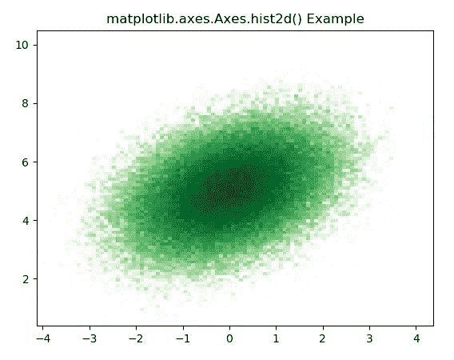
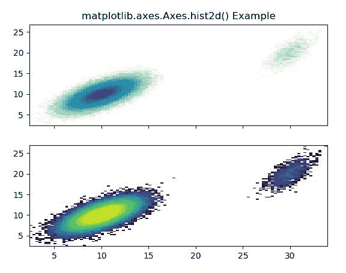

# Python 中的 Matplotlib.axes.Axes.hist2d()

> 原文:[https://www . geeksforgeeks . org/matplotlib-axes-axes-hist 2d-in-python/](https://www.geeksforgeeks.org/matplotlib-axes-axes-hist2d-in-python/)

**[Matplotlib](https://www.geeksforgeeks.org/python-introduction-matplotlib/)** 是 Python 中的一个库，是 NumPy 库的数值-数学扩展。**轴类**包含了大部分的图形元素:轴、刻度、线二维、文本、多边形等。，并设置坐标系。Axes 的实例通过回调属性支持回调。

## matplotlib.axes.Axes.hist2d()函数

matplotlib 库的 Axes 模块中的 **Axes.hist2d()函数**用于绘制 2d 直方图。

> **语法:** Axes.hist2d(self，x，y，bins = 10，range=None，density=False，weights=None，cmin=None，cmax=None，* data = None，* * * kwargs)
> 
> **参数:**该方法接受以下描述的参数:
> 
> *   **x，y :** 这些参数是数据的序列。
> *   **bin:**该参数为可选参数，包含整数或序列或字符串。
> *   **范围:**该参数是可选参数，它是箱的下限和上限。
> *   **密度:**该参数为可选参数，包含布尔值。
> *   **权重:**该参数是可选参数，是权重数组，形状与 x 相同。
> *   **cmin :** 该参数有计数小于 cmin 的所有箱将不会显示。
> *   **cmax :** 该参数有计数超过 cmax 的所有箱将不会显示。
> 
> **返回:**这将返回以下内容:
> 
> *   **h :** 这将返回样本 x 和 y 的二维直方图。
> *   **xedges :** 这将返回沿 x 轴的料箱边缘。
> *   **yedges :** 这将返回沿 y 轴的料箱边缘。
> *   **图像:**这将返回四边网格。

下面的例子说明了 matplotlib.axes.Axes.hist2d()函数在 matplotlib.axes 中的作用:

**示例-1:**

```py

# Implementation of matplotlib function
from matplotlib import colors
from matplotlib.ticker import PercentFormatter
import numpy as np
import matplotlib.pyplot as plt

N_points = 100000
x = np.random.randn(N_points)
y = .4 * x + np.random.randn(100000) + 5

fig, ax = plt.subplots()
ax.hist2d(x, y, bins = 100, 
          norm = colors.LogNorm(),
          cmap ="Greens")

ax.set_title('matplotlib.axes.Axes.\
hist2d() Example')

plt.show()
```

**输出:**

**例-2:**

```py
# Implementation of matplotlib function
from matplotlib import colors
import numpy as np
from numpy.random import multivariate_normal
import matplotlib.pyplot as plt

result = np.vstack([
    multivariate_normal([10, 10],
            [[3, 2], [2, 3]], size = 100000),
    multivariate_normal([30, 20],
            [[2, 3], [1, 3]], size = 1000)
])

fig, [axes, axes1] = plt.subplots(nrows = 2, 
                                  ncols = 1,
                                  sharex = True)

axes.hist2d(result[:, 0], result[:, 1],
            bins = 100, cmap ="GnBu",
            norm = colors.LogNorm())

axes1.hist2d(result[:, 0], result[:, 1],
             bins = 100, norm = colors.LogNorm())

axes.set_title('matplotlib.axes.Axes.\
hist2d() Example')

plt.show()
```

**输出:**
