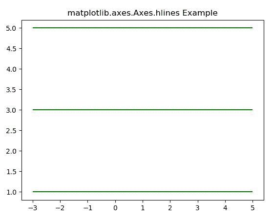
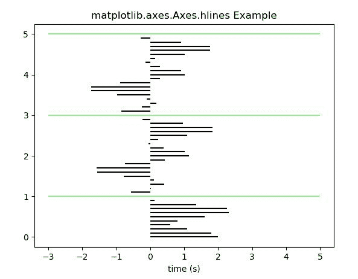

# Matplotlib.axes.Axes.hlines()中的 Python

> 哎哎哎:# t0]https://www . geeksforgeeks . org/matplot lib-axes-axes-hlines-in-python/

**[Matplotlib](https://www.geeksforgeeks.org/python-introduction-matplotlib/)** 是 Python 中的一个库，是 NumPy 库的数值-数学扩展。**轴类**包含了大部分的图形元素:轴、刻度、线二维、文本、多边形等。，并设置坐标系。Axes 的实例通过回调属性支持回调。

## matplotlib . axes . axes . hline()函数

matplotlib 库的 Axes 模块中的 **Axes.hlines()函数**用于绘制从 xmin 到 xmax 的每 y 处的垂直线。

> **语法:**axes . hline(self，y，xmin，xmax，colors='k '，linestyles = ' solid '，label= "，*，data=None，**kwargs)
> 
> **参数:**该方法接受以下描述的参数:
> 
> *   **y:** 该参数是绘制直线的 y 索引序列。
> *   **xmin，xmax:** 这些参数包含一个数组。它们代表每一行的开始和结束。
> *   **颜色:**该参数为可选参数。并且是默认值 *k* 的线条颜色。
> *   **line style:**该参数也是可选参数。它用来表示线条样式{ '实线'，'虚线'，'虚线'，'虚线'，'虚线' }。
> *   **标签:**该参数也是可选参数。这是剧情的标签。
> 
> **返回:**这将返回*线路集合*。

下面的例子说明了 matplotlib.axes.Axes.hlines()函数在 matplotlib.axes 中的作用:

**示例#1:**

```
# Implementation of matplotlib function

import numpy as np
from matplotlib import patches
import matplotlib.pyplot as plt

fig, ax = plt.subplots()
ax.hlines([1, 3, 5], -3, 5, color ="green")
ax.set_title('matplotlib.axes.Axes.hlines Example')

plt.show()
```

**输出:**


**例 2:**

```
# Implementation of matplotlib function

import numpy as np
from matplotlib import patches
import matplotlib.pyplot as plt

t = np.arange(0.0, 5.0, 0.1)
s = np.exp(-t) + np.cos(3 * np.pi * t) + np.sin(np.pi * t)
nse = np.random.normal(0.0, 0.8, t.shape) * s

fig, ax = plt.subplots()

ax.hlines(t, [0], s)
ax.set_xlabel('time (s)')
ax.hlines([1, 3, 5], -3, 5, color ="lightgreen")
ax.set_title('matplotlib.axes.Axes.hlines Example')

plt.show()
```

**输出:**
