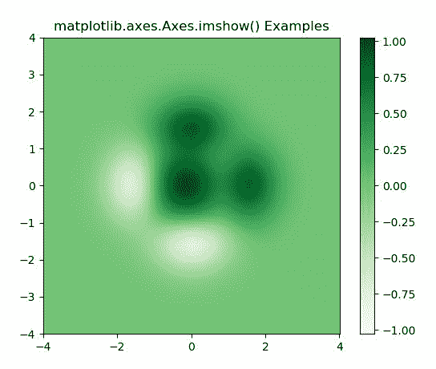
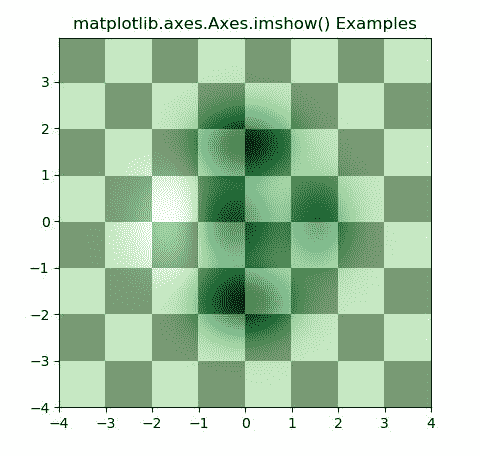

# matplotlib . axes . im show()中的 Python

> 哎哎哎:# t0]https://www . geeksforgeeks . org/matplotlib-axes-im how-in-python/上

**[Matplotlib](https://www.geeksforgeeks.org/python-introduction-matplotlib/)** 是 Python 中的一个库，是 NumPy 库的数值-数学扩展。**轴类**包含了大部分的图形元素:轴、刻度、线二维、文本、多边形等。，并设置坐标系。Axes 的实例通过回调属性支持回调。

## matplotlib.axes.Axes.imshow()函数

matplotlib 库的 Axes 模块中的 **Axes.imshow()函数**也用于在 2D 规则光栅上显示图像或数据。

> **语法:**
> 
> > Axes.imshow(self，X，cmap =无，norm=无，aspect =无，插值=无，alpha =无，vmin =无，vmax =无，原点=无，范围=无，形状=，filternorm=1，filterrad=4.0，imlim=，重采样=无，url =无，*数据=无，* * * kwargs)
> 
> **参数:**该方法接受以下描述的参数:
> 
> *   **X:** 这个参数是图像的数据。
> *   **cmap :** 此参数是一个 colormap 实例或注册的 colormap 名称。
> *   **norm :** 此参数是 Normalize 实例，它将数据值缩放到标准颜色映射范围[0，1]，以映射到颜色
> *   **vmin，vmax :** 这些参数本质上是可选，它们是 colorbar 范围。
> *   **alpha :** 此参数是颜色的强度。
> *   **纵横比:**该参数用于控制轴的纵横比。
> *   **插值:**该参数是用来显示图像的插值方法。
> *   **原点:**此参数用于将数组的[0，0]索引放置在轴的左上角或左下角。
> *   **重采样:**该参数是用于相似的方法。
> *   **范围:**该参数是数据坐标中的包围盒。
> *   **filternorm :** 此参数用于反锯齿图像调整大小滤镜。
> *   **filterrad :** 此参数是具有半径参数的过滤器的过滤器半径。
> *   **网址:**该参数设置创建的**轴图像的网址。**
> 
> **返回:**这将返回以下内容:
> 
> *   **图像:**这将返回**轴图像**

下面的例子说明了 matplotlib.axes.Axes.imshow()函数在 matplotlib.axes 中的作用:

**示例-1:**

```py
# Implementation of matplotlib function
import matplotlib.pyplot as plt
import numpy as np
from matplotlib.colors import LogNorm

dx, dy = 0.015, 0.05
y, x = np.mgrid[slice(-4, 4 + dy, dy),
                slice(-4, 4 + dx, dx)]
z = (1 - x / 3\. + x ** 5 + y ** 5) * np.exp(-x ** 2 - y ** 2)
z = z[:-1, :-1]
z_min, z_max = -np.abs(z).max(), np.abs(z).max()

fig, ax = plt.subplots()

c = ax.imshow(z, cmap ='Greens', vmin = z_min,
              vmax = z_max, extent =[x.min(),
                                     x.max(),
                                     y.min(),
                                     y.max()],
              interpolation ='nearest', 
              origin ='lower')

fig.colorbar(c, ax = ax)
ax.set_title('matplotlib.axes.Axes.imshow() Examples')
plt.show()
```

**输出:**


**示例-2:**

```py
# Implementation of matplotlib function
import matplotlib.pyplot as plt
import numpy as np
from matplotlib.colors import LogNorm

dx, dy = 0.015, 0.05
x = np.arange(-4.0, 4.0, dx)
y = np.arange(-4.0, 4.0, dy)
X, Y = np.meshgrid(x, y)

extent = np.min(x), np.max(x), np.min(y), np.max(y)

fig, ax = plt.subplots()

Z1 = np.add.outer(range(8), range(8)) % 2
ax.imshow(Z1, cmap ="binary_r", interpolation ='nearest',
                 extent = extent, alpha = 1)

def geeks(x, y):
    return (1 - x / 2 + x**5 + y**6) * np.exp(-(x**2 + y**2))

Z2 = geeks(X, Y)

ax.imshow(Z2, cmap ="Greens", alpha = 0.7, 
          interpolation ='bilinear',
          extent = extent)

ax.set_title('matplotlib.axes.Axes.imshow() Examples')
plt.show()
```

**输出:**
