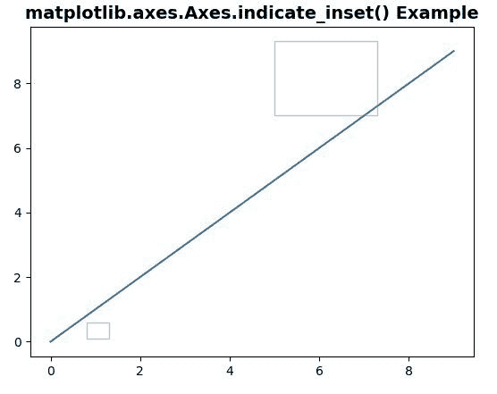
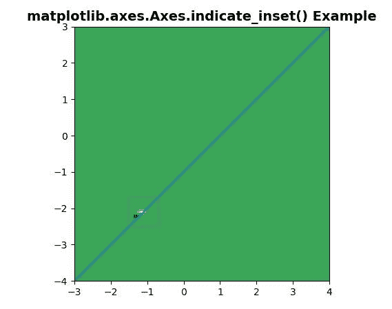

# Python 中的 matplotlib . axes . axes . indicate _ inset()

> 原文:[https://www . geeksforgeeks . org/matplotlib-axes-axes-indicate _ inset-in-python/](https://www.geeksforgeeks.org/matplotlib-axes-axes-indicate_inset-in-python/)

**[Matplotlib](https://www.geeksforgeeks.org/python-introduction-matplotlib/)** 是 Python 中的一个库，是 NumPy 库的数值-数学扩展。**轴类**包含了大部分的图形元素:轴、刻度、线二维、文本、多边形等。，并设置坐标系。Axes 的实例通过回调属性支持回调。

## matplotlib . axes . axes . indicate _ insert()函数

matplotlib 库的 Axes 模块中的**axes . indicate _ insert()函数**也用于给轴添加一个插入指示器。

> **语法:**axes . end _ insert(self，bounds，inset_ax=None，* transform = None，facecolor='none '，edgecolor='0.5 '，alpha=0.5，zorder=4.99，**kwargs)
> 
> **参数:**该方法接受以下描述的参数:
> 
> *   **边界:**此参数是待标记矩形的左下角及其宽度和高度。[x0，y0，宽度，高度]
> *   **变换:**该参数是矩形的单位在轴-相对坐标中。
> *   **zorder:** 此参数包含数字，默认值为 5。
> *   **插入轴:**该参数是一个可选的插入轴，用于绘制连接线。
> *   **面颜色:**此参数用于插入矩形的面颜色。
> *   **edgecolor:** 这个参数是矩形的颜色和连接线的颜色。
> *   **alpha:** 此参数表示矩形和连接线的透明度。
> 
> **返回:**该方法返回以下内容:
> 
> *   **矩形 _ 补丁:**这返回指示框。
> *   **连接线:**这将返回连接到 inset_ax(左下、左上、右下、右上)角的四条连接线。

**注意:**该功能在 Matplotlib 版本>中工作= 3.0

下面的例子说明了 matplotlib.axes . axes . indicate _ inset()函数在 matplotlib . axes 中的作用:

**例 1:**

```
# Implementation of matplotlib function
import matplotlib.pyplot as plt

fig, ax = plt.subplots()
ax.plot(range(10))
axin1 = ax.indicate_inset([0.8, 0.1, 0.5, 0.5])
axin2 = ax.indicate_inset(
        [5, 7, 2.3, 2.3], transform = ax.transData)
ax.set_title('matplotlib.axes.Axes.indicate_inset() Example',
             fontsize = 14, fontweight ='bold')
plt.show()
```

**输出:**


**例 2:**

```
# Implementation of matplotlib function
import matplotlib.pyplot as plt
import numpy as np

def geeks():
    from matplotlib.cbook import get_sample_data
    import numpy as np
    f = get_sample_data("axes_grid/bivariate_normal.npy",
                        asfileobj = False)

    z = np.load(f)
    return z, (-3, 4, -4, 3)

fig, ax = plt.subplots()
ax.plot(range(-3, 5), range(-4, 4))
X, extent = geeks()
Z2 = np.zeros([150, 150], dtype ="g")
ny, nx = X.shape
Z2[30:30 + ny, 30:30 + nx] = X

ax.imshow(Z2**3 + 100, extent = extent, 
          interpolation ="nearest",
          origin ="lower", cmap ="Greens")

axins, axins1 = ax.indicate_inset([-1.5, -2.5, 0.8, 0.8])

ax.set_title('matplotlib.axes.Axes.indicate_inset() Example',
             fontsize = 14, fontweight ='bold')
plt.show()
```

**输出:**
