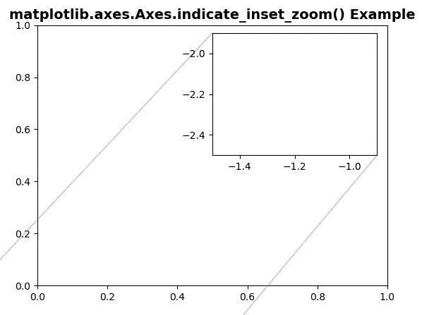
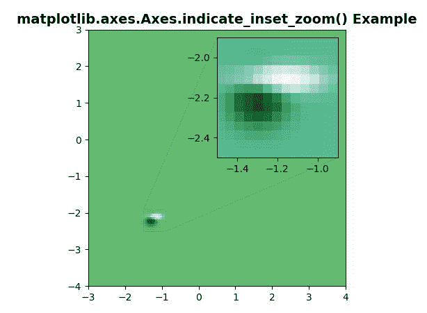

# Python 中的 matplotlib . axes . axes . indicate _ inset _ zoom()

> 原文:[https://www . geeksforgeeks . org/matplotlib-axes-axes-indicate _ inset _ zoom-in-python/](https://www.geeksforgeeks.org/matplotlib-axes-axes-indicate_inset_zoom-in-python/)

**[Matplotlib](https://www.geeksforgeeks.org/python-introduction-matplotlib/)** 是 Python 中的一个库，是 NumPy 库的数值-数学扩展。**轴类**包含了大部分的图形元素:轴、刻度、线二维、文本、多边形等。，并设置坐标系。Axes 的实例通过回调属性支持回调。

## matplotlib . axes . axes . indicate _ insert _ zoom()函数

matplotlib 库的 Axes 模块中的**axes . indicate _ insert()函数**也用于给轴添加一个插入指示器。

> **语法:**axes . end _ insert(self，bounds，inset_ax=None，* transform = None，facecolor='none '，edgecolor='0.5 '，alpha=0.5，zorder=4.99，**kwargs)
> 
> **参数:**该方法接受以下描述的参数:
> 
> *   **插图 _ax:** 此参数是可选的插图轴，用于绘制连接线。
> *   *** *夸脱:**其他夸脱传递给**斧。插图 _ 矩形**。
> 
> **返回:**该方法返回以下内容:
> 
> *   **矩形 _ 补丁:**这返回指示框。
> *   **连接线:**这将返回连接到 inset_ax(左下、左上、右下、右上)角的四条连接线。

**注意:**该功能在 Matplotlib 版本>中工作= 3.0

下面的例子说明了 matplotlib.axes.Axes .指示 matplotlib.axes 中的 _inset_zoom()函数:

**例 1:**

```
# Implementation of matplotlib function
import matplotlib.pyplot as plt
import numpy as np
fig, ax = plt.subplots()

Z2 = np.zeros([150, 150], dtype ="g")

axins = ax.inset_axes([0.5, 0.5, 0.47, 0.47])
x1, x2, y1, y2 = -1.5, -0.9, -2.5, -1.9
axins.set_xlim(x1, x2)
axins.set_ylim(y1, y2)

ax.indicate_inset_zoom(axins)

ax.set_title('matplotlib.axes.Axes.indicate_inset_zoom() Example',
             fontsize = 14, fontweight ='bold')
plt.show()
```

**输出:**



**例 2:**

```
# Implementation of matplotlib function
import matplotlib.pyplot as plt
import numpy as np

def geeks():
    from matplotlib.cbook import get_sample_data
    import numpy as np
    f = get_sample_data("axes_grid / bivariate_normal.npy",
                        asfileobj = False)
    z = np.load(f)
    return z, (-3, 4, -4, 3)

fig, ax = plt.subplots()

X, extent = geeks()
Z2 = np.zeros([150, 150], dtype ="g")
ny, nx = X.shape
Z2[30:30 + ny, 30:30 + nx] = X

ax.imshow(Z2, extent = extent, interpolation ="nearest",
          origin ="lower", cmap ="YlGn")

axins = ax.inset_axes([0.5, 0.5, 0.47, 0.47])
axins.imshow(Z2, extent = extent, interpolation ="nearest",
          origin ="lower", cmap ="BuGn")
x1, x2, y1, y2 = -1.5, -0.9, -2.5, -1.9
axins.set_xlim(x1, x2)
axins.set_ylim(y1, y2)

ax.indicate_inset_zoom(axins)

ax.set_title('matplotlib.axes.Axes.indicate_inset_zoom() Example',
             fontsize = 14, fontweight ='bold')
plt.show()
```

**输出:**
